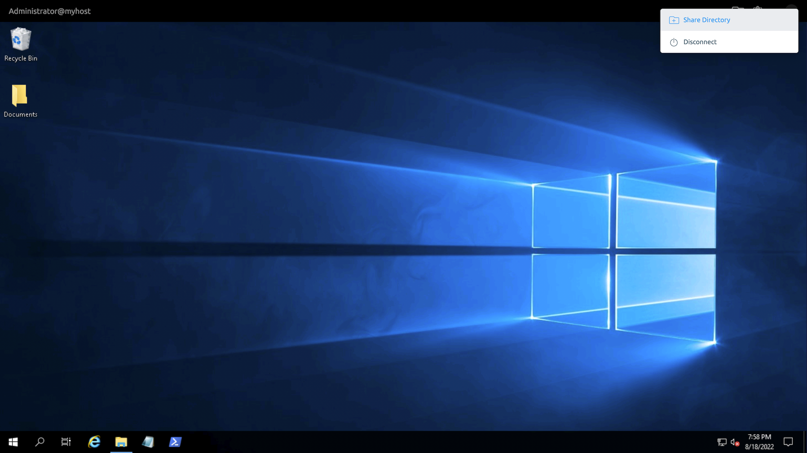
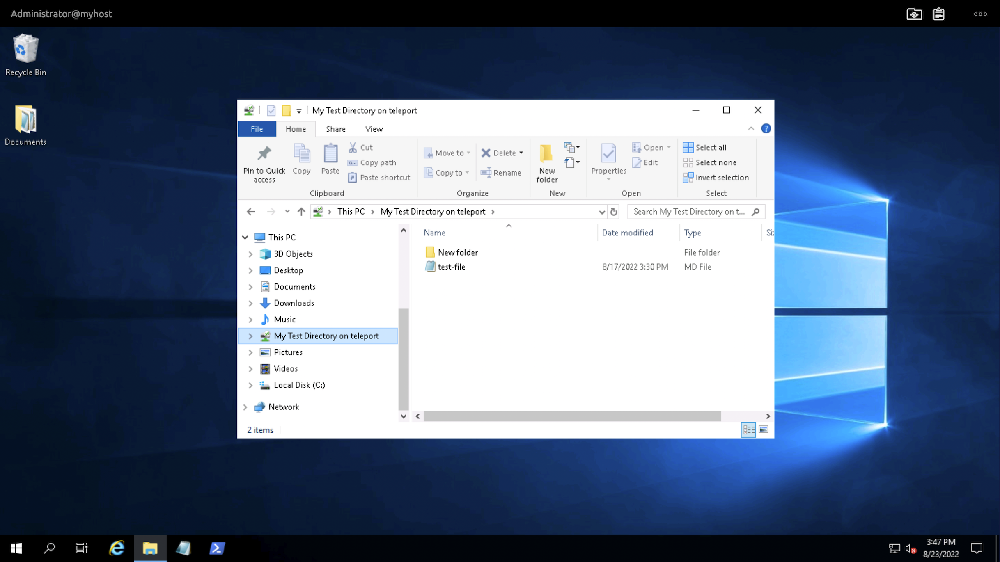

Directory Sharing is a Teleport feature of that makes it easy to move files
between a local machine and a remote desktop—and apply changes to those
files—without compromising security.

During a remote desktop session, you can select a folder on your local
workstation to share with the remote desktop. Changes to the folder on either
the remote desktop or your workstation are reflected on both machines for the
duration of the session.

The shared directory makes it convenient to download log files, edit
configuration files, or perform any other file manipulations on a remote Windows
desktop. You can disable Directory Sharing for specific users via their Teleport
roles, and use session recording to audit activity in the shared directory
after the session ends.

## Prerequisites

(!docs/pages/includes/edition-prereqs-tabs.mdx!)

{/*lint ignore messaging to ignore the page title linked here*/}
- The Teleport Desktop Service with at least one remote desktop registered in
  your cluster. If you have not yet configured Desktop Access, read [Getting
  Started with Desktop Access](./getting-started.mdx) before beginning this
  guide.

- A browser on your local machine that supports the File System Access API,
  which Teleport uses for Directory Sharing. We support the latest versions of
  Chromium-based browsers like Google Chrome, Brave, and Microsoft Edge.

  Brave users can enable the File System Access API by navigating to
  [brave://flags/#file-system-access-api](brave://flags/#file-system-access-api)
  and selecting "Enable".

  You can see a full compatibility table in the [Mozilla Developer Network
  documentation](https://developer.mozilla.org/en-US/docs/Web/API/File_System_Access_API#browser_compatibility).

- (!docs/pages/includes/tctl.mdx!)

## Step 1/4. Share a directory

To share a directory, open the Teleport Web UI and begin a desktop session by
navigating to the "Desktops" tab on the sidebar, finding a desktop you want to
connect to, and clicking "CONNECT".

Once the session starts, click the three-dot menu on the top-right of the screen
and click "Share Directory":



### Limitations on directories you can share

#### Prohibited directories

For security reasons the web browser's filesystem access API prohibits you from
sharing certain directories, including the standard locations for commonly used
user directories such as "Desktop" and "Documents", as well as critical
directories more typically used by the operating system itself.

For a full list of the blocked user directories, see the [File System Access
Specification](https://wicg.github.io/file-system-access/#enumdef-wellknowndirectory).

Subdirectories *within* these blocked user directories may still be shared.

#### Long directory names

Based on testing, we have determined that directory sharing leads to unexpected
errors if you share directories whose names (including all path segments) have
640 characters or more.

### After you share a directory

When you first share a directory, your browser will prompt you to allow it to
make changes in the directory, and you will need to grant these permissions to
enable directory sharing.

After you grant permissions, you will see a new directory in File Explorer on
the remote desktop. The directory will have the same name as the directory on
your local machine, but with "on teleport" appended to the name.



You can only share a single directory at a time.

## Step 2/4. Edit files in your directory

You can easily share files—and file modifications—between your local machine and
the remote desktop.

### Editing on the remote side

When you create, edit, or delete a file in the shared directory on the remote
side, your browser will apply those changes to the directory on your local
machine.

If you move a file into the shared directory on the remote side, that
file will appear on the local side as well. And if you move a file outside the
directory on the remote side, the remote desktop will copy it, keeping it within
the shared directory.

You can also copy a file from one subdirectory within the shared directory and
paste it into another—the local side will reflect the changes.

<Admonition type="warning">

Directory Sharing does not support moving files between subdirectories within
the shared directory on the remote side.

</Admonition>

### Editing on the local side

You can create, edit, and delete files in the shared directory on your
local machine, as well as move files between subdirectories.

To view your local changes on the remote side, you will need to either refresh
or re-open the remote directory, or re-open any individual files you changed
locally. When you do this, the remote desktop will request the current state of
the directory from the Teleport Web UI.

### File size restrictions

Performance for moving large files to and from the shared directory
will depend on network conditions, and file editing performance will
depend on the program you use to edit files.

While there is no size limit for files within your shared directory, we only
recommend manipulating files up to 32 MB to reduce the impact of the shared
directory on network bandwidth and system resources.

## Step 3/4. Disconnect

To stop sharing a directory, end your remote desktop session. Navigate to the
three-dot menu on the upper-right of the desktop session in your browser and
click "Disconnect."

The next time you start a session on the remote desktop, the directory will no
longer be shared. You will need to share the directory again to access its
content.

## Step 4/4. Disable Directory Sharing

The Teleport Auth Service grants access to Directory Sharing on a remote desktop
based on the roles of the user who initiates the desktop session.

A Teleport role enables Directory Sharing by default. If one of a user's
Teleport roles disables Directory Sharing, then Directory Sharing will be
disabled for that user.

To disable Directory Sharing for a Teleport user, define a role similar to the
following in a file called `role.yaml`:

```yaml
kind: role
version: v5
metadata:
  name: "no-sharing"
spec:
  options:
    desktop_directory_sharing: false
```

Create the role:

```code
$ tctl create -f role.yaml
```

(!docs/pages/includes/add-role-to-user.mdx role="no-sharing"!)

## Next steps

### Further reading

Directory Sharing is a powerful tool for editing files on remote desktops, and
you'll want to make sure you have a comprehensive audit trail so you can conduct
a post-incident retrospective or investigate unintended usage. Learn how to set
up [session recording for desktop access](../../reference/agent-services/desktop-access-reference/sessions.mdx).

Aside from Directory Sharing, the Teleport Desktop Service also enables you to
share the contents of your clipboard with a remote desktop. Learn how to use
[Clipboard Sharing](../../reference/agent-services/desktop-access-reference/clipboard.mdx).

### How Directory Sharing works

Directory Sharing involves a browser on a local workstation and a remote Windows
desktop.

On the remote side, Directory Sharing takes advantage of [file system-related
messaging](https://docs.microsoft.com/en-us/openspecs/windows_protocols/ms-rdpefs/)
within the Remote Desktop Protocol (RDP). On the local side, the Teleport Web UI
uses the browser's [File System Access
API](https://developer.mozilla.org/en-US/docs/Web/API/File_System_Access_API) to
read from and write to a user-selected local directory.

The Teleport Web UI establishes a secure WebSocket session with the Teleport
Proxy Service, which forwards traffic to and from the relevant Teleport Desktop
Service instance.

The Teleport Desktop Service enables the Web UI to communicate with remote
desktops by implementing Teleport Desktop Protocol (TDP), which creates an
abstraction layer between the WebSocket protocol and RDP.

The Teleport Desktop Service converts TDP traffic from the Teleport Web UI into
RDP traffic to send to the remote desktop. The Desktop Service also converts RDP
traffic from the the remote desktop into TDP messages to send to the Teleport
Web UI. Based on these messages, the Teleport Web UI advertises information
about—or performs modifications on—the shared directory.

You can read more about TDP in [Teleport RFD
37](https://github.com/gravitational/teleport/blob/master/rfd/0037-desktop-access-protocol.md)
and how Directory Sharing uses it in [RFD
67](https://github.com/gravitational/teleport/blob/master/rfd/0067-desktop-access-file-system-sharing.md).
