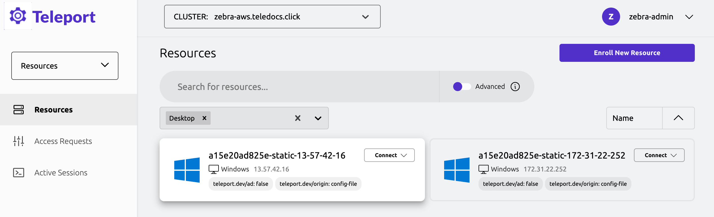
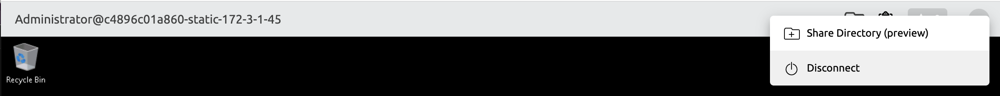

This guide demonstrates how to configure Teleport to provide secure, passwordless access
to Microsoft Windows desktops for local Windows users.

Passwordless access for local users is limited to 5 desktops in Teleport Community Edition.

If you have more than 5 desktops registered under `static_hosts` with `ad: false`, Teleport
Community Edition will not allow connections to any of them.

Teleport Enterprise users can have unlimited number of desktops.

## Prerequisites

To complete the steps in this guide, verify your environment meets the following requirements:

(!docs/pages/includes/edition-prereqs-tabs.mdx!)

- A Linux server to run the Teleport Windows Desktop Service.
  You can reuse an existing server running any other Teleport instance.
  However, you must generate a new invitation token to add the Windows Desktop Service
  to an existing Teleport instance.
- A physical or virtual machine running Microsoft Windows with Remote Desktop enabled
  and the RDP port (typically port 3389) open for inbound connections from the Linux server.
- (!docs/pages/includes/tctl.mdx!)

## Step 1/4. Prepare Windows

Before you can enroll a Microsoft Windows desktop as a resource to be protected by Teleport,
you need to prepare the Microsoft Windows environment with a certificate from the Teleport
certificate authority (CA) and modify the default authentication service for remote desktop
access.

To prepare a Windows computer:

1. Open a Command Prompt (`cmd.exe`) window on the Windows computer you want to enroll.

{/*lint ignore ordered-list-marker-value*/}
2. Export the Teleport user certificate authority by running the following
   command, assigning <Var name="teleport.example.com"/> to your
   Teleport cluster address:

   ```code
   $ curl.exe -fo teleport.cer https://<Var name="teleport.example.com"/>/webapi/auth/export?type=windows
   ```

   If you are using Teleport's support for HSM-backed keys, then your Teleport cluster
   has multiple user CAs (one for each Auth Service instance). You can download a bundle
   containing all CAs by appending `&format=zip` to the URL.

3. Download the Teleport Windows Auth setup program:

```code
$ curl.exe -fo teleport-windows-auth-setup-v(=teleport.version=)-amd64.exe https://cdn.teleport.dev/teleport-windows-auth-setup-v(=teleport.version=)-amd64.exe
```

4. Double-click the executable you downloaded to run the Teleport Windows Auth Setup program
   interactively and select the Teleport certificate that you exported when prompted.

   If you are using Teleport's support for HSM-backed keys and you downloaded a zip file in step 2,
   then you should extract the zip file and repeat the process below for each CA certificate.
   You can defer the reboot until you have installed all of the certificates.

   The setup program:

   - Enables Windows to trust the Teleport certificate authority.
   - Installs the required dynamic link library (DLL) for Teleport to use.
   - Disables Network Level Authentication (NLA) for remote desktop services.
   - Enables RemoteFX compression.

  In versions below Teleport 17.4.0, the Windows auth package for local users is
  "greedy" and attempts to process all smart card logins. This prevents smart
  card logins from outside of Teleport from working, and also makes it
  impossible to use Teleport to connect as Active Directory users. This is no
  longer the case with Teleport 17.4.0 and up. To connect as local users and
  Active Directory users on the same host, you need to register the host twice
  with Teleport, once with `ad: true` and once with `ad: false`.

  Note: in order for the Windows Local Security Authority (LSA) to load the Teleport DLL,
  [LSA protection](https://learn.microsoft.com/en-us/windows-server/security/credentials-protection-and-management/configuring-additional-lsa-protection)
  must be disabled.

{/*lint ignore ordered-list-marker-value*/}
5. Restart the computer.


If you want to automate the installation process, you can run the setup program from
an administrative Command Prompt or PowerShell console with the following command:

```code
$ teleport-windows-auth-setup-v(=teleport.version=)-amd64.exe install --cert=teleport.cer -r
```

## Step 2/4. Configure the Windows Desktop Service

Now that you have prepared the Windows computer to enroll in the cluster, the next steps
involve:

- Generating an invitation token on your administrative workstation.
- Configuring a Linux server to run the Windows Desktop Service.

To configure the Windows Desktop Service:

1. Sign in to the Teleport cluster from your administrative workstation to authenticate your identity.

1. Generate a short-lived invitation token by running the following command:

   ```code
   $ tctl tokens add --type=windowsdesktop
   ```

   The command displays information similar to the following:

   ```text
   The invite token: (=presets.tokens.first=)
   This token will expire in 60 minutes.
   ```

1. Copy the token from your administrative workstation and paste it into a file on the
Linux server where you want to run the Windows Desktop Service.

   For example, create a file named `/tmp/token` on the Linux server and paste the token
   into the file.

1. Check whether Teleport is installed on the Linux server where you want to run the
Windows Desktop Service by running the following command:

   ```code
   $ teleport version
   ```

   If Teleport isn't installed on the Linux server, follow the appropriate [Installation
instructions](../../installation.mdx#linux) for your environment.

1. Configure the `/etc/teleport.yaml` file on the Linux server with settings similar to the
following for the Windows Desktop Service:


   ```yml
   version: v3
   teleport:
     nodename: <Var name="windows.teleport.example.com" />
     proxy_server: <Var name="teleport.example.com" />:443
     auth_token: "/tmp/token"
   windows_desktop_service:
     enabled: true
     static_hosts:
     - name: host1
       ad: false
       addr: 192.0.2.156

   auth_service:
     enabled: false
   proxy_service:
     enabled: false
   ssh_service:
     enabled: false
   ```

   In this file:

   - Set the `proxy_server` to the address of your Teleport cluster.
   - List the Windows desktops under `static_hosts`.

   Teleport can't automatically discover Windows desktops without Active Directory.
   Therefore, you must specify the Windows IP addresses or host names that you want to
   enroll using the Teleport configuration file or use the Teleport API to build your own
   integration.

   You can find an example of API integration on
  [GitHub](https://github.com/gravitational/teleport/tree/master/examples/desktop-registration).

1. (Optional) Add labels for the Windows Desktop Service to the configuration file.

   You can add labels to Windows computers using the `labels` section of the host config. For example, the following
   adds the `datacenter: dc1` label:

   ```diff
   version: v3
   teleport:
     nodename: <Var name="windows.teleport.example.com" />
     proxy_server: teleport.example.com:443
     auth_token: /tmp/token
   windows_desktop_service:
     enabled: true
     static_hosts:
     - name: host1
       ad: false
       addr: 192.0.2.156
   +   labels:
   +     datacenter: dc1
   ```

   Alternatively, you can attach labels to Windows computers by matching to their hostnames.
   For example, the following adds the `cloud: ec2` label to computers that have
   host names ending with `.us-east-2.compute.internal`:

   ```diff
   version: v3
   teleport:
     nodename: <Var name="windows.teleport.example.com" />
     proxy_server: teleport-proxy.example.com:443
   windows_desktop_service:
     enabled: true
     static_hosts:
      - name: host1
        ad: false
   -    addr: 192.0.2.156
   +    addr: ip-192-0-2-156.us-east-2.compute.internal
   + host_labels:
   +    - match: '.*\.us-east-2.compute.internal'
   +      labels:
   +        cloud: ec2
   ```

   For more information about using labels and roles, see [Configure Windows-specific
   role permissions](./rbac.mdx).

1. (!docs/pages/includes/start-teleport.mdx service="the Teleport Windows Desktop Service"!)

## Step 3/4. Configure remote Windows desktop access

To access a remote desktop, a Teleport user must have a role with the
appropriate permissions for that desktop.

To configure a role for desktop access:

1. Sign in to the Teleport cluster from your administrative workstation to authenticate your identity.

1. Create a `windows-desktop-admins.yaml` file to define a new role:

   ```yaml
   kind: role
   version: v6
   metadata:
     name: windows-desktop-admins
   spec:
     allow:
       windows_desktop_labels:
         "*": "*"
       windows_desktop_logins: ["Administrator", "alice"]
   ```

   In this file:

   - Set `windows_desktop_labels` to specify any labels you want to use to allow or deny access to specific hosts.
   - Set `windows_desktop_logins` to specify the Windows logins that Teleport users assigned to the role
   can use to access Windows desktops.

   Depending on how you configure role-based access controls for Windows, Teleport can create local user logins
   automatically from the `windows_desktop_logins` you specify. For more information about enabling Teleport
   to create local Windows logins, see [Automatic User Creation](../../reference/agent-services/desktop-access-reference/user-creation.mdx).

1. Apply the new role to your cluster by running the following command:

   ```code
   $ tctl create -f windows-desktop-admins.yaml
   ```

   (!docs/pages/includes/create-role-using-web.mdx!)

1. (\!docs/pages/includes/add-role-to-user.mdx role="windows-desktop-admins" \!)

## Step 4/4. Connect

Now that you have configured a Linux server to run the Windows Desktop Service and
created a role to allow a Teleport user to connect to Microsoft Windows with a local
Windows login, you can use the Teleport user assigned the `windows-desktop-admins` role
to connect to Windows desktops from the Teleport Web UI.
Alternatively, you can connect using Teleport Connect.

To connect to a Windows desktop:

1. Sign in to the Teleport cluster using an account that's assigned the
`windows-desktop-admins` role.

1. Select **Resources**.

1. Click **Type**, then select **Desktops**.

1. Click **Connect** for the Windows desktop you want to access, then select the
Windows login to use for the connection.

   

   Teleport opens a remote desktop connection and starts recording the desktop session. When you're
   finished working with the Windows desktop, click the **More items** menu, then click **Disconnect**.

   

   To view the recording, select **Audit** in the Teleport Web UI, then click **Session Recordings** in the menu.

## Uninstall

(!docs/pages/includes/uninstall-windows-auth.mdx!)

## Next steps

For more general information about how to create, assign, and update roles, see [Access Controls
Getting Started](../../admin-guides/access-controls/getting-started.mdx).
For more specific information about configuring Windows-specific role permissions, see
[Role-Based Access Control for Desktops](./rbac.mdx).
