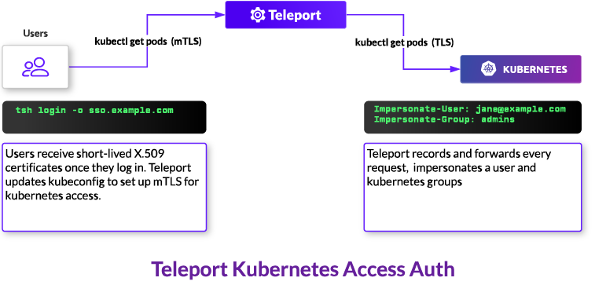

This guide explains the way the Teleport Kubernetes Service applies role-based
access controls when a Teleport user interacts with a Kubernetes cluster. The
Kubernetes Service intercepts requests to a Kubernetes API server and modifies
each request depending on the user's Teleport roles.

In this guide, we will show you how to configure the fields available in a
Teleport role to manage access to Kubernetes clusters you have connected to
Teleport.

For an example of how to use Teleport roles to manage access to Kubernetes with
a local `minikube` cluster, see our [RBAC how-to guide](./manage-access.mdx).

## Role fields for managing Kubernetes access

In this section, we will explain the fields within a Teleport role that
configure access to Kubernetes clusters.

To manage access to Kubernetes clusters, a Teleport role must include the
following fields in the `spec.allow` section:

- [`kubernetes_labels`](#kubernetes_labels)
- [`kubernetes_resources`](#kubernetes_resources)
- [`kubernetes_groups`](#kubernetes_groups-and-kubernetes_users)
- [`kubernetes_users`](#kubernetes_groups-and-kubernetes_users)

Here is an example of a Teleport role that restricts access to Kubernetes
clusters:

```yaml
kind: role
metadata:
  name: kube-access
version: v7
spec:
  allow:
    kubernetes_labels:
      'region': '*'
      'platform': 'minikube'
    kubernetes_resources:
      - kind: pod
        namespace: "production"
        name: "^webapp-[a-z0-9-]+$"
      - kind: pod
        namespace: "development"
        name: "*"
    kubernetes_groups:
    - developers
    kubernetes_users:
    - minikube
  deny: {}
```

### `kubernetes_labels`

You can add labels to a Kubernetes cluster when you register it with Teleport.
You can restrict a user's access to Kubernetes clusters with different labels
using a role's  `kubernetes_labels` field.

```yaml
kind: role
metadata:
  name: kube-access
version: v7
spec:
  allow:
    kubernetes_labels:
      'region': '*'
      'environment': 'development'
      # ...
  deny: {}
```

The value of the `kubernetes_labels` field is a mapping from label *keys* to one
or more label *values* (i.e., either a string or a list).

#### How the Kubernetes Service evaluates `kubernetes_labels`

If both the key and the value of a label are wildcards, `*`, the Teleport
Kubernetes Service allows the user to access Kubernetes clusters with all
labels:

```yaml
spec:
  allow:
    kubernetes_labels:
      '*': '*'
    # ...
```

Otherwise, the Kubernetes Service checks whether all of the keys in
`kubernetes_labels` match the keys corresponding to a registered Kubernetes
cluster. If they do not, there is no matching Kubernetes cluster, and the
Kubernetes Service denies the request.

For example, a cluster with labels that include the `environment` key but not
the `region` key would not match the `kubernetes_labels` field in the
`kube-access` role above.

The Kubernetes Service then retrieves the values of the Kubernetes cluster
labels with the keys in `kubernetes_labels`. The value of each key in
`kubernetes_labels` *must* match the value of a Kubernetes cluster's label
before the Kubernetes Service lets a user access the cluster.

For example, the `kube-access` role above allows a user to access Kubernetes
clusters with the `region` key and any value. It restricts the user to
Kubernetes clusters with the `environment` key and the `development` value. We
will explain valid values of keys within `kubernetes_labels` in the next
section.

#### Label values

For the key of a label in `kubernetes_labels` to match the key of a Kubernetes
cluster, the match must be exact. For values, however, you can configure regular
expressions, wildcards, and multiple values to provide flexibility.

##### Regular expressions and wildcards

You can use regular expressions or wildcard characters to match subsets or
variations of a string. If a value begins with `^` and ends in `$`, the
Kubernetes Service will treat it as a regular expression using Go's `re2` syntax
(see the `re2` [README](https://github.com/google/re2/wiki/Syntax)).

Otherwise, the Kubernetes Service evaluates wildcards within the value, matching
them to any sequence of characters in a label.

Here is an example:

```yaml
spec:
  allow:
    kubernetes_labels:
      'region': 'us-east-*'
      'team': '^data-eng-[a-z-]+$'
    # ...
```

This `allow` rule matches clusters with the labels `region:us-east-1` and
`region:us-east-2b`. It also matches clusters with the labels
`team:data-eng-analytics` and `team:data-eng-ml-training`.

##### Multiple values

If a key in `kubernetes_labels` has multiple values, the Kubernetes Service will
consider the label values a match if **any** of these values match a Kubernetes
cluster's labels. For example, this `kubernetes_labels` configuration matches
clusters with the `region:us-east-2` label and either the `development` or
`staging` environments:

```yaml
spec:
  allow:
    kubernetes_labels:
      'region': 'us-east-*'
      'environment': ['development', 'staging']
    # ...
```

#### Applying labels

You can apply labels to an instance of the Teleport Kubernetes Service. The way
to do this depends on how you have launched the service:

<Tabs>
  <TabItem label="Helm">
  Set labels when installing or upgrading the `teleport-kube-agent` Helm chart,
  e.g.:

    ```code
    $ helm upgrade teleport-agent teleport-kube-agent --set kubeClusterName={CLUSTER?}\
      --set proxyAddr=${PROXY?} --set authToken=${TOKEN?} --create-namespace --namespace=teleport-agent\
      --set labels.env=prod --set labels.region=us-west-1
    ```
  </TabItem>

  <TabItem label="Config">
  Set labels when enabling the Teleport Kubernetes Service in a `teleport`
  instance's configuration file:

    ```yaml
    kubernetes_service:
      enabled: true
      kube_cluster_name: cookie
      labels:
        env: prod
        region: us-west-1
    ```
  </TabItem>
</Tabs>

### `kubernetes_groups` and `kubernetes_users`

The Teleport Kubernetes Service receives requests from end users, e.g., via
`kubectl`, and forwards them to a Kubernetes API server. The Kubernetes Service
uses  [impersonation
headers](https://kubernetes.io/docs/reference/access-authn-authz/authentication/#user-impersonation)
to send requests to the API server with one Kubernetes user and zero or more
Kubernetes groups.



The `kubernetes_users` and `kubernetes_groups` fields indicate which users and
groups to allow a user to assume when they send requests to a Kubernetes API
server:

```yaml
kind: role
metadata:
  name: kube-access
version: v7
spec:
  allow:
    kubernetes_groups:
    - developers
    - viewers
    kubernetes_users:
    - myuser
    - system:serviceaccount:someNamespace:saName # Service account name
    # ...
  deny: {}
```

The value of `kubernetes_groups` and `kubernetes_users` is a list of names of
groups, users, or service accounts to enable impersonation for.

#### Kubernetes Users and Groups

Kubernetes Users and Groups are entities that exist in
the Kubernetes Cluster and for which permissions are controlled through
`ClusterRoleBinding` or `RoleBinding` resources. If they do not
exist in the cluster, Kubernetes RBAC will ignore them.

Here's an example of a `ClusterRoleBinding` resource that assigns the built-in `view`
`ClusterRole` to a Group `cluster-viewer-group` and to a User `cluster-viewer-user`:

```yaml
apiVersion: rbac.authorization.k8s.io/v1
kind: ClusterRoleBinding
metadata:
  name: cluster-viewer
roleRef:
  apiGroup: rbac.authorization.k8s.io
  kind: ClusterRole
  name: view
subjects:
- apiGroup: rbac.authorization.k8s.io
  kind: Group
  name: cluster-viewer-group
- apiGroup: rbac.authorization.k8s.io
  kind: User
  name: cluster-viewer-user
```

At this point, the User and the Group have the same permissions to view resources
in Kubernetes Namespaces. It's not mandatory to assign the same permissions to
Kubernetes Users and Groups as Kubernetes merges the permissions associated with
the impersonation principals used in the request.

#### Kubernetes Service Accounts

Teleport supports Service Account impersonation by using the fully-qualified
name of the Service Account in the `kubernetes_users` field.

The Service Account's fully-qualified name consists of the following pattern:

```
system:serviceaccount:<namespace>:<service_account_name>
```

The FQN must be prefixed with `system:serviceaccount:`, otherwise Kubernetes will
evaluate it as a normal User.

An example of a role that impersonates a Service Account can be found below.

```yaml
kind: role
metadata:
  name: kube-access-impersonate-sa
version: v7
spec:
  allow:
    kubernetes_users:
    - system:serviceaccount:someNamespace:saName
    # ...
  deny: {}
```

#### How Teleport users impersonate Kubernetes Users, Groups and Service Accounts

There are two ways for an end user to specify which user or service account and groups
to impersonate:

##### Manually

When a user runs `tsh kube login` to authenticate to a Kubernetes cluster, they
can use the `--as` and `--as-groups` flags to manually specify the user and
groups to authenticate as. The Teleport Kubernetes Service determines whether
the user and groups belong to a user's `kubernetes_users` and
`kubernetes_groups` configuration and, if not, denies the user access.

##### Automatically

If the user has not explicitly determined a Kubernetes user and Kubernetes
groups when authenticating to a cluster, the Teleport Kubernetes Service
determines this from the `kubernetes_users` and `kubernetes_groups` fields in a
user's roles.

If a user has exactly one value in `kubernetes_users`, the Teleport Kubernetes
Service impersonates that user. If there are no values in `kubernetes_users`,
the Kubernetes Service uses the user's Teleport username.

The Kubernetes Service will deny a request if a user has multiple
`kubernetes_users` and has not specified one when authenticating to a cluster
(i.e., using the `--as` flag described in the previous section).

If the user has not specified a Kubernetes group to impersonate, the Kubernetes
Service uses all values within `kubernetes_groups`.

With the `kube-access` role above, after you authenticate to Teleport, the
Kubernetes Service uses impersonation headers to forward requests to the API
server with the `developers` group and the `myuser` Kubernetes user.

#### Enabling impersonation

To enable the Kubernetes Service to forward user requests with impersonation
headers, you must ensure that its service account has permissions to impersonate
Kubernetes RBAC principals within your cluster. The Kubernetes Service denies
requests to impersonate any user or group that a user does not have access to.

Below is a Kubernetes `ClusterRole` that grants the minimum set of permissions
to enable impersonation, and a `ClusterRoleBinding` that grants these
permissions to a service account.

<Admonition type="tip">

There is usually no need to define these resources manually. The [manual
methods](register-clusters/register-clusters.mdx) and [automatic methods](../auto-discovery/kubernetes/kubernetes.mdx) for
registering Kubernetes clusters with Teleport include steps for setting up the
Kubernetes RBAC resources that Teleport needs to allow access to clusters.

</Admonition>

```yaml
apiVersion: rbac.authorization.k8s.io/v1
kind: ClusterRole
metadata:
  name: teleport-impersonation
rules:
- apiGroups:
  - ""
  resources:
  - users
  - groups
  - serviceaccounts
  verbs:
  - impersonate
- apiGroups:
  - ""
  resources:
  - pods
  verbs:
  - get
- apiGroups:
  - "authorization.k8s.io"
  resources:
  - selfsubjectaccessreviews
  verbs:
  - create
---
apiVersion: rbac.authorization.k8s.io/v1
kind: ClusterRoleBinding
metadata:
  name: teleport
roleRef:
  apiGroup: rbac.authorization.k8s.io
  kind: ClusterRole
  name: teleport-impersonation
subjects:
- kind: ServiceAccount
  name: teleport-serviceaccount
  namespace: default
```

#### Specifying groups and users based on user traits

You can specify Kubernetes groups and users for each Teleport user individually,
rather than hardcoding this information into your Teleport roles. To do so, you
can add template variables to Teleport your roles, and the Teleport Auth Service
will populate them with information from each authenticating user.

For more information on how template variable expansion works in Teleport roles,
see the [Teleport Zero Trust Access Controls
Reference](../../reference/access-controls/roles.mdx).

##### Single Sign-On provider traits

Teleport's roles map OIDC claims or SAML attributes using template variables.
The Teleport Auth Service will substitute any template variable in the format
`{{external.*}}` with the corresponding SAML attribute or OIDC claim:

```yaml
kind: role
version: v7
metadata:
  name: group-member
spec:
  allow:
    kubernetes_groups: ["{{external.groups}}"]
    kubernetes_users: ["{{external.kube_username}}"]
    # ...
```

If a user authenticates to Teleport via a SAML connector, for example, and the
user has a `kube_username` attribute with the value `myuser` and a `groups` attribute
with values `developers` and `viewers`, the `group-member` role above will
evaluate to the following:

```yaml
kind: role
version: v7
metadata:
  name: group-member
spec:
  allow:
    kubernetes_groups: ["developers", "viewers"]
    kubernetes_users: ["myuser"]
    # ...
```

##### Local user traits

For local users, you can specify arbitrary key-value data in the `spec.traits`
field of a `user` resource, then use the `{{external.*}}` template variable in a
role to refer to those traits.

For example, this role fills in `kubernetes_users` and `kubernetes_groups` with
internal traits:

```yaml
kind: role
version: v7
metadata:
  name: group-member
spec:
  allow:
    kubernetes_groups: ["{{external.groups}}"]
    kubernetes_users: ["{{external.kube_username}}"]
    # ...
```

You can then supply the values for these template variables when creating or
modifying a local user. For example, this user definition includes traits
that the Auth Service will use to populate the role definition above:

```yaml
kind: user
version: v2
metadata:
  name: alice
spec:
  roles:
    - group-member
  traits:
    groups:
      - developers
      - viewers
    kube_username:
      - myuser
```

### `kubernetes_resources`

The `kubernetes_resources` field enables a Teleport role to configure access to
specific resources in a Kubernetes cluster:

```yaml
kind: role
metadata:
  name: kube-access
version: v7
spec:
  allow:
    kubernetes_labels:
      '*':'*'
    kubernetes_resources:
      - kind: pod
        namespace: "production"
        name: "webapp"
        verbs: ['*']
    # ...
```

The value of this field is a list of mappings, where each mapping has four
fields:

- `kind`: The kind of resource to enable access to. Currently, Teleport supports
the following kinds:

  | Kind | Grants access to |
  | ---- | ----------- |
  | `*` | All resources |
  | `pod` | Pods |
  | `secret` | Secrets |
  | `configmap` | ConfigMaps |
  | `namespace` | Namespaces and all resources within |
  | `service` | Services |
  | `serviceaccount` | ServiceAccounts |
  | `kube_node` | Nodes |
  | `persistentvolume` | PersistentVolumes |
  | `persistentvolumeclaim` | PersistentVolumeClaims |
  | `deployment` | Deployments |
  | `replicaset` | ReplicaSets |
  | `statefulset` | StatefulSets |
  | `daemonset` | DaemonSets |
  | `clusterrole` | ClusterRoles |
  | `kube_role` | Roles |
  | `clusterrolebinding` | ClusterRoleBindings |
  | `rolebinding` | RoleBindings |
  | `cronjob` | CronJobs |
  | `job` | Jobs |
  | `certificatesigningrequest` | CertificateSigningRequests |
  | `ingress` | Ingresses |

- `namespace`: The Kubernetes namespace in which to allow access to a resource.
  In the `kube-access` role, we are allowing access to a pod in the
  `production` namespace.

- `name`: The name of the pod to allow access to. In `kube-access`, this is
  the `webapp` pod.

- `verbs`: The operations to allow on the resource. Currently, Teleport supports:

  | Verb | Grants access to |
  | ---- | ----------- |
  | `*` | All operations |
  | `get` | Read a resource |
  | `list` | List resources |
  | `create` | Create a resource |
  | `update` | Update a resource |
  | `patch` | Patch a resource |
  | `delete` | Delete a resource |
  | `deletecollection` | Delete a collection of resources |
  | `watch` | Watch resources |
  | `portforward` | Create portforward requests for Pods |
  | `exec` | Execute commands in Pods |

For both the `namespace` and `name` fields, you can add a wildcard character
(`*`) to replace any sequence of characters. For example, `name: "pod-*-*"`
matches pods named `pod-1-a` and `pod-2-c`. As with `kubernetes_labels`, if a
value begins with `^` and ends in `$`, the Kubernetes Service will treat it as a
regular expression using Go's `re2` syntax (see the `re2`
[README](https://github.com/google/re2/wiki/Syntax)).

<Admonition type="tip" >
For a user to access a pod named in a role's `kubernetes_resources` field, the user
must be assigned a Teleport role that contains at least one value within
`kubernetes_groups` or `kubernetes_users`. Teleport does not alter Kubernetes
roles to allow or deny access. Read the next section for an explanation of how the
Kubernetes Service evaluates Teleport roles in order to allow or deny access to
pods in a cluster.
</Admonition>

## How the Kubernetes Service evaluates Teleport roles

When a Teleport user makes a request to a Kubernetes cluster's API server, the
Teleport Kubernetes Service intercepts the request and inspects the user's
authorization. The Kubernetes Service denies the request if the user is not
authorized to view a particular resource. If the user *is* authorized to perform
their request, the Kubernetes Service modifies the request and forwards it to
the appropriate API server.

### Authorizing user requests

When the Teleport Kubernetes Service receives a request, it evaluates two fields
within the user's roles. If either of these fields does not allow the user to
perform the request, the Kubernetes Service returns an error to the user:

#### `kubernetes_labels`

The Teleport Kubernetes Service will only allow a user access to a pod if the
cluster where the pod is running has a label that matches a user's
`kubernetes_labels` configuration.

#### `kubernetes_resources`

Some resource URIs within the Kubernetes API server include the names of
specific resources.

For example, if a user runs `kubectl exec` to execute a command against the
`webapp` pod in the `development` namespace, `kubectl` sends a request to the
target cluster's API server at the following path:

```
"/api/v1/namespaces/development/pods/webapp/exec"
```

If a Kubernetes pod is available within the URL path of the request to a
Kubernetes API server, the Teleport Kubernetes Service will check whether the
user is authorized to access that pod.

In the example above, the Kubernetes Service checks if the user is authorized to
access the `webapp` pod in the `development` namespace and, if not, denies the
request.

### Forwarding user requests

Once the Teleport Kubernetes Service has authorized the user to perform a
request against a Kubernetes cluster and (if applicable) a particular resource,
it assembles a request to the upstream API server. It adds impersonation headers
to the request based on the `kubernetes_groups` and `kubernetes_users` fields in
the user's role (see the [discussion of these
fields](#kubernetes_groups-and-kubernetes_users) earlier).

Because the Teleport Kubernetes Service accesses the upstream API server via the
RBAC principals listed in the Teleport user's `kubernetes_groups` and
`kubernetes_users` fields, the principals you specify in these fields must have
access to the resources listed in the user's `kubernetes_resources` field.
Otherwise, the Kubernetes Service will forward a request to the upstream API
server with improper authorization, and the API server will deny the request.

### Multiple roles

#### How the Kubernetes Service evaluates multiple roles

Before evaluating a user's request to a Kubernetes API server, the Teleport
Kubernetes Service checks each of the user's roles. If one role's
`spec.allow.kubernetes_labels` or `spec.allow.kubernetes_resources` conditions
do not match the user's request, the Kubernetes Service checks the next role,
and so on.

If the Kubernetes Service finds a role with a `spec.allow` condition that
matches all of the cluster's labels and the request's resources, it looks up the
role's `allow.kubernetes_groups` and `allow.kubernetes_users` fields. It adds
these values to a list of RBAC principals it will use to write impersonation
headers later on.

Next, the Kubernetes Service checks each of the user's roles for `spec.deny`
conditions. If one role's `spec.deny.kubernetes_labels` or
`spec.deny.kubernetes_resources` fields match the user's request, the Kubernetes
Service looks up the role's `spec.deny.kubernetes_groups` and
`spec.deny.kubernetes_users` fields. It removes each of these values from the
list of users and groups it created earlier, denying the user access to these
RBAC principals.

#### Example

Let's say you have assigned the following three roles to a user:

```yaml
kind: role
metadata:
  name: allow-dev-us-east-2
version: v7
spec:
  allow:
    kubernetes_labels:
      - "region": "us-east-2"
    kubernetes_resources:
      - kind: pod
        namespace: "development"
        name: "redis-*"
      - kind: pod
        namespace: "development"
        name: "nginx-*"
    kubernetes_groups:
      - dev-viewers # Allows the user to view pods in the development namespace
---
kind: role
metadata:
  name: allow-exec
  version: v7
spec:
  allow:
    kubernetes_labels:
      - "*": "*"
    kubernetes_resources:
      - kind: pod
        namespace: "*"
        name: "*"
    kubernetes_groups:
      - executors # Allows the user to execute commands against any pod
---
kind: role
metadata:
  name: deny-redis-exec
  version: v7
spec:
  deny:
    kubernetes_resources:
      - kind: pod
        namespace: "*"
        name: "redis-*"
    kubernetes_groups:
      - executors
```

The `dev-viewers` Kubernetes group allows the user to view pods in the
`development` namespace. The `executors` Kubernetes group allows the user to
execute commands against any pod in any namespace.

If a user with these roles runs `kubectl get pods/redis-1` in the `development`
namespace, and the cluster has the label `region:us-east-2`, the Kubernetes
Service will accept the request. Since the `deny-redis-exec` role denies the
`executors` group for `redis-*` pods, the Kubernetes Service will forward the
request while impersonating the `dev-viewers` group but *not* the `executors`
group,

However, if the same user runs `kubectl exec -it nginx /bin/bash` in the
`development` namespace, against the same cluster, the Kubernetes Service will
forward the request with an impersonation header for both the `dev-viewers` and
the `executors` groups, since the `deny-redis-exec` role's `deny` condition does
not match the request.

#### Progressively enabling access to resources

You can design your Teleport and Kubernetes RBAC to progressively allow access
to limited subsets of Kubernetes resources. In other words, your users would
have limited access to a wide range of resources in your Kubernetes cluster.
Subsets of these users would have greater access to more limited sets of
resources. Of *these* subsets of users, you can assign an even smaller group
greater access to another set of resources, and so on.

To do this, define multiple Teleport roles where:

- Some roles enable a lower degree of access to more Kubernetes resources
- Other roles allow a higher degree of access to fewer Kubernetes resources

You can then assign combinations of roles to different users.

For example, this combination of roles allows a user to view all pods in all
registered Kubernetes clusters, but only run `kubectl exec` or `kubectl logs` on
`nginx-*` pods:

```yaml
kind: role
metadata:
  name: kube-viewer
version: v7
spec:
  allow:
    kubernetes_labels:
      '*': '*'
    kubernetes_resources:
      - kind: pod
        namespace: "*"
        name: "*"
    kubernetes_groups:
    - viewer # can get and list pods but not execute commands or retrieve logs
---
kind: role
metadata:
  name: nginx-exec
version: v7
spec:
  allow:
    kubernetes_labels:
      '*': '*'
    kubernetes_resources:
      - kind: pod
        namespace: "*"
        name: "nginx-*"
    kubernetes_groups:
    - execAndLogs
```

In this case, the `kube-viewer` role maps a user to the Kubernetes `viewer`
group, which allows a user to get and list pods but not execute commands and
retrieve logs. With the `nginx-exec` role, the user can access the `execAndLogs`
group, which can execute commands and retrieve logs, but only on `nginx` pods.

In this setup, you could also combine the `kube-viewer` role with other roles
that grant elevated access to subsets of pods, depending on the requirements of
your Teleport users.

### Security consideration: Resource namespace restrictions

When a Teleport user sends a request to list pods, e.g., with `kubectl get
pods`, the Teleport Kubernetes Service does the following:

- Retrieves available pods from the upstream Kubernetes API server, adding
  impersonation headers to the request based on the user's Teleport roles. These
  include the Kubernetes user and groups the user sends the request as.
- Filters the list of available pods based on the pods that the user is
  authorized to access via `kubernetes_resources`.
- Returns the list of pods to the user.

To avoid leaking resources unintentionally, you should ensure that namespace
restrictions in your Kubernetes RBAC line up with those you have set up in
Teleport.

For example, let's say a user has a Teleport role that grants access to any pod
in any namespace, and maps that user to the `default-pod-viewer` Kubernetes
group. This group can only view pods in the `default` namespace:

```yaml
kind: role
metadata:
  name: kube-access-1
version: v7
spec:
  allow:
    kubernetes_groups:
      - default-pod-viewer
    kubernetes_resources:
      - kind: pod
        namespace: "*"
        name: "*"
    # ...
```

The user has a second Teleport role that maps the user to the `system:masters`
Kubernetes group (which can access any pod in any namespace), and grants access
only to the `webapp` pod in the `default` namespace:

```yaml
metadata:
  name: kube-access-2
version: v7
spec:
  allow:
    kubernetes_groups:
      - system:masters
    kubernetes_resources:
      - kind: pod
        namespace: "default"
        name: "webapp"
    # ...
```

Since the `kube-access-2` role maps the user to `system:masters`, when the
Kubernetes Service forwards a request from this user, it will fetch all pods
from the Kubernetes cluster by adding the `system:masters` group to the
request's impersonation headers.

However, since the user also has a role (`kube-access-1`) that allows access to
all pods in all namespaces, the Kubernetes Service will not filter the pods it
retrieved via its first request to the API server.

In other words, the Kubernetes Service has no way to know that Teleport had
mapped the user to the `system:masters` group in order to grant access to only
the `webapp` pod in the `default` namespace.

If you have namespace restrictions in your Teleport RBAC, you should
make sure that the same namespace restrictions exist in the Kubernetes RBAC
resources you map to your Teleport users.

For example, you should rewrite the `kube-access-1` role to have the following
permissions, restricting the user to pods in the `default` namespace:

```yaml
kind: role
metadata:
  name: kube-access-1
version: v7
spec:
  allow:
    kubernetes_groups:
      - default-pod-viewer
    kubernetes_resources:
      - kind: pod
        namespace: "default"
        name: "*"
```    # ...
