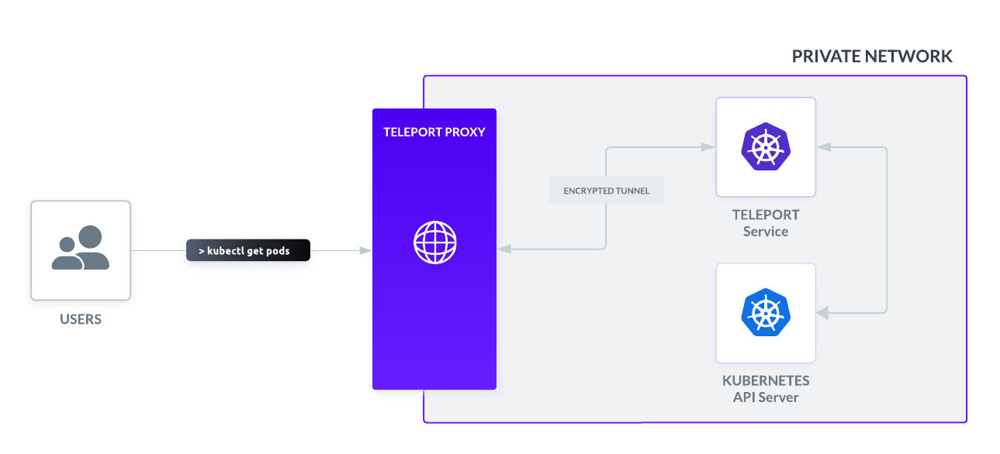

This guide demonstrates how to enroll a Kubernetes cluster as a Teleport
resource by deploying the Teleport Kubernetes Service on the Kubernetes cluster
you want to protect. 

In this scenario, the Teleport Kubernetes Service pod detects that it is running
on Kubernetes and enrolls the Kubernetes cluster automatically. The following
diagram provides a simplified overview of this deployment scenario with the
Teleport Kubernetes Service running on the Kubernetes cluster:



For information about other ways to enroll and discover Kubernetes clusters, see
[Registering Kubernetes Clusters with Teleport](register-clusters/register-clusters.mdx).

## Prerequisites

- Access to a running Teleport cluster, `tctl` admin tool, and `tsh` client tool, 
  version >= (=teleport.version=). 

  You can verify the tools you have installed by running the following commands:

  ```code
  $ tctl version
  # Teleport v(=teleport.version=) go(=teleport.golang=)

  $ tsh version
  # Teleport v(=teleport.version=) go(=teleport.golang=)
  ```
  
  You can download these tools by following the appropriate [Installation 
  instructions](../../installation.mdx#linux) for your environment.

(!docs/pages/includes/kubernetes-access/helm-k8s.mdx!)

- (!docs/pages/includes/tctl.mdx!)

## Step 1/3. Create RBAC resources

To authenticate to a Kubernetes cluster using Teleport, you must have a Teleport
role that grants access to the Kubernetes cluster you plan to interact with.

In this step, we show you how to create a Teleport role called `kube-access`
that enables a user to send requests to any Teleport-protected Kubernetes
cluster as a member of the `viewers` group. The Teleport Kubernetes Service
impersonates the `viewers` group when proxying requests from the user.

1. Create a file called `kube-access.yaml` with the following content:
   
   ```yaml
   kind: role
   metadata:
     name: kube-access
   version: v7
   spec:
     allow:
       kubernetes_labels:
         '*': '*'
       kubernetes_resources:
         - kind: '*'
           namespace: '*'
           name: '*'
           verbs: ['*']
       kubernetes_groups:
       - viewers
     deny: {}
   ```

1. Apply your changes:

   ```code
   $ tctl create -f kube-access.yaml
   ```

1. (!docs/pages/includes/add-role-to-user.mdx role="kube-access"!)

While you have authorized the `kube-access` role to access Kubernetes clusters
as a member of the `viewers` group, this group does not yet have permissions
within its Kubernetes cluster. To assign these permissions, create a Kubernetes
`RoleBinding` or `ClusterRoleBindings` that grants permission to the `viewers`
group.
   
1. Create a file called `viewers-bind.yaml` with the following contents:

   ```yaml
   apiVersion: rbac.authorization.k8s.io/v1
   kind: ClusterRoleBinding
   metadata:
     name: viewers-crb
   subjects:
   - kind: Group
     # Bind the group "viewers" to the kubernetes_groups assigned in the "kube-access" role
     name: viewers
     apiGroup: rbac.authorization.k8s.io
   roleRef:
     kind: ClusterRole
     # "view" is a default ClusterRole that grants read-only access to resources
     # See: https://kubernetes.io/docs/reference/access-authn-authz/rbac/#user-facing-roles
     name: view
     apiGroup: rbac.authorization.k8s.io
   ```

1. Apply the `ClusterRoleBinding` with `kubectl`:
   
   ```code
   $ kubectl apply -f viewers-bind.yaml
   ```

Your Teleport user now has permissions to assume membership in the `viewers`
group when accessing your Kubernetes cluster, and the `viewers` group now has
permissions to view resources in the cluster. The next step is to deploy the
Teleport Kubernetes Service in the cluster to proxy user requests.

## Step 2/3. Follow guided enrollment instructions

In this step, you will deploy the Teleport Kubernetes Service on your Kubernetes
cluster by copying a script from the Teleport Web UI and running it on your
terminal.

1. Open the Teleport Web UI and sign in using your administrative account.

1. Click **Enroll New Resource**.

1. Type all or part of **Kubernetes** in the Search field to filter the resource types 
   displayed, then click **Kubernetes**.

1. Copy the command to add the `teleport-agent` chart repository and paste 
   it in a terminal on your workstation.

1. Type `teleport-agent` for namespace where you will deploy the Teleport
   Kubernetes Service and the display name to use when connecting to this
   cluster, then click **Next**.

   After you click Next, Teleport generates a script to configure and enroll the 
   Kubernetes cluster as a resource in the Teleport cluster.

1. Copy the command displayed in the Teleport Web UI and run it in your
   terminal.

   The Teleport Web UI displays "Successfully detected your new Kubernetes cluster" as 
   confirmation that your cluster is enrolled. When you see this message, click **Next**
   to continue.

## Step 3/3. Test Kubernetes access

Now that you have deployed the Teleport Kubernetes Service on your Kubernetes
cluster and enrolled the cluster as a Teleport resource, confirm that you can
access your Kubernetes cluster as a member of the `viewers` group.

If you followed the previous steps in this guide, the **Set Up Access** view
populates the **Kubernetes Groups** field with `viewers`.

To set up and test access:

1. Click **Next**.

1. Specify the `teleport-agent` namespace, the Kubernetes `viewers` group from
   the previous step, and your Teleport user name.

1. Copy and run the commands displayed in the Teleport Web UI to interact with the
   Kubernetes cluster and verify access through Teleport. Alternatively, run the
   commands shown below:

   Authenticate to your Teleport cluster, assigning 
   <Var name="teleport.example.com"/> to your cluster domain and 
   <Var name="admin@example.com"/> to your Teleport username:

   ```code
   $ tsh login --proxy=<Var name="teleport.example.com"/>:443 --auth=local --user=<Var name="admin@example.com"/> <Var name="teleport.example.com"/>
   ```

   List Kubernetes clusters available for you to access:

   ```code
   $ tsh kube ls
   ```

   Retrieve credentials to access your Kubernetes cluster, replacing 
   <Var name="Kubernetes-cluster-name"/> with your Kubernetes cluster name:

   ```code
   $ tsh kube login <Var name="Kubernetes-cluster-name"/>
   ```

   The Teleport Kubernetes Service proxies `kubectl` commands: 

   ```code
   $ kubectl get pods -n teleport-agent
   ```

   You should see the Teleport Kubernetes Service pod you deployed earlier:

   ```text
   NAME               READY   STATUS    RESTARTS   AGE
   teleport-agent-0   1/1     Running   0          8m6s
   ```

1. Click **Finish**.

## Next steps

This guide demonstrated how to enroll a Kubernetes cluster by running the
Teleport Kubernetes Service within the Kubernetes cluster. 

- For information about discovering Kubernetes clusters hosted on cloud providers, see 
[Kubernetes Cluster Discovery](../auto-discovery/kubernetes/kubernetes.mdx). 
- To learn about other ways you can register a Kubernetes cluster with Teleport, see 
[Registering Kubernetes Clusters with Teleport](register-clusters/register-clusters.mdx).
- For a complete list of the parameters you can configure in the `teleport-kube-agent` 
helm chart, see the [Chart Reference](../../reference/helm-reference/teleport-kube-agent.mdx).
