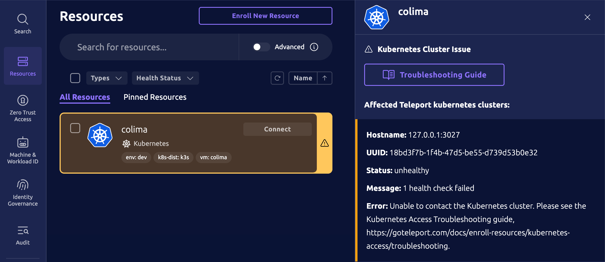

This documentation provides an overview of Kubernetes cluster health checks with Teleport. Teleport Kubernetes Service instances periodically check the connectivity and permissions of enrolled Kubernetes clusters. 

Kubernetes cluster health checks are available in Teleport version (= kubernetes.health_check_min_version =) and later.

Teleport Kubernetes health checks provide:

- **Observability**: Discover network and permission issues before users do. Unhealthy Kubernetes clusters are visible in a Teleport UI, command line tool, or Prometheus metrics.
- **High Availability**: Automatically route and distribute connections to healthy Kubernetes clusters in a high-availability configuration.

## How Kubernetes health checks work

The Teleport Kubernetes Service checks Kubernetes permissions and health endpoint to determine whether a Kubernetes cluster is both up and usable with Teleport.

Four Kubernetes RBAC permissions are routinely checked with the Kubernetes [SelfSubjectAccessReview](https://kubernetes.io/docs/reference/kubernetes-api/authorization-resources/self-subject-access-review-v1/) API. The permissions are part of minimum requirements for Teleport to work with a Kubernetes cluster. The checked permissions are:
- Impersonate users
- Impersonate groups
- Impersonate service accounts
- Get pods

If a permission can't be checked, the Kubernetes cluster's [/readyz](https://kubernetes.io/docs/reference/using-api/health-checks/) endpoint is called to further distinguish connection errors and Kubernetes component errors.

## Health states

A Kubernetes cluster is in a `healthy`, `unhealthy`, or `unknown` state.
- `healthy` indicates a Kubernetes cluster's health was checked and is fine
- `unhealthy` indicates a Kubernetes cluster's health was checked and is not usable for some reason
- `unknown` indicates a Kubernetes cluster has been excluded from health checks, or the first health check is initializing

<Admonition type="warning">

`unknown` Kubernetes clusters may be unhealthy.

`unknown` Kubernetes clusters are not checked for health due to:
- Running a pre-(= kubernetes.health_check_min_version =) version of Teleport Kubernetes Service instances
- Explicitly disabling `health_check_config`
- Explicitly configuring `health_check_config` labels to exclude a Kubernetes cluster
</Admonition>

## Viewing health

Kubernetes cluster health is viewed through the Teleport web UI, desktop Connect UI, `tctl` CLI tool, or Prometheus metrics.

### Teleport Web UI and Teleport Connect

The Teleport web and Connect UI highlight unhealthy Kubernetes clusters.

Clicking a highlighted Kubernetes cluster shows details of an unhealthy Kubernetes cluster.



It may take approximately `5m` for a health change to be reported.
{/* TODO(gavin): delete this line when we fix health status reporting delay */}

Click the circular arrow refresh icon to get the latest health status. 

### Teleport `tctl` CLI

The Teleport `tctl` CLI tool searches and displays unhealthy Kubernetes clusters.
```code
tctl kube ls --query 'health.status == "unhealthy"' 
```

Run `tctl get kube_server/<your-kube-server-name>` for an overview of Kubernetes cluster health for a specific Kubernetes service.
```yaml
kind: kube_server
...
status:
  target_health:
    address: 192.168.106.2:58458
    message: 1 health check passed
    protocol: http
    status: healthy
    transition_reason: threshold_reached
    transition_timestamp: "2025-10-13T19:26:58.842855Z"
version: v3
```

### Teleport Prometheus metrics

Health check metrics offer a high-level view of Kubernetes cluster health. The total number of Kubernetes clusters in a `healthy`, `unhealthy`, or `unknown` state are monitored with gauge metrics `teleport_resources_health_status_healthy`, `teleport_resources_health_status_unhealthy`, and `teleport_resources_health_status_unknown`.

- `teleport_resources_health_status_healthy{type="kubernetes"}` is the total number of _healthy_ Kubernetes clusters
- `teleport_resources_health_status_unhealthy{type="kubernetes"}` is the total number of _unhealthy_ Kubernetes clusters
- `teleport_resources_health_status_unknown{type="kubernetes"}` is the total number of Kubernetes clusters in an _unknown_ state

A [PromQL](https://prometheus.io/docs/prometheus/latest/querying/basics/) expression may be used to determine the total number of Kubernetes clusters.
```promql
teleport_resources_health_status_healthy{type="kubernetes"} +
teleport_resources_health_status_unhealthy{type="kubernetes"} +
teleport_resources_health_status_unknown{type="kubernetes"}
```

A PromQL expression may be used to detect the presence of unhealthy Kubernetes clusters.
```promql
teleport_resources_health_status_unhealthy{type="kubernetes"} > 0
```

<Admonition type="note">
Prometheus metrics don't distinguish which cluster is unhealthy.

To determine which cluster is unhealthy, use the Teleport Web UI, Teleport Connect, or the following `tctl` command:

```code
$ tctl kube ls --query 'health.status == "unhealthy"'
```
</Admonition>

Health check metrics may also be viewed with the Teleport diagnostic endpoint `http://<diagnostic-address>/metrics`.
```text
# HELP teleport_resources_health_status_healthy Number of healthy resources
# TYPE teleport_resources_health_status_healthy gauge
teleport_resources_health_status_healthy{type="kubernetes"} 99972
# HELP teleport_resources_health_status_unhealthy Number of unhealthy resources
# TYPE teleport_resources_health_status_unhealthy gauge
teleport_resources_health_status_unhealthy{type="kubernetes"} 3
# HELP teleport_resources_health_status_unknown Number of resources in an unknown health state
# TYPE teleport_resources_health_status_unknown gauge
teleport_resources_health_status_unknown{type="kubernetes"} 25
```

Diagnostic endpoint metrics are disabled by default. See [Monitoring your Teleport deployment](../../zero-trust-access/management/diagnostics/diagnostics.mdx) to learn how to enable diagnostic metrics.

## Configuring health checks

The Teleport `tctl` CLI tool enables reading, adding, editing, and deleting `health_check_config` resources.

`health_check_config` resources offer a way to configure and selectively apply health checks to Kubernetes clusters.

An example `health_check_config`.
```yaml
kind: health_check_config
version: v1
metadata:
  name: example
  description: Example healthcheck configuration
spec:
  # interval is the time between each health check. Default 30s.
  interval: 30s
  # timeout is the health check connection establishment timeout. Default 5s.
  timeout: 5s
  # healthy_threshold is the number of consecutive passing health checks
  # after which a target's health status becomes "healthy". Default 2.
  healthy_threshold: 2
  # unhealthy_threshold is the number of consecutive failing health checks
  # after which a target's health status becomes "unhealthy". Default 1.
  unhealthy_threshold: 1
  # match is used to select Kubernetes clusters that apply these settings.
  # Kubernetes clusters are matched by label selectors and at least one label selector
  # must be set.
  # If multiple `health_check_config` resources match the same Kubernetes cluster,
  # the matching health check configs are sorted by name and only the first
  # config applies.
  match:
    # disable all labels and expressions for all resources in this config
    disable: false
    # kubernetes_labels matches Kubernetes cluster labels. An empty value is ignored.
    # If kubernetes_labels_expression is also set, then the match result is the logical
    # AND of both.
    kubernetes_labels:
      - name: env
        values:
          - dev
          - staging
    # kubernetes_labels_expression is a label predicate expression to match Kubernetes clusters.
    # An empty value is ignored.
    # If kubernetes_labels is also set, then the match result is the logical AND of both.
    kubernetes_labels_expression: 'labels["owner"] == "platform-team"'
```

A `default-kube` `health_check_config` is introduced in version (= kubernetes.health_check_min_version =), and enables all Kubernetes clusters to participate in health checks.
```yaml
kind: health_check_config
metadata:
  description: Enables all health checks by default
  name: default-kube
spec:
  match:
    kubernetes_labels:
    - name: '*'
      values:
      - '*'
version: v1
```

`default-kube` may be disabled, but not permanently deleted. Deleting with `tctl rm health_check_config/default-kube` has the effect of resetting the config to its default settings and matching all Kubernetes clusters.

A different `default` `health_check_config` also exists, and focuses on matching databases for health checks.

Multiple different `health_check_config` resources may be created for different groups of Kubernetes clusters. When multiple `health_check_config` match the same Kubernetes cluster, configs are sorted in ascending order by name, and only the first config applies (e.g., the name "00-my-config" has greater precedence than "10-my-config").

## Disabling Kubernetes health checks

Set the `match.disabled` field to `true` on any `health_check_config`. 

For example, use `tctl edit health_check_config/default-kube`
```yaml
kind: health_check_config
metadata:
  description: Enables all health checks by default
  name: default-kube
spec:
  match:
    disable: true
    kubernetes_labels:
    - name: '*'
      values:
      - '*'
version: v1
```

Any defined labels, such as `kubernetes_labels`, are ignored when `disable: true`.

## `tctl` health check commands

Read the default health check config with `tctl get`:
```bash
$ tctl get health_check_config/default-kube
```

Create a new health check config with `tctl create`:
```bash
$ tctl create health_check_config.yaml
```

Update an existing config interactively with `tctl edit`:
```bash
$ tctl edit health_check_config/default-kube
```

Delete a health check config with `tctl rm`:
```bash
$ tctl rm health_check_config/example
```

Teleport Kubernetes Service instances are notified of changes to `health_check_config`, and reevaluate whether a Kubernetes cluster participates in health checks, applying any changes.

## FAQ

### What guidance is there for troubleshooting unhealthy Kubernetes clusters?

See the [Kubernetes Service troubleshooting guide](./troubleshooting.mdx) for specific errors returned by health checks.

### Do health check metrics show which Kubernetes cluster is unhealthy?

No. A specific Kubernetes cluster's health cannot be determined from the `teleport_resources_health_status_*` health metrics.

Only the quantity of unhealthy Kubernetes clusters are available from metrics.

### How do I configure health checks for high-availability?

No additional configuration is needed.

Health-based connection routing is automatic when multiple Teleport Kubernetes Service instances are proxying to the same Kubernetes cluster.

Configuring high-availability with multiple Teleport Kubernetes Service instances proxying the same Kubernetes cluster would be needed.

