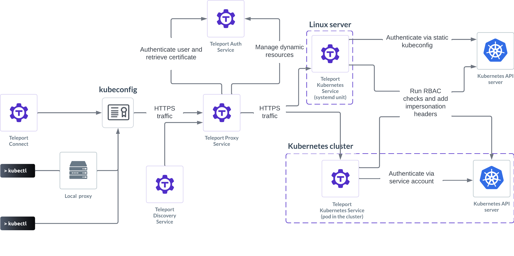

Teleport provides secure access to Kubernetes clusters:

- Users can access Kubernetes clusters with Single Sign-On (SSO) providers like
  Okta and switch between clusters without logging in twice.
- Operators can implement granular role-based access controls, including
  limiting access to specific Kubernetes clusters or even specific resources within a
  cluster.
- Organizations can achieve compliance by recording `kubectl` sessions.

The guides in this section show you how to protect Kubernetes clusters with
Teleport. For instructions on self-hosting Teleport Community Edition or
Teleport Enterprise on Kubernetes, see the [Kubernetes Deployment
Guides](../../admin-guides/deploy-a-cluster/helm-deployments/helm-deployments.mdx).

Here is an example of using Teleport to access a Kubernetes cluster, execute
commands, and view your `kubectl`  activity in Teleport's audit log:

You can set up the Teleport Discovery Service to protect Kubernetes clusters
with your Teleport automatically. Read more about [Teleport
auto-discovery](../auto-discovery/kubernetes/kubernetes.mdx).

Teleport protects Kubernetes clusters through the Teleport Kubernetes Service,
which is a Teleport agent service. For more information on agent services, read
[Teleport Agent Architecture](../../reference/architecture/agents.mdx). You can also learn
how to deploy a [pool of Teleport agents](../agents/introduction.mdx) to run
multiple agent services.

## Get started

The fastest way to register a Kubernetes cluster with Teleport is to deploy a
Teleport Kubernetes Service instance on the cluster you want to register.
We'll show you how to do this in our [Getting Started
Guide](getting-started.mdx).

## Manually register Kubernetes clusters

In some cases, you will want to register a Kubernetes cluster with Teleport
manually when you create the cluster. There are a few ways to do this:

- [Deploy the Teleport Kubernetes
  Service with IAM Joining](./register-clusters/iam-joining.mdx) on your cluster of
  choice.
- Deploy the Teleport Kubernetes Service outside your Kubernetes cluster (e.g.,
  directly on a virtual machine) and [give it access to a
  kubeconfig](./register-clusters/static-kubeconfig.mdx).
- Deploy the Teleport Kubernetes Service outside of Kubernetes  and [use dynamic
  configuration resources](./register-clusters/dynamic-registration.mdx) to
  register your clusters.

## Configure access to Kubernetes clusters

Once you register a Kubernetes cluster with Teleport, you can apply fine-grained
access controls to manage the way users access your cluster.

Read our [Kubernetes RBAC guide](./manage-access.mdx) for step-by-step
instructions on giving your users the correct access to Kubernetes clusters,
groups, users, and resources.

For a comprehensive reference to configuring access controls in your
Teleport-registered Kubernetes clusters, see our [Access Controls
Reference](./controls.mdx).
