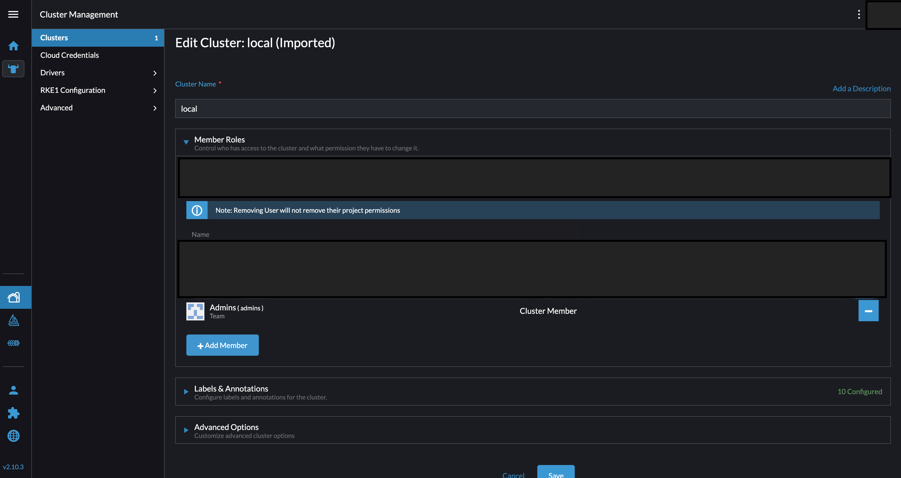
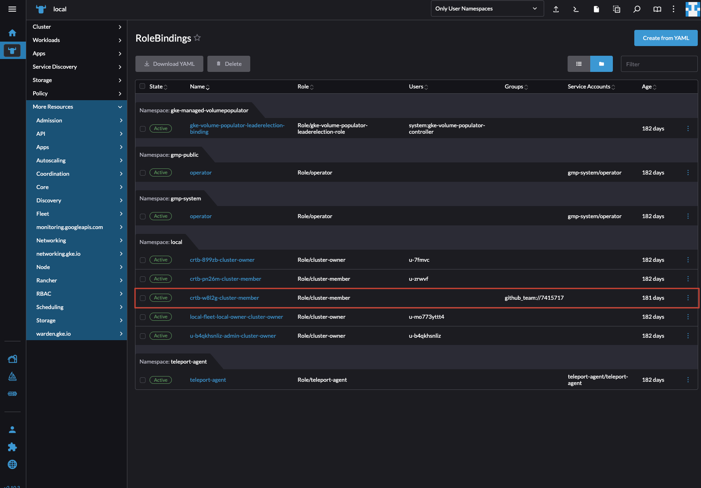

Teleport can be configured to interoperate with [Rancher's RBAC](https://ranchermanager.docs.rancher.com/how-to-guides/new-user-guides/authentication-permissions-and-global-configuration/manage-role-based-access-control-rbac) system allowing you to centrally manage and audit access to Rancher-managed clusters.
 
This guide demonstrates how to configure Teleport's Kubernetes RBAC to grant access using Rancher's built-in or custom roles — such as the Cluster Member role. 
This approach enables you to manage Kubernetes access through Teleport while aligning with Rancher’s existing RBAC structure.

## Prerequisites

(!docs/pages/includes/edition-prereqs-tabs.mdx!)

- (!docs/pages/includes/tctl.mdx!)
- Access to a Rancher UI Cluster with admin privileges
- Existing cluster(s) managed through Rancher
- Rancher RBAC already configured with users/groups assigned appropriate roles (such as Cluster Member)
- (Optional) Rancher authentication configured with external authentication providers

Within Rancher, cluster and project roles are implemented on top of [Kubernetes RBAC](https://kubernetes.io/docs/reference/access-authn-authz/rbac/).
Therefore, enforcement of permissions and roles is performed by Kubernetes.

## Step 1/4. Discover existing Rancher RBAC configuration

This guide assumes you already have Rancher RBAC configured with users/groups assigned appropriate roles (such as Cluster Member). 
In this step, we'll discover your existing Rancher RBAC configuration to align Teleport with your current access patterns.

 

To proceed, you'll need to:

1. Authenticate to your cluster with administrative privileges. See guide to [Access a Rancher cluster with kubectl](https://ranchermanager.docs.rancher.com/how-to-guides/new-user-guides/manage-clusters/access-clusters/use-kubectl-and-kubeconfig)

2. Discover Rancher RBAC bindings and identifiers:
- Navigate to **Cluster** in left sidebar
- Select **More Resources**, Navigate to the **RBAC** tab
- On the Rbac Tab, select Rolebindings, you'll be presented witha list of Role/Rolebindings with the Kubernetes Rbac subject identifiers.

 

Alternatively, you can run the command below to list Kubernetes RoleBindings and extract the group information that Teleport will use to match your existing Rancher access patterns:

   ```code
   # List all rolebindings with their names and associated groups
   $ kubectl get rolebindings -n <namespace> -o custom-columns='NAME:.metadata.name,ROLE:.roleRef.name,GROUPS:.subjects[?(@.kind=="Group")].name'
   
   # Example output:
     NAME                     ROLE            GROUPS
     crtb-w8l2g-cluster-member cluster-member github_team://7415717
   ```
Note: This example uses GitHub as the external authentication provider. If your Rancher setup uses a different [external authentication service](https://ranchermanager.docs.rancher.com/how-to-guides/new-user-guides/authentication-permissions-and-global-configuration/authentication-config#external-vs-local-authentication),
the general approach remains the same. Rancher will return users from the configured external source during role binding and access configuration.

## Step 2/4. Enroll clusters to Teleport

This step connects your Rancher-managed clusters to Teleport for centralized access control:

To enroll your cluster(s), see the official [Teleport Kubernetes Access documentation](/docs/kubernetes-access/getting-started/)
for detailed enrollment instructions.

## Step 3/4. Configure cluster access in Teleport

Now we'll define Teleport roles that map to Rancher's RBAC permissions:

We'll create a Teleport role that authenticates users to the cluster
as a member of the `github_team://7415717` group subject assigned the Rancher `cluster-member` Role.

In the previous section, we discovered the built-in Cluster Member role authorizing members
of this group to perform read-only operations at the cluster level. This specific role:
- Enables the user to access cluster nodes
- Denies the user permissions to create, modify or delete resources (e.g. can't deploy workloads)

For more information on permissions granted by the Cluster Member role, see the following guide on
[Cluster and Project Roles](https://ranchermanager.docs.rancher.com/how-to-guides/new-user-guides/authentication-permissions-and-global-configuration/manage-role-based-access-control-rbac/cluster-and-project-roles)

### Define a Teleport Role

Create a file called `kube-access.yaml` with the following content:

```yaml
kind: role
version: v7
metadata:
  name: kube-access
spec:
  allow:
    kubernetes_groups: ["github_team://7415717"]
    kubernetes_labels:
      "*": "*"
    kubernetes_resources:
      - kind: "*"
        namespace: "*"
        name: "*"
```

In this role, we have defined the following allow rules:
- `kubernetes_groups`: Authenticates the user to your Kubernetes cluster as a member of the Kubernetes group subject 
`github_team://7415717`, authorizing members of this group with the Cluster Member Role permissions

### Create the Role

Once you have finished configuring the kube-access role, create it using the following command:

```code
$ tctl create -f kube-access.yaml
```

### Assign the Role

Assign the kube-access role to your Teleport user by running the appropriate commands for your authentication provider:

```code
$ tctl users update <username> --set-roles=kube-access
```

## Step 4/4. Access and verify resources

Finally, we'll test the integration by accessing resources through Teleport:

You've now configured the Teleport Kubernetes Service to give your Teleport user
access to the Rancher cluster as a user with the built-in Rancher Cluster Member Role. In this step,
we will authenticate to your Rancher cluster via Teleport and test our new access controls.

### Log in to Teleport

```code
$ tsh login --proxy teleport.example.com
$ tsh status

# Example output showing Kubernetes group membership:
> Profile URL:        https://teleport.example.com:443
  Logged in as:       user@example.com
  Cluster:            teleport.example.com
  Roles:              kube-access
  Kubernetes:         enabled
  Kubernetes groups:  github_team://7415717
  Valid until:        2025-04-14 09:02:31 +0100 BST
```

### List Accessible Kubernetes Clusters

```code
$ tsh kube ls

# You should see your enrolled clusters in the list:
Kube Cluster Name   Labels                         Selected
------------------  ------------------------------ --------
rancher-cluster
```

### Access Your Cluster

```code
$ tsh kube login rancher-cluster
```

### Verify Permissions

```code
# Check specific permissions
$ kubectl auth can-i create deployments
no
```

## Optional: Using Role Templates for Scalable Access

For organizations with many users, creating roles for individuals isn't scalable. Teleport's role templates allow dynamic group assignments using variable interpolation.

### Key Benefits

- Single template serves multiple users or nested access lists
- Dynamic group assignments via traits
- Simplified RBAC management
- Scale permissions across many departments

This example shows how to create an access list that grants the `cluster-member` role bound
to a Kubernetes subject "groups" assigned to Teleport SSO users.
Teleport receives user metadata (traits) during SSO login served by Teleport access lists and populates template variables.

### Create a Template Role
This Teleport role configuration defines Kubernetes access permissions using template variables
to dynamically assign Kubernetes groups based on an external attribute served by the Teleport access list.

```yaml
kind: role
version: v7
metadata:
  name: kube-access-template
spec:
  allow:
    kubernetes_groups: ['{{external.rancher_group}}']
    kubernetes_labels:
      "*": "*"
    kubernetes_resources:
      - kind: "*"
        namespace: "*"
        name: "*"
```

## Configuring Access Lists for Role Templates

### Example Access List Configuration

```yaml
version: v1
kind: access_list
metadata:
  name: Rancher cluster access  # Descriptive name
spec:
  title: "Rancher cluster non-admin access"
  description: "Grants cluster-member role permissions on Rancher clusters"
  
  # Audit settings ensure regular review of access
  audit:
    recurrence:
      frequency: 6months  # Semi-annual reviews
      day_of_month: "1"   # First day of the month
    notifications:
      start: 336h  # 14 day reminder before audit
    next_audit_date: "2025-09-01T00:00:00Z"
  
  # Ownership configuration
  owners:
    - name: admin
      membership_kind: MEMBERSHIP_KIND_USER
  ownership_requires:
    roles: null
    traits: null
  
  # Grants configuration
  grants:
    roles:
      - kube-access-template  # The teleport role we created earlier
    traits:
      rancher_group:
        - github_team://7415717  # The kubernetes subject that has the `cluster-member` rolebinding

  # Membership requirements
  membership_requires:
    traits:
      groups:
        - platform  # Requires platform group membership from the Identity provider
```

### Applying the Access List

1. Save the configuration to `access_list.yaml`
2. Create the access list:

```code
$ tctl create -f access_list.yaml
```

When a Teleport SSO user who is a member of the "platform" group logs in:
1. Teleport verifies their group membership as "platform"
2. The access list automatically grants them:
   - The `kube-access-template` role
   - The specified Rancher group trait `github_team://7415717` that has the `cluster-member` role
3. The user receives certificates with these permissions
4. Kubernetes logins are generated using the template role

To verify the access works correctly, repeat the [Access and Verify Permissions](#access-and-verify-permissions) steps.


## Next Steps

- [Manage Kubernetes Access](manage-access.mdx)
- [Teleport RBAC Reference](/docs/access-controls/guides/rbac/)
