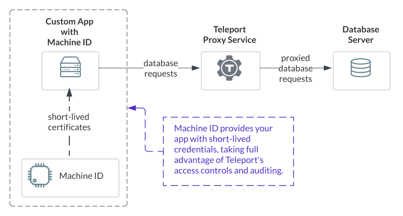

Teleport protects and controls access to databases. Machine ID
can be used to grant machines secure, short-lived access to these databases.

In this guide, you will configure `tbot` to produce credentials that can be
used to access a database configured in Teleport.



## Prerequisites

(!docs/pages/includes/edition-prereqs-tabs.mdx!)

- If you have not already put your database behind the Teleport Database Service,
  follow the [database access getting started guide](../../database-access/getting-started.mdx).
  The Teleport Database Service supports databases like PostgreSQL, MongoDB,
  Redis, and much more. See our [database access
  guides](../../database-access/guides/guides.mdx) for a complete list.
- (!docs/pages/includes/tctl.mdx!)
- The `tsh` binary must be installed on the machine that will access the
  database. Depending on how `tbot` was installed, this may already be
  installed. If it is not, see [Installation](../../../installation.mdx) for
  details.
- `tbot` must already be installed and configured on the machine that will
  access the database. For more information, see the
  [deployment guides](../deployment/deployment.mdx).

## Step 1/4. Configure RBAC

First, Teleport must be configured to allow the credentials produced by the bot
to access the database server and database. This is done by creating a
role that grants the necessary permissions and then assigning this role to a
Bot.

Create a file called `role.yaml` with the following content:

```yaml
kind: role
version: v6
metadata:
  name: example-role
spec:
  allow:
    db_labels:
      '*': '*'
    db_names: [example-db]
    db_users: [alice]
    rules:
      - resources: [db_server, db]
        verbs: [read, list]
```

Replace:

- `example-role` with a descriptive name related to your use case.
- `example-db` with the name of the database which the bot will be used to
  access.
- `alice` with the name of the user which the bot will use when connecting to
  the database.

Use `tctl create -f ./role.yaml` to create the role.

Now, use `tctl bots update` to add the role to the Bot. Replace `example`
with the name of the Bot you created in the deployment guide and `example-role`
with the name of the role you just created:

```bash
$ tctl bots update example --add-roles example-role
```

This rule will allow the bot to do two things:

- Access the database `example` on any database server (due to the `'*': '*'`
  label selector) as the user `alice`.
- Discover information about database resources in Teleport.

The `'*': '*'` label selector grants access to any database server configured in Teleport.
In production, consider restricting the bot's access using a more specific
label selector; see the
[Database Access RBAC guide](../../database-access/rbac.mdx)
for a full reference of database-related role options.

## Step 2/4. Configure a database `tbot` output

Now, `tbot` needs to be configured with an output that will produce the
credentials needed for database access. To do this, the `database` output
type is used.

The database you wish to generate credentials for is configured as part of the
`database` output. This is controlled using three fields:

- `service` specifies the Database Service as named in the Teleport
  configuration that the credentials will grant access to.
- `database` specifies the database on the Database Service that the credentials
  will grant access to.
- `username` specifies the user on the database that the credentials will grant
  access to. This field does not need to be specified for all types of
  database.

In addition, the `format` field in the database output controls the format of
the generated credentials. This allows for compatibility with clients that
expect a specific format. When this field is not specified, a sensible default
option is used that is compatible with most clients. The full list of supported
`format` options is below:

| Client        | `format`      | Description                          |
|---------------|---------------|--------------------------------------|
| Default       | Unspecified   | Provides a certificate in `tlscert`, a private key in `key` and the CA in `teleport-database-ca.crt`. This is compatible with most clients. |
| MongoDB       | `mongo`       | Provides `mongo.crt` and `mongo.cas`. |
| CockroachDB   | `cockroach`   | Provides `cockroach/node.key`, `cockroach/node.crt`, and `cockroach/ca.crt`. |
| Generic TLS   | `tls`         | Provides `tls.key`, `tls.crt`, and `tls.cas` for generic clients that require specific file extensions. |

Outputs must be configured with a destination. In this example, the `directory`
destination will be used. This will write artifacts to a specified directory on
disk. Ensure that this directory can be written to by the Linux user that
`tbot` runs as, and that it can be read by the Linux user that will be accessing
applications.

Modify your `tbot` configuration to add a `database` output:

```yaml
outputs:
- type: database
  destination:
    type: directory
    path: /opt/machine-id
  # Specify the details of the database you wish to connect to.
  service: example-server
  database: example
  username: alice
  # Specify a format to use for the output credentials. For most databases,
  # this configuration field can be omitted.
  # format: mongo
```

If operating `tbot` as a background service, restart it. If running `tbot` in
one-shot mode, it must be executed before you attempt to execute the Ansible
playbook.

## Step 3/4. Configure the local database access proxy

Now that `tbot` has produced the database access credentials, a local proxy
should be set up to forward the database connections from your database client
to the Teleport Proxy Service through a TLS connection. This is necessary as the TLS
connection allows the Teleport Proxy Service to identify the protocol and intended
recipient.

The local proxy needs to be running as long as the client needs to
make connections to the database or as long as a connection is still open. One
way to keep this local proxy running in the background is to use a systemd
service. This is demonstrated in the remainder of this step, but a different
service manager could be used or a number of other techniques could be used to
run the local proxy whilst the client is running.

The local proxy opens a specified port on the local loopback interface. Clients
must then be configured to connect to this port on localhost. As the port is
opened on the local loopback interface, it means that the local proxy must be
running on the same host as the client which wants to connect to the database.

By default, database clients must also be configured to use the credentials
when connecting to the local port. This ensures no other users of the host can
access the database via the local port, and ensures the connection between your
database client and server is never unencrypted, even over localhost.

To create a systemd service for this purpose, create a unit file at
`/etc/systemd/system/tbot-db-proxy.service`:

```systemd
[Unit]
Description=Teleport Machine ID Proxy Service
After=network.target
# If you have followed a previous guide and configured tbot itself as a systemd
# service, uncomment the following line to create a dependency between the two
# services.
# Requires=tbot.service

[Service]
Type=simple
# Ensure that the teleport user/group exists and has read access to the
# destination directory.
User=teleport
Group=teleport
Restart=always
RestartSec=5
# Adjust `12345` to any port of your choosing that is free on the local loopback
# interface. Adjust `example-server` to the name of the Database Service in
# teleport.
ExecStart=/usr/local/bin/tbot -c /etc/tbot.yaml proxy --proxy=proxy.example.com:3080 --destination-dir=/opt/machine-id db --port=12345 example-server
ExecReload=/bin/kill -HUP $MAINPID
PIDFile=/run/tbot-db-proxy.pid
LimitNOFILE=8192

[Install]
WantedBy=multi-user.target
```

This will start a local proxy on port `12345` that can be used to connect
to the `example-server` database server. Be sure to customize the `tbot`
parameters as necessary for your local setup.

Finally, run the following commands to enable and start the local proxy service:

```code
$ sudo systemctl enable tbot-db-proxy
$ sudo systemctl start tbot-db-proxy
$ sudo systemctl status tbot-db-proxy
```

### Authenticated tunnel

Whilst the default behaviour requires the client to use client certificate
authentication, it is possible to configure an **authenticated tunnel**. This will
automatically attach credentials to any incoming connection to the local port.
Whilst this is less secure, it can be necessary if the client you
wish to use with your database does not support client certificate
authentication.

If you wish to enable the authenticated tunnel mode, `--tunnel` flag is used
with `tbot proxy db...`.

If you are executing this in the foreground,
provide the `--tunnel` flag. If you are using a systemd service, add `--tunnel`
to the `ExecStart` in `machine-id-proxy.service` and then reload the unit.

Once this has been enabled, you do not need to specify a password or TLS
certificates and certificate authorities in the client when connecting to the
configured port.

## Step 4/4. Configure the client to connect to the database

With the credentials generated and the local proxy running, you can now
configure your client to use the local proxy with the credentials.

Refer to these sample Go programs for using the credentials:

<Tabs>
  <TabItem label="Self-Hosted PostgreSQL">
  ```go
  (!docs/pages/includes/machine-id/postgresql/postgresql.go!)
  ```
  </TabItem>
  <TabItem label="Self-Hosted MongoDB">
  ```go
  (!docs/pages/includes/machine-id/mongodb/mongodb.go!)
  ```
  </TabItem>
</Tabs>

You're all set. You have provided your application with short-lived
certificates tied to a machine identity that can access your database, be
rotated, and audited, all while being controlled with all the familiar Teleport
access controls.

## Next steps

- Read the [configuration reference](../../../reference/machine-id/configuration.mdx) to explore
  all the available configuration options.
