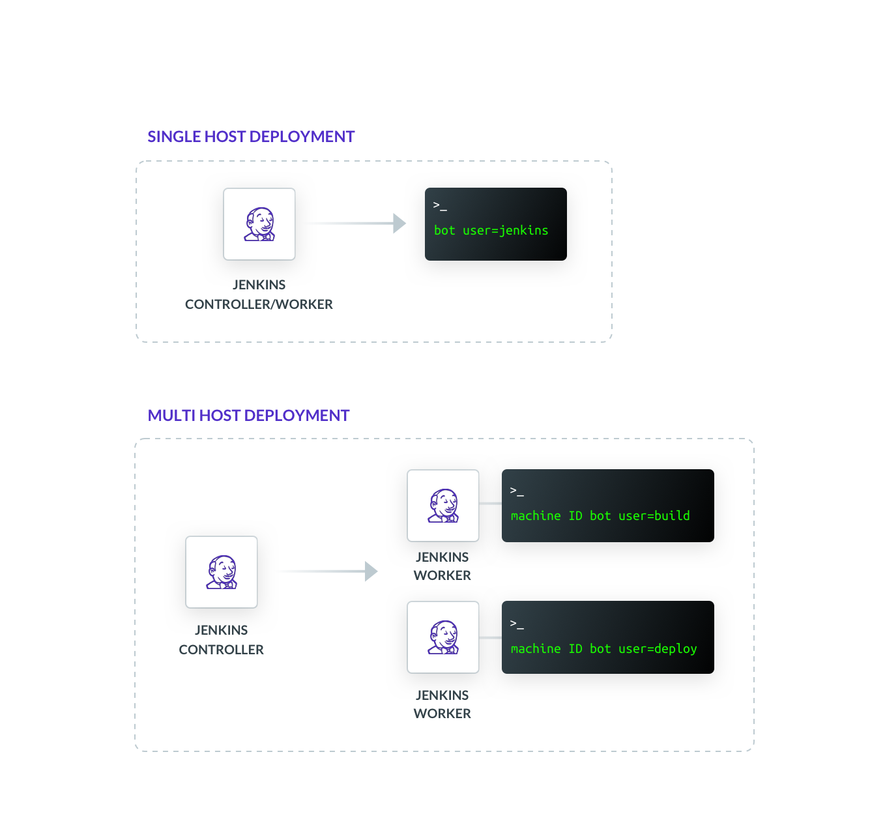

Jenkins is an open source automation server that is frequently used to build
Continuous Integration and Continuous Delivery (CI/CD) pipelines.

In this guide, we will demonstrate how to migrate existing Jenkins pipelines to
utilize Machine ID with minimal changes.

## Prerequisites

You will need the following tools to use Teleport with Jenkins.

(!docs/pages/includes/edition-prereqs-tabs.mdx!)

- `ssh` OpenSSH tool
- Jenkins
- (!docs/pages/includes/tctl.mdx!)

## Architecture

Before we begin, it should be noted that Jenkins is a tool that is notoriously
difficult to secure. Machine ID is one part of securing your infrastructure,
but it alone is not sufficient. Below we will provide some basic guidance which
can help improve the security posture of your Jenkins installation.

### Single-host deployments

The simplest Jenkins deployments have the
controller (process that stores configuration, plugins, UI) and agents (process
that executes tasks) run on the same host. This deployment model is simple to
get started with, however any compromise of the `jenkins` user within a single
pipeline can lead to the compromise of your entire CI/CD infrastructure.

### Multihost deployments

A slightly more complex, but more secure deployment
is running your Jenkins controllers and agents on different hosts and pinning
workloads to specific agents. This is an improvement over the simple deployment
because you can limit the blast radius of the compromise of a single pipeline
to a subset of your CI/CD infrastructure instead of all of your infrastructure.

### Best practices

We strongly encourage the use of the second deployment model whenever possible,
with ephemeral hosts and IAM joining when possible. When using Machine ID with
this model, create and run Machine ID bots per-host and pin particular
pipelines to a worker. This will allow you to give each pipeline the minimal
scope for server access, reduce the blast radius if one pipeline is
compromised, and allow you to remotely audit and lock pipelines if you detect
malicious behavior.

<Figure align="left" bordered caption="Jenkins Deployments">
  
</Figure>

## Step 1/2 Configure and start Machine ID

First, determine if you would like to create a new role for Machine ID or use
an existing role. You can run `tctl get roles` to examine your existing roles.

In the example below, create a file called `api-workers.yaml` with the content below
to create a new role called `api-workers` that will allow you to log in to Nodes
with the label `group: api` and Linux user `jenkins`.

```
kind: "role"
version: "v3"
metadata:
  name: "api-workers"
spec:
  allow:
    logins: ["jenkins"]
    node_labels:
      "group": "api"
```

<Tabs>
<TabItem scope={["cloud"]} label="Teleport Enterprise Cloud">
On your client machine, log in to Teleport using `tsh` before using `tctl`.

```code
$ tctl create -f api-workers.yaml
$ tctl bots add jenkins --roles=api-workers
```
</TabItem>
<TabItem scope={["oss","enterprise"]} label="Self-Hosted">
Connect to the Teleport Auth Server and use `tctl` to examine what roles exist on
your system.

```code
$ tctl create -f api-workers.yaml
$ tctl bots add jenkins --roles=api-workers
```
</TabItem>

</Tabs>

Machine ID allows you to use Linux Access Control Lists (ACLs) to control
access to certificates on disk. You will use this to limit the access Jenkins
has to the short-lived certificates Machine ID issues.

In the example that follows, you will create a Linux user called `teleport` to
run Machine ID but short-lived certificates will be written to disk as the
Linux user `jenkins`.

```code
$ sudo adduser \
    --disabled-password \
    --no-create-home \
    --shell=/bin/false \
    --gecos "" \
    teleport
```

Create and initialize the directories you will need using the `tbot init`
command.

```code
$ sudo tbot init \
    --destination-dir=/opt/machine-id \
    --bot-user=teleport \
    --owner=teleport:teleport \
    --reader-user=jenkins
```

(!docs/pages/includes/machine-id/machine-id-init-bot-data.mdx!)

Next, you need to start Machine ID in the background of each Jenkins worker.

First create a configuration file for Machine ID at `/etc/tbot.yaml`.

```yaml
version: v2
# Replace "example.teleport.sh:443" with the address of your Teleport Proxy or
# Teleport Cloud tenant.
proxy_server: "example.teleport.sh:443"
onboarding:
  join_method: "token"
  # Replace the token field with the name of the token that was output when you
  # ran `tctl bots add`.
  token: "00000000000000000000000000000000"
storage:
  type: directory
  path: /var/lib/teleport/bot
outputs:
  - type: identity
    destination:
      type: directory
      path: /opt/machine-id
```

### Create a `tbot` systemd unit file

(!docs/pages/includes/machine-id/daemon.mdx!)

## Step 2/2. Update and run Jenkins pipelines

Using Machine ID within a Jenkins pipeline is now a one-line change. For
example, if you want to run the `hostname` command on a remote host, add the
following to your Jenkins pipeline.

```
steps {
  sh "ssh -F /opt/machine-id/ssh_config root@node-name.example.com hostname"
}
```

You are all set. You have provided Jenkins with short-lived certificates tied
to a machine identity that can be rotated, audited, and controlled with all the
familiar Teleport access controls.

## Next steps

[More information about `TELEPORT_ANONYMOUS_TELEMETRY`.](../../../reference/machine-id/telemetry.mdx)

