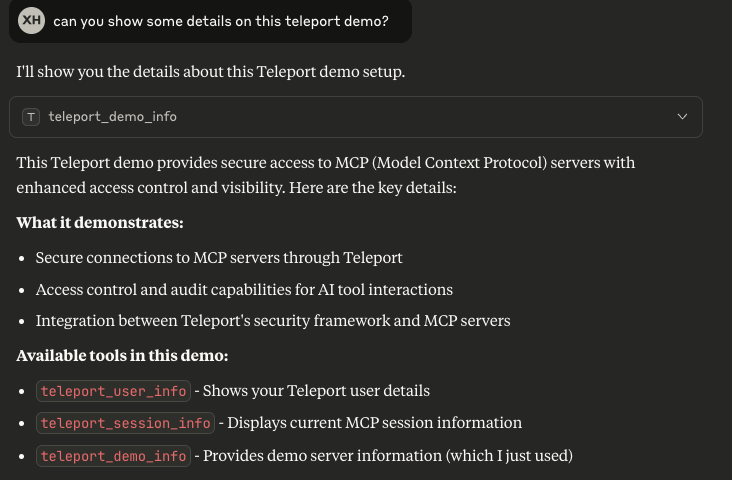

Teleport can provide secure connections to your MCP (Model Context Protocol)
servers while improving both access control and visibility.

This guides shows you how to:

- Enroll the Teleport demo MCP server in your Teleport cluster.
- Connect to the MCP server via Teleport.

## How it works


The Teleport Application Service includes a built-in demo MCP server designed to
showcase how MCP access works.

Users can configure their MCP clients such as Claude Desktop to start an MCP
server using `tsh`. Once successfully authorized, `tsh` establishes a session
with the Application Service.

Once the session is established, the Application Service starts the in-memory
demo MCP server. Teleport then proxies the connection between the client and the
remote MCP server, applying additional role-based access controls such as
filtering which tools are available to the user. While proxying, Teleport also
logs MCP protocol requests as audit events, providing visibility into user
activity.

## Prerequisites

(!docs/pages/includes/edition-prereqs-tabs.mdx edition="Teleport (v18.1.0 or higher)"!)
- A host, e.g., an EC2 instance, where you will run the Teleport Applications
  Service.

## Step 1/3. Configure the Teleport Application Service

You can update an existing Application Service or create a new one to enable the
demo MCP server.

<Tabs>

<TabItem label="Update an existing service">

If you already have an existing Application Service running, you can enable the
demo MCP server by adding the following in your YAML configuration:
```diff
app_service:
  enabled: true
+  mcp_demo_server: true
...
```

Now restart the Application Service.

</TabItem>
<TabItem label="Create a new service">

{/* lint ignore heading-increment remark-lint */}
#### Get a join token
(!docs/pages/includes/tctl-token.mdx serviceName="Application" tokenType="app" tokenFile="/tmp/token"!)

(!docs/pages/includes/database-access/alternative-methods-join.mdx!)

#### Install the Teleport Application Service
Install Teleport on the host where you will run the Teleport Application Service:

(!docs/pages/includes/install-linux.mdx!)

#### Configure the Teleport Application service

On the host where you will run the Teleport Application Service, create a
configuration file:
```code
$ sudo teleport configure \
   -o file \
   --roles=app \
   --proxy=<Var name="teleport.example.com:443" /> \
   --token=/tmp/token \
   --mcp-demo-server
```

The command will generate an Application Service configuration to proxy the demo
MCP server and save the configuration to `/etc/teleport.yaml`.

#### Start the Teleport Application Service

(!docs/pages/includes/start-teleport.mdx service="the Application Service"!)
</TabItem>
</Tabs>

## Step 2/3. Configure your Teleport user

(!docs/pages/includes/mcp-access/configure-user-rbac.mdx!)

## Step 3/3. Connect

Log in to Teleport with the user we've just created, <Var name="my_user" />:

```code
$ tsh login --proxy=<Var name="teleport.example.com:443" /> --user=<Var name="my_user" />
```

Now we can inspect available MCP servers:

```code
$ tsh mcp ls
Name              Description                                                       Type  Labels
----------------- ----------------------------------------------------------------- ----- ------
teleport-mcp-demo A demo MCP server that shows current user and session information stdio
```

To show configurations for your MCP client to connect:

```code
$ tsh mcp config teleport-mcp-demo
Found MCP servers:
teleport-mcp-demo

Here is a sample JSON configuration for launching Teleport MCP servers:
{
  "mcpServers": {
    "teleport-mcp-teleport-mcp-demo": {
      "command": "/path/to/tsh",
      "args": ["mcp", "connect", "teleport-mcp-demo"]
    }
  }
}

Tip: You can use this command to update your MCP servers configuration file automatically.
- For Claude Desktop, use --client-config=claude to update the default configuration.
- For Cursor, use --client-config=cursor to update the global MCP servers configuration.
In addition, you can use --client-config=<path> to specify a config file location that is compatible with the "mcpServers" mapping.
For example, you can update a Cursor project using --client-config=<path-to-project>/.cursor/mcp.json
```

Once your MCP client configuration is updated, you will find the Teleport demo
MCP server in your MCP client. The demo MCP server consists of several tools
that provide basic information on this demo, your Teleport user, and the MCP
session. You can interact with it using sample questions like "can you show some
details on this teleport demo?":




## Next Steps

Learn more about protecting MCP servers with Teleport in the following topics:

- [MCP Access Control](rbac.mdx).
- Configuration and CLI [reference](../../reference/agent-services/mcp-access.mdx).
- Audit events [reference](../../reference/monitoring/audit.mdx#event-types).
