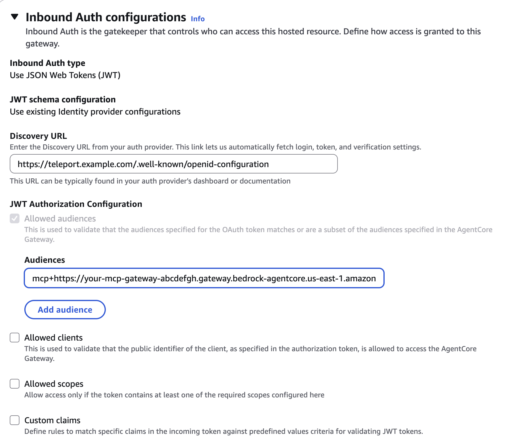

(!docs/pages/includes/mcp-access/integration-intro.mdx serviceName="AWS Bedrock AgentCore Gateway" !)

## How it works

The AWS Bedrock AgentCore Gateway is configured to trust Teleport as its inbound
identity provider. Teleport authenticates client requests and proxies them to
the AgentCore Gateway, which then forwards the requests to the target MCP
servers.

## Prerequisites

(!docs/pages/includes/edition-prereqs-tabs.mdx edition="Teleport (v18.7.0 or higher)" clients="\`tsh\` client"!)
- Ability to configure your AWS Bedrock AgentCore Gateway
- A running Teleport Application Service. If you have not yet done this, follow
  the [Getting Started guide](../getting-started.mdx).
- A Teleport user with sufficient permissions (e.g. role `mcp-user`) to access
  MCP servers.

## Step 1/2. Configure Inbound Auth Configuration for AWS Bedrock AgentCore Gateway

When creating the gateway, configure inbound authentication as follow:
- Select **Use JSON Web Tokens (JWT)** as the **Inbound Auth type**.
- Select **Use existing Identity provider configurations** for **JWT schema configuration**.
- Set the **Discovery URL** to:
```code
https://<Var name="CLUSTER" initial_value="teleport.example.com"/>/.well-known/openid-configuration`
```
Replace <Var name="CLUSTER"/> with your Teleport cluster name.

After the gateway is created, copy the Gateway resource URL. The Teleport
application URI will be:
```code
mcp+<Var name="GATEWAY_URL" initial_value="https://your-mcp-gateway.bedrock-agentcore.us-east-1.amazonaws.com/mcp" />
```

This URI is also used as the audience claim in the token that the gateway should
validate:


## Step 2/2. Connect via Teleport

You can register an MCP application in Teleport by defining it in your Teleport
Application Service configuration, or by using dynamic registration with `tctl`
or Terraform:

<Tabs>
<TabItem label="Static configuration">
```yaml
app_service:
  enabled: "yes"
  apps:
  - name: "bedrock-mcp"
    uri: "mcp+<Var name="GATEWAY_URL"/>
    labels:
      env: dev
      service: "bedrock"
    rewrite:
      headers:
      - "Authorization: Bearer {{internal.id_token}}"
```

Restart the Application Service.
</TabItem>

<TabItem label="tctl">
Create an `app` resource definition file named `app-bedrock-mcp.yaml`:
```yaml
# app-bedrock-mcp.yaml
kind: app
version: v3
metadata:
  name: "bedrock-mcp"
  labels:
    env: dev
    service: "bedrock"
spec:
  uri: "mcp+<Var name="GATEWAY_URL"/>
  rewrite:
    headers:
    - name: "Authorization"
      value: "Bearer {{internal.id_token}}"
```

Create the `app` resource with:
```code
$ tctl create -f app-bedrock-app.yaml
```
</TabItem>

<TabItem label="Terraform">
Create a `teleport_app` resource in terraform:
```hcl
resource "teleport_app" "bedrock" {
  version = "v3"
  metadata = {
    name = "bedrock-mcp"
    labels = {
      "teleport.dev/origin" = "dynamic"
      "env"                 = "dev"
      "service"             = "bedrock"
    }
  }

  spec = {
    uri = "mcp+<Var name="GATEWAY_URL"/>
    rewrite = {
      headers = [{
        name  = "Authorization"
        value = "Bearer {{internal.id_token}}"
      }]
    }
  }
}
```
Apply the configuration:
```code
$ terraform apply
```
</TabItem>

</Tabs>

(!docs/pages/includes/mcp-access/integration-limit-tools.mdx!)
```yaml
kind: role
version: v8
metadata:
  name: bedrock-mcp-readonly
spec:
  allow:
    app_labels:
      'service': 'bedrock'
    mcp:
      tools:
      - ^(get|query|list|search|find)_.*$
```

(!docs/pages/includes/mcp-access/integration-tsh.mdx service="bedrock" serviceName="AWS Bedrock AgentCore Gateway" !)

## Next steps

- Review [Enroll a Streamable-HTTP MCP Server](../enrolling-mcp-servers/streamable-http.mdx).
- See the [dynamic registration](../dynamic-registration.mdx) guide.
- Learn more about [Egress JWT Authentication](../jwt.mdx).
- Connect your [MCP clients](../../../connect-your-client/model-context-protocol/mcp-access.mdx).
