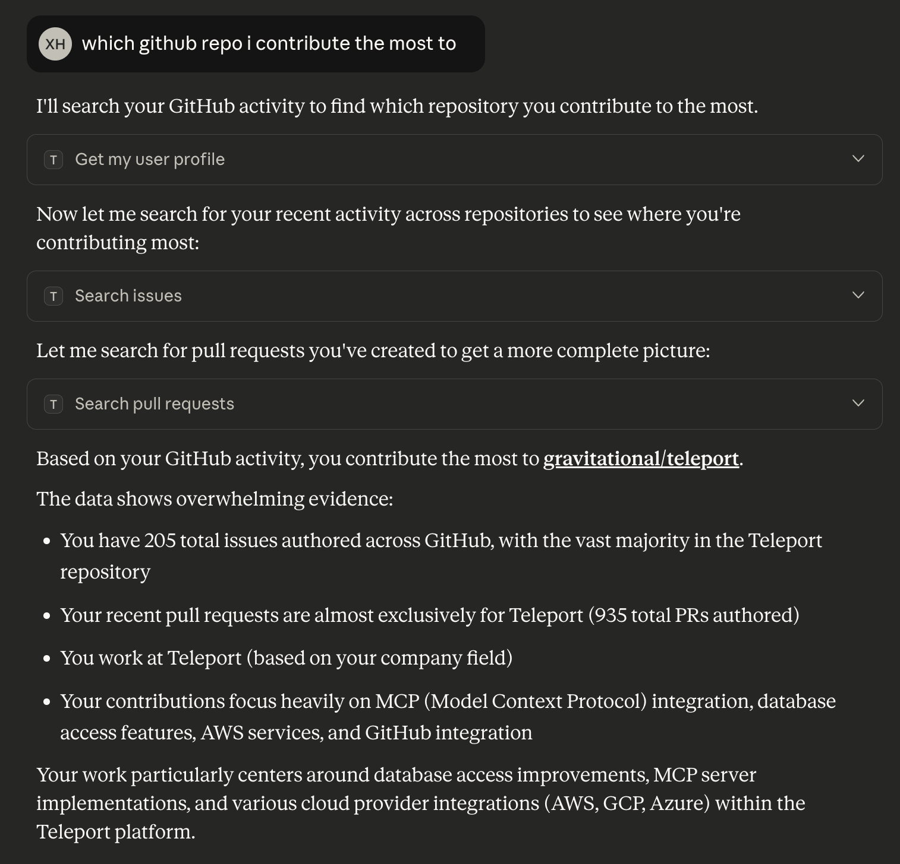

(!docs/pages/includes/mcp-access/integration-intro.mdx serviceName="GitHub" !)

## How it works

The [GitHub MCP server](https://github.com/github/github-mcp-server) uses a
personal access token of a service account to access GitHub and
[`mcp-proxy`](https://github.com/sparfenyuk/mcp-proxy) exposes it to the
Teleport Application Service over a streamable-HTTP endpoint by translating the
original transport. Teleport proxies all client requests to the server, which
interacts with GitHub using the permissions granted to the service account.

## Prerequisites

(!docs/pages/includes/edition-prereqs-tabs.mdx edition="Teleport (v18.3.0 or higher)" clients="\`tsh\` client"!)
- Access to a service account to your GitHub organization.
- A host to run the MCP server that is reachable by the Teleport Application Service.
- A running Teleport Application Service. If you have not yet done this, follow
  the [Getting Started guide](../getting-started.mdx).
- A Teleport user with sufficient permissions (e.g. role `mcp-user`) to access
  MCP servers.

## Step 1/3. Create a personal access token

Log in to GitHub using your service account. Navigate to Settings > Developer
Settings > Personal access tokens, then click **Generate new token**.

When creating the token, grant only the minimal permissions needed. Avoid broad
scopes such as write or admin access unless absolutely required.

Once the token is created, save it for use in the next step.

## Step 2/3. Run the GitHub MCP server

First, install `mcp-proxy` on the host that will run the MCP server:
```code
# Option 1: With uv (recommended)
$ uv tool install mcp-proxy

# Option 2: With pipx (alternative)
$ pipx install mcp-proxy
```

Now start the GitHub MCP server behind `mcp-proxy`, using the personal access
token <Var name="github_personal_access_token" />:
```code
$ mcp-proxy \
  --host <Var name="MCP_HOST" initial_value="localhost"/>  --port 8000 \
  -- docker run -i --rm -e GITHUB_PERSONAL_ACCESS_TOKEN=<Var name="github_personal_access_token" /> \
  ghcr.io/github/github-mcp-server
```

Replace `<Var name="MCP_HOST"/>` with the hostname of the host machine running
the MCP server. The host must be reachable by the Teleport Application
Service.

After starting, `mcp-proxy` exposes a streamable-HTTP endpoint at `http://<Var
name="MCP_HOST" initial="localhost" />:8000/mcp`.

## Step 3/3. Connect via Teleport

(!docs/pages/includes/mcp-access/integration-teleport-app.mdx service="github" serviceName="GitHub" port="8000"!)

(!docs/pages/includes/mcp-access/integration-limit-tools.mdx!)
```yaml
kind: role
version: v8
metadata:
  name: github-mcp-readonly
spec:
  allow:
    app_labels:
      'service': 'github'
    mcp:
      tools:
      - ^(get|search|list)_.*$
      - ^.*_read$
```

(!docs/pages/includes/mcp-access/integration-tsh.mdx service="github" serviceName="GitHub" !)



## Connect to GitHub without service account

Instead of using a service account's personal access token, you can require each
Teleport user to supply their own token from the client side. This removes the
need to run an `mcp-proxy`, allowing you to use the official MCP server directly
when configuring your MCP server:
```yaml
app_service:
  enabled: "yes"
  apps:
  - name: "github-mcp"
    uri: "mcp+https://api.githubcopilot.com/mcp/"
    labels:
      env: dev
      service: github
```

When configuring the MCP client, use your own personal access token as a bearer
token for the `Authorization` header:
```code
$ tsh mcp config github-mcp --client-config claude --header "Authorization: Bearer <Var name="github_personal_access_token" />"
```

## Next steps

- Review [Enroll a Streamable-HTTP MCP Server](../enrolling-mcp-servers/streamable-http.mdx).
- See the [dynamic registration](../dynamic-registration.mdx) guide.
- Learn more about [github-mcp-server](https://github.com/github/github-mcp-server).
- Connect your [MCP clients](../../../connect-your-client/model-context-protocol/mcp-access.mdx).
