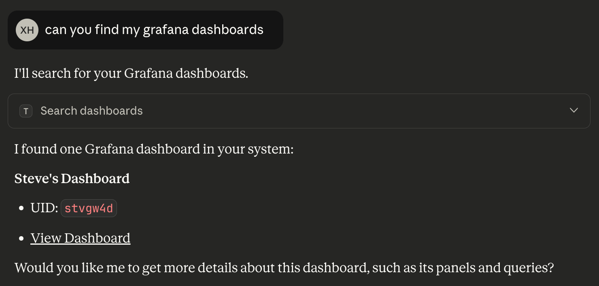
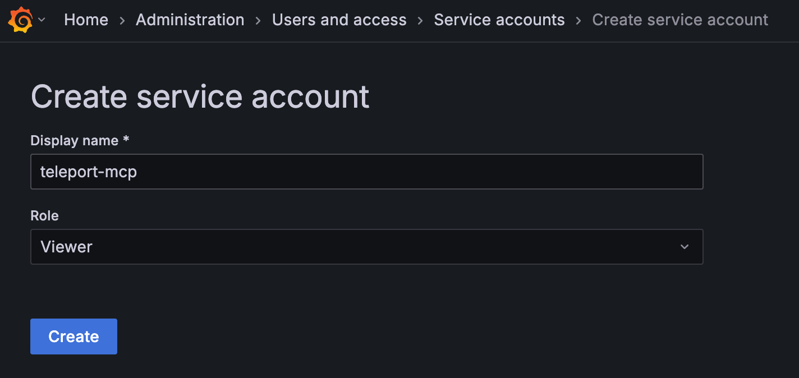

This guide demonstrates how to run a Grafana MCP server and connect it via
Teleport.

## How it works

The [Grafana MCP server](https://github.com/grafana/mcp-grafana)
forwards JWT tokens signed by Teleport to access Grafana and runs on a local
endpoint reachable by Teleport. Teleport proxies all client requests to the
server, which interacts with Grafana using permissions mapped by [JWT
authentication](https://grafana.com/docs/grafana/latest/setup-grafana/configure-access/configure-authentication/jwt/).

## Prerequisites

(!docs/pages/includes/edition-prereqs-tabs.mdx edition="Teleport (v18.3.0 or higher)" clients="\`tsh\` client"!)
- Ability to configure your Grafana instance.
- A host to run the MCP server that is reachable by the Teleport Application Service.
- Running [Teleport Application Service](../getting-started.mdx).
- A Teleport user with sufficient permissions (e.g. role `mcp-user`) to access
  MCP servers.

## Step 1/3. Configure JWT authentication in Grafana

(!docs/pages/includes/application-access/jwt-grafana-config.mdx!)

## Step 2/3. Run the Grafana MCP server

The Grafana MCP Server can be run either as a compiled binary or via the
official Docker image:

<Tabs>
<TabItem label="mcp-grafana binary">
Run the MCP server in streamable-HTTP transport. Assign  <Var name="GRAFANA_URL"
initial_value="https://your-grafana-instance-url"/> to the URL of your Grafana
instance and <Var name="MCP_HOST" initial_value="localhost" /> to the hostname
of the host machine running the MCP server:
```code
$ export GRAFANA_URL=<Var name="GRAFANA_URL" initial_value="https://your-grafana-instance-url" />
$ ./mcp-grafana --transport streamable-http --address <Var name="MCP_HOST" initial_value="localhost" />:8000
```
</TabItem>

<TabItem label="docker">
Run the MCP server in streamable-HTTP transport. Assign <Var name="GRAFANA_URL"
initial_value="https://your-grafana-instance-url"/> to the URL of your Grafana
instance:
```code
$ docker run -d -p 8000:8000 \
  -e GRAFANA_URL=<Var name="GRAFANA_URL" initial_value="https://your-grafana-instance-url" /> \
  mcp/grafana --transport streamable-http
```
</TabItem>
</Tabs>

The Grafana MCP Server now exposes a streamable-HTTP endpoint at `http://<Var name="MCP_HOST"/>:8000/mcp`.

## Step 3/3. Connect via Teleport

You can register an MCP application in Teleport by defining it in your Teleport
Application Service configuration, or by using dynamic registration with `tctl`
or Terraform:

<Tabs>
<TabItem label="Static configuration">
Replace <Var name="MCP_HOST"/> with the host running the Grafana MCP server:
```yaml
app_service:
  enabled: "yes"
  apps:
  - name: "grafana-mcp"
    uri: "mcp+http://<Var name="MCP_HOST"/>:8000/mcp"
    labels:
      env: dev
      service: grafana
    rewrite:
      headers:
      - "X-Grafana-API-Key: {{internal.jwt}}"
```

Restart the Application Service.
</TabItem>

<TabItem label="tctl">
Create an `app` resource definition file named `app-grafana-mcp.yaml`. Replace
<Var name="MCP_HOST" /> with the host running the Grafana MCP server:
```yaml
# app-grafana-mcp.yaml
kind: app
version: v3
metadata:
  name: grafana-mcp
  labels:
    env: dev
    service: grafana
spec:
  uri: "mcp+http://<Var name="MCP_HOST" />:8000/mcp"
  rewrite:
    headers:
    - name: "X-Grafana-API-Key"
      value: "{{internal.jwt}}"
```

Create the `app` resource with:
```code
$ tctl create -f app-grafana-app.yaml
```
</TabItem>

<TabItem label="Terraform">
Create a `teleport_app` resource in terraform. Replace <Var name="MCP_HOST" />
with the host running the Grafana MCP server:
```hcl
resource "teleport_app" "grafana" {
  version = "v3"
  metadata = {
    name = "grafana"
    labels = {
      "teleport.dev/origin" = "dynamic"
      "env"                 = "dev"
      "service"             = "grafana"
    }
  }

  spec = {
    uri = "mcp+http://<Var name="MCP_HOST" />:8000/mcp"
    rewrite = {
      headers = [{
        name  = "X-Grafana-API-Key"
        value = "{{internal.jwt}}"
      }]
    }
  }
}
```
Apply the configuration:
```code
$ terraform apply
```
</TabItem>

</Tabs>

The header rewrite configuration above will replace the `{{internal.jwt}}`
template variable with a Teleport-signed JWT token in each request. The Grafana
MCP server will use this token as a bearer token in "Authorization" header when
connecting to Grafana.

(!docs/pages/includes/mcp-access/integration-limit-tools.mdx!)
```yaml
kind: role
version: v8
metadata:
  name: grafana-mcp-readonly
spec:
  allow:
    app_labels:
      'service': 'grafana'
    mcp:
      tools:
      - ^(get|query|list|search|find)_.*$
```

(!docs/pages/includes/mcp-access/integration-tsh.mdx service="grafana" serviceName="Grafana" !)



## Connect to Grafana using a service account

Instead of accessing Grafana with JWT authentication, you can also use a service
account.

Navigate to Administrators > Users and Accounts > Service Accounts, and then
click **Create Service Account**:



Assign the **Viewer** role to keep the service account limited to read-only
access.

After the service account is created, click **Add service account
token** to generate a new token. Use this token <Var
name="SERVICE_ACCOUNT_TOKEN" initial_value="your_service_account_token"/> when
starting the Grafana MCP server:
```code
$ docker run -d -p 8000:8000 \
  -e GRAFANA_URL=<Var name="GRAFANA_URL" /> \
  -e GRAFANA_SERVICE_ACCOUNT_TOKEN=<Var name="SERVICE_ACCOUNT_TOKEN"/> \
  mcp/grafana --transport streamable-http
```

Lastly, you don’t need to configure any header rewrites in the Teleport
application:
```yaml
app_service:
  enabled: "yes"
  apps:
  - name: "grafana-mcp"
    uri: "mcp+http://<Var name="MCP_HOST"/>:8000/mcp"
    labels:
      env: dev
      service: grafana
```

## Next Steps

- Read more on accessing Grafana through Teleport with [JWT authentication](../../application-access/jwt/grafana.mdx).
- Review [Enroll a Streamable-HTTP MCP Server](../enrolling-mcp-servers/streamable-http.mdx).
- See the [dynamic registration](../dynamic-registration.mdx) guide.
- Learn more about [mcp-grafana](https://github.com/grafana/mcp-grafana).
- Connect your [MCP clients](../../../connect-your-client/model-context-protocol/mcp-access.mdx).
