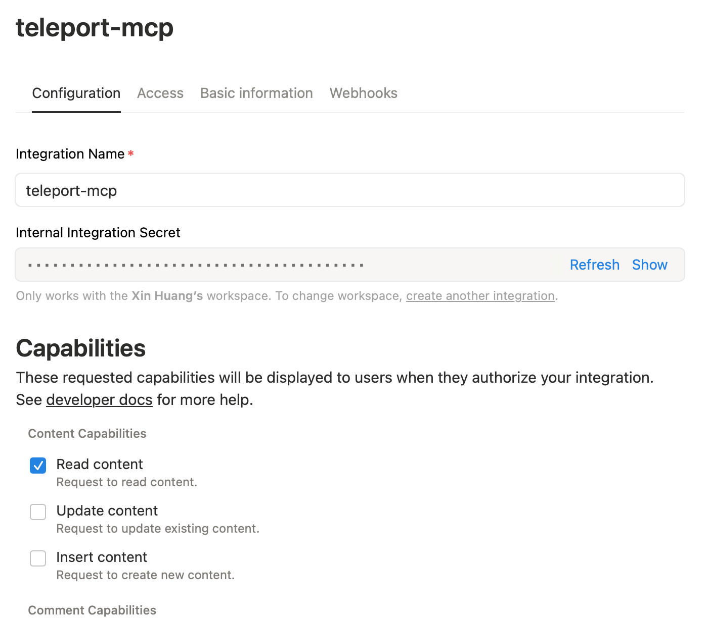
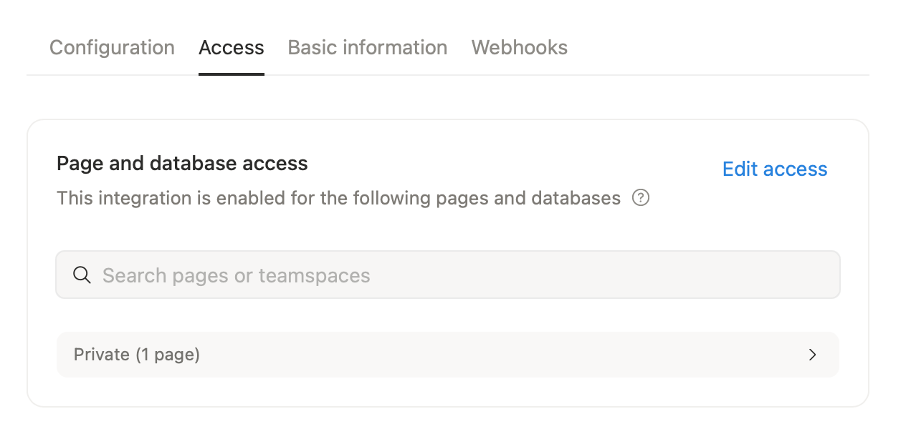
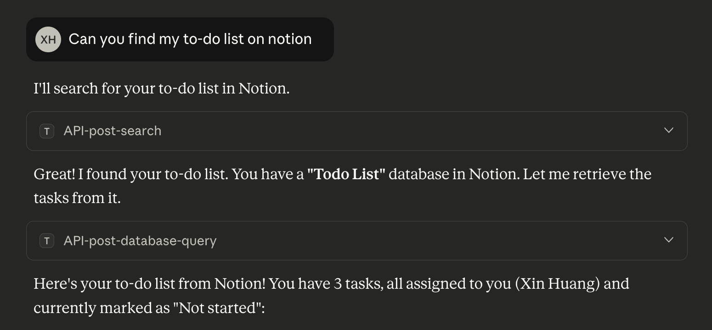

(!docs/pages/includes/mcp-access/integration-intro.mdx serviceName="Notion" !)

## How it works

The [Notion MCP server](https://github.com/makenotion/notion-mcp-server)
uses an integration token to access Notion and runs on a local endpoint
reachable by the Teleport Application Service. Teleport proxies all client
requests to the server, which interacts with Notion using the permissions
granted to the integration.

## Prerequisites

(!docs/pages/includes/edition-prereqs-tabs.mdx edition="Teleport (v18.3.0 or higher)" clients="\`tsh\` client"!)
- Access to your Notion workspace and sufficient privileges to manage integrations.
- A host to run the MCP server that is reachable by the Teleport Application Service.
- A running Teleport Application Service. If you have not yet done this, follow
  the [Getting Started guide](../getting-started.mdx).
- A Teleport user with sufficient permissions (e.g. role `mcp-user`) to access
  MCP servers.

## Step 1/3. Create an integration in Notion

Go to https://www.notion.so/profile/integrations and create a new **internal
integration**.



To limit the scope available to LLMs, disable all permissions except "Read
Content" in the "Capabilities" section.

Next, open "Access" tab and select the pages you want the integration to be able
to access.



Finally, return to the "Configuration" tab, copy the "Internal Integration
Secret" for use in the next step.

## Step 2/3. Run the Notion MCP server

Start the Notion MCP server using your Notion integration token <Var
name="ntn_your_internal_integration_secret" />:
```code
$ export NOTION_TOKEN=<Var name="ntn_your_internal_integration_secret" />
$ npx @notionhq/notion-mcp-server --transport http --port 8000 --auth-token teleport-local-connection
```

The MCP server listens on all network interfaces by default. Run it on a private
network and ensure the hostname <Var name="MCP_HOST" initial="localhost" /> is
reachable by the Teleport Application Service.

The `--auth-token` value is the shared secret Teleport uses to authenticate to
the MCP server. Since the MCP server is not publicly accessible, using a fixed
value is acceptable.

## Step 3/3. Connect via Teleport

(!docs/pages/includes/mcp-access/integration-teleport-app.mdx service="notion" serviceName="Notion" port="8000" !)

(!docs/pages/includes/mcp-access/integration-limit-tools.mdx!)
```yaml
kind: role
version: v8
metadata:
  name: notion-mcp-readonly
spec:
  allow:
    app_labels:
      'service': 'notion'
    mcp:
      tools:
      - API-get-*
      - API-retrieve-*
      - API-post-database-query
      - API-post-search
```

(!docs/pages/includes/mcp-access/integration-tsh.mdx service="notion" serviceName="Notion" !)



## Next steps

- Review [Enroll a Streamable-HTTP MCP Server](../enrolling-mcp-servers/streamable-http.mdx).
- See the [dynamic registration](../dynamic-registration.mdx) guide.
- Learn more about [notion-mcp-server](https://github.com/makenotion/notion-mcp-server).
- Connect your [MCP clients](../../../connect-your-client/model-context-protocol/mcp-access.mdx).
