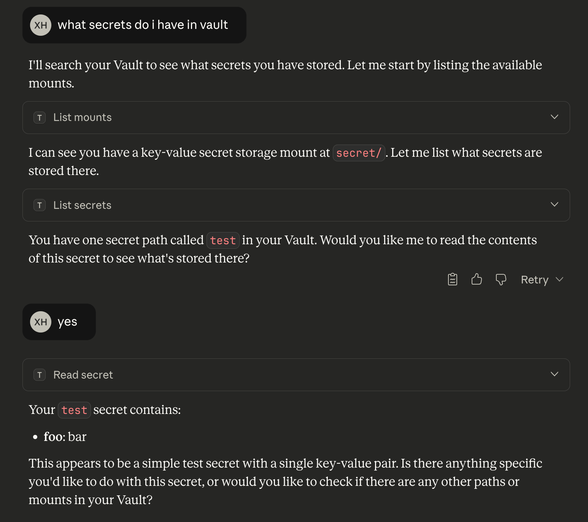

(!docs/pages/includes/mcp-access/integration-intro.mdx serviceName="HashiCorp Vault" !)

## How it works

The [HashiCorp Vault MCP server](https://github.com/hashicorp/vault-mcp-server)
uses a service token to access HashiCorp Vault and runs on a local endpoint
reachable by the Teleport Application Service. Teleport proxies all client
requests to the server, which interacts with HashiCorp Vault using the
permissions granted by the policy bound to the token.

## Prerequisites

(!docs/pages/includes/edition-prereqs-tabs.mdx edition="Teleport (v18.3.0 or higher)" clients="\`tsh\` client"!)
- Access to your Vault instance and sufficient privileges to manage policies.
- A host to run the MCP server that is reachable by the Teleport Application Service.
- A running Teleport Application Service. If you have not yet done this, follow
  the [Getting Started guide](../getting-started.mdx).
- A Teleport user with sufficient permissions (e.g. role `mcp-user`) to access
  MCP servers.

## Step 1/3. Create a policy in Vault

First, create a policy file:
```code
$ cat > mcp-readonly.hcl <<EOF
# Read/list all secrets and metadata stored in the KV v2 engine at "secret/"
path "secret/data/*" {
  capabilities = ["read", "list"]
}
path "secret/metadata/*" {
  capabilities = ["read", "list"]
}
EOF
```
This example grants read-only access to all secrets stored under the `secret/` KV
v2 engine. You can tighten or expand these paths depending on your needs.

To load the policy into Vault:
```code
$ vault policy write mcp-readonly mcp-readonly.hcl
```

Once the policy created, generate a Vault token that the MCP server will use:
```code
$ vault token create -policy="mcp-readonly" -display-name="teleport-mcp-service" -ttl=720h
```

Copy the result token for use in the next step.

## Step 2/3. Run the Vault MCP server

The Vault MCP Server can be run either as a compiled binary or via the official
Docker image:

<Tabs>
<TabItem label="vault-mcp-server binary">
To start the MCP server in streamable-HTTP mode:
```code
$ export TRANSPORT_MODE=http
$ export TRANSPORT_HOST=<Var name="MCP_HOST" initial="localhost" /> # or listen to a network that is reachable by Teleport
$ export VAULT_ADDR=<Var name="VAULT_ADDR" initial_value="https://your-vault-address:8200" />
$ export VAULT_TOKEN=<Var name="VAULT_TOKEN" initial_value="your_vault_token"/>
$ ./vault-mcp-server
```

Replace `<Var name="MCP_HOST"/>` with the hostname of the host machine running
the MCP server. The host must be reachable by the Teleport Application
Service.
</TabItem>

<TabItem label="docker">
To start the MCP server in streamable-HTTP mode:
```code
$ docker run -d -p 8080:8080 \
  -e TRANSPORT_MODE=http \
  -e TRANSPORT_HOST=0.0.0.0 \
  -e VAULT_ADDR=<Var name="VAULT_ADDR" initial_value="https://your-vault-address:8200" /> \
  -e VAULT_TOKEN=<Var name="VAULT_TOKEN" initial_value="your_vault_token"/> \
  --name vault-teleport-mcp hashicorp/vault-mcp-server
```
</TabItem>
</Tabs>

After starting, the Vault MCP Server exposes a streamable-HTTP endpoint at
`http://<Var name="MCP_HOST" initial="localhost" />:8080/mcp`.

## Step 3/3. Connect via Teleport

(!docs/pages/includes/mcp-access/integration-teleport-app.mdx service="vault"  serviceName="Vault" port="8080" !)

(!docs/pages/includes/mcp-access/integration-limit-tools.mdx!)
```yaml
kind: role
version: v8
metadata:
  name: vault-mcp-readonly
spec:
  allow:
    app_labels:
      'service': 'vault'
    mcp:
      tools:
      - ^(get|list)_.*$
```

(!docs/pages/includes/mcp-access/integration-tsh.mdx service="vault" serviceName="Vault" !)



## Next steps

- Review [Enroll a Streamable-HTTP MCP Server](../enrolling-mcp-servers/streamable-http.mdx).
- See the [dynamic registration](../dynamic-registration.mdx) guide.
- Learn more about [vault-mcp-server](https://github.com/hashicorp/vault-mcp-server).
- Connect your [MCP clients](../../../connect-your-client/model-context-protocol/mcp-access.mdx).
