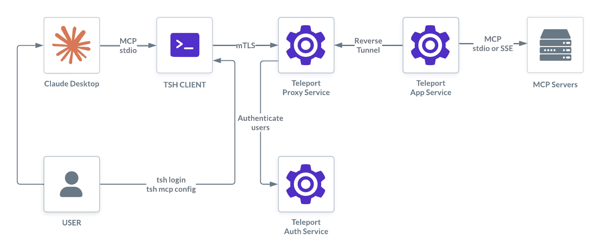

Teleport can provide secure connections to your MCP servers while improving both
access control and visibility.

Teleport protects MCP servers through the Teleport Application Service, which is
a Teleport Agent service. For more information on agent services, read [Teleport
Agent Architecture](../../reference/architecture/agents.mdx). You can also learn
how to deploy a [pool of Teleport Agents](../agents/agents.mdx) to run multiple
agent services.

## Getting started
- [Protect a MCP Server with Teleport](./getting-started.mdx): Provides instructions to set up a Teleport Service and enable secure access to a MCP server.

## Configuration & management
- [MCP Access Controls](./rbac.mdx): Role-Based Access Control (RBAC) for Teleport MCP access.

## Troubleshooting & support
- [Troubleshooting MCP Access](./troubleshooting.mdx): Frequently asked questions about Teleport MCP access.
