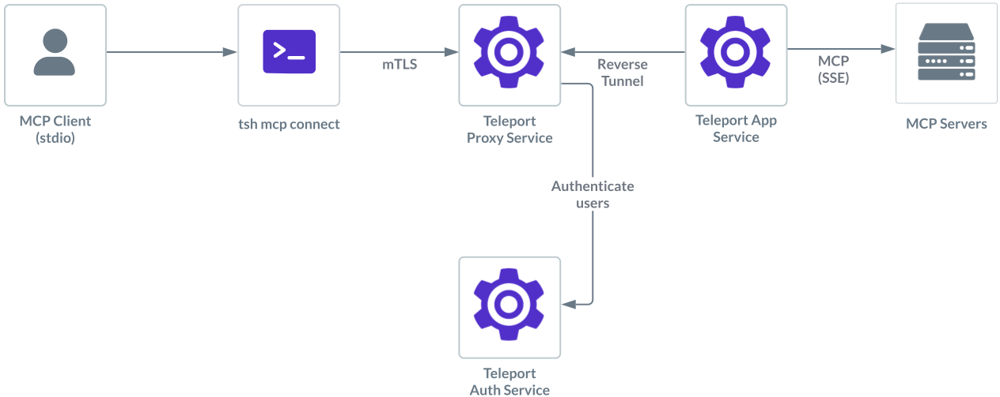

Teleport can provide secure access to MCP servers with SSE transport.

This guides shows you how to:

- Enroll a MCP server with SSE transport in your Teleport cluster.
- Connect to the SSE MCP server via Teleport.

## How it works



Users can configure their MCP clients such as Claude Desktop to start an MCP
server using `tsh`. Once successfully authorized, `tsh` establishes a session
with the Application Service.

The Teleport Application Service first starts an SSE connection to the remote MCP server
defined in the application definition. Teleport then proxies the MCP protocol
between the client and the remote MCP server, applying additional role-based
access controls such as filtering which tools are available to the user. While
proxying, Teleport also logs MCP protocol requests as audit events, providing
visibility into user activity.

<Admonition type="warning">
HTTP with SSE transport has been deprecated in MCP specification version
2025-03-26. It is recommended to update your MCP server to use the
streamable-HTTP transport instead.
</Admonition>

## Prerequisites

(!docs/pages/includes/edition-prereqs-tabs.mdx edition="Teleport (v18.3.0 or higher)"!)
- A host, e.g., an EC2 instance, where you will run the Teleport Application
  Service.
- The endpoint of the SSE MCP server <Var name="MCP endpoint" initial="http://my-sse-server/sse" />.

## Step 1/3. Configure the Teleport Application Service

(!docs/pages/includes/mcp-access/configure-app-service.mdx extraAppScheme="sse+" !)

## Step 2/3. Configure your Teleport user

(!docs/pages/includes/mcp-access/configure-user-rbac.mdx!)

## Step 3/3. Connect

Log in to Teleport with the user we've just created, <Var name="my_user" />:

```code
$ tsh login --proxy=<Var name="teleport.example.com:443" /> --user=<Var name="my_user" />
```

Now we can inspect available MCP servers:

```code
$ tsh mcp ls
Name       Description           Type  Labels
---------- --------------------- ----- ----------
everything everything MCP server SSE   env=dev
```

(!docs/pages/includes/mcp-access/tsh-mcp-config.mdx!)

## Next Steps

Learn more about protecting MCP servers with Teleport in the following topics:

- [MCP Access Control](./rbac.mdx).
- [JWT Authentication to MCP server](./jwt.mdx)
- [Register MCP servers dynamically](./dynamic-registration.mdx)
- Configuration and CLI [reference](../../reference/agent-services/mcp-access.mdx).
