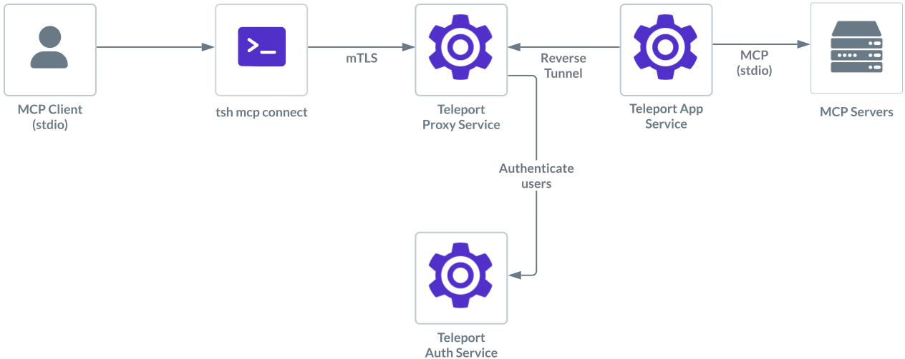

Teleport can provide secure access to MCP servers with stdio transport.

This guides shows you how to:

- Enroll a MCP server with stdio transport in your Teleport cluster.
- Connect to the stdio MCP server via Teleport.

## How it works



Users can configure their MCP clients such as Claude Desktop to start an MCP
server using `tsh`. Once successfully authorized, `tsh` establishes a session
with the Application Service.

The Application Service starts the MCP server using the command and arguments
defined by Teleport administrators in the app definition. Teleport then proxies
the connection between the client and the remote MCP server, applying additional
role-based access controls such as filtering which tools are available to the
user. While proxying, Teleport also logs MCP protocol requests as audit events,
providing visibility into user activity.

## Prerequisites

(!docs/pages/includes/edition-prereqs-tabs.mdx edition="Teleport (v18.1.0 or higher)"!)
- A host, e.g., an EC2 instance, where you will run the Teleport Applications
  Service.
- Tools on the same host that can launch stdio-based MCP servers like `npx`
  or `docker`.

## Step 1/3. Configure the Teleport Application Service

You can update an existing Application Service or create a new one to enable the
the MCP server.

<Tabs>

<TabItem label="Update an existing service">

If you already have an existing Application Service running, you can add a MCP
server in your YAML configuration:
```yaml
app_service:
  enabled: true
  apps:
  - name: "everything"
    labels:
      env: dev
    description:
    mcp:
      # Command to launch stdio-based MCP servers.
      command: "docker"
      # Args to execute with the command.
      args: ["run", "-i", "--rm", "mcp/everything"]
      # Name of the host user account under which the command will be
      # executed. Required for stdio-based MCP servers.
      run_as_host_user: "docker"
```

Replace the MCP details with the MCP server you desire to run then restart the Application Service.

</TabItem>
<TabItem label="Create a new service">

{/* lint ignore heading-increment remark-lint */}
#### Get a join token
(!docs/pages/includes/tctl-token.mdx serviceName="Application" tokenType="app" tokenFile="/tmp/token"!)

(!docs/pages/includes/database-access/alternative-methods-join.mdx!)

#### Install the Teleport Application Service
Install Teleport on the host where you will run the Teleport Application Service:

(!docs/pages/includes/install-linux.mdx!)

#### Configure the Teleport Application service

On the host where you will run the Teleport Application Service, create a file
at `/etc/teleport.yaml` with the following content:
```yaml
version: v3
teleport:
  join_params:
    token_name: "/tmp/token"
    method: token
  proxy_server: "<Var name="teleport.example.com:443" />"
auth_service:
  enabled: false
proxy_service:
  enabled: false
ssh_service:
  enabled: false
app_service:
  enabled: true
  apps:
  - name: "everything"
    labels:
      env: dev
    description:
    mcp:
      # Command to launch stdio-based MCP servers.
      command: "docker"
      # Args to execute with the command.
      args: ["run", "-i", "--rm", "mcp/everything"]
      # Name of the host user account under which the command will be
      # executed. Required for stdio-based MCP servers.
      run_as_host_user: "docker"
```

Replace <Var name="teleport.example.com:443" /> with the host and port of your Teleport Proxy
Service or Teleport Cloud tenant, and replace the MCP details with the MCP
server you desire to run.

#### Start the Teleport Application Service

(!docs/pages/includes/start-teleport.mdx service="the Application Service"!)

</TabItem>
</Tabs>

## Step 2/3. Configure your Teleport user

(!docs/pages/includes/mcp-access/configure-user-rbac.mdx!)

## Step 3/3. Connect

Log in to Teleport with the user we've just created, <Var name="my_user" />:

```code
$ tsh login --proxy=<Var name="teleport.example.com:443" /> --user=<Var name="my_user" />
```

Now we can inspect available MCP servers:

```code
$ tsh mcp ls
Name       Description           Type  Labels
---------- --------------------- ----- ----------
everything everything MCP server stdio env=dev
```

To show configurations for your MCP client to connect:

```code
$ tsh mcp config everything
Found MCP servers:
everything

Here is a sample JSON configuration for launching Teleport MCP servers:
{
  "mcpServers": {
    "teleport-mcp-everything": {
      "command": "/path/to/tsh",
      "args": ["mcp", "connect", "everything"]
    }
  }
}

Tip: You can use this command to update your MCP servers configuration file automatically.
- For Claude Desktop, use --client-config=claude to update the default configuration.
- For Cursor, use --client-config=cursor to update the global MCP servers configuration.
In addition, you can use --client-config=<path> to specify a config file location that is compatible with the "mcpServers" mapping.
For example, you can update a Cursor project using --client-config=<path-to-project>/.cursor/mcp.json
```

Once your MCP client configuration is updated, you will see
`teleport-mcp-everything` MCP server with allowed tools appear in your MCP client.

## Next Steps

Learn more about protecting MCP servers with Teleport in the following topics:

- [MCP Access Control](./rbac.mdx).
- [Register MCP servers dynamically](./dynamic-registration.mdx)
- Configuration and CLI [reference](../../reference/agent-services/mcp-access.mdx).
