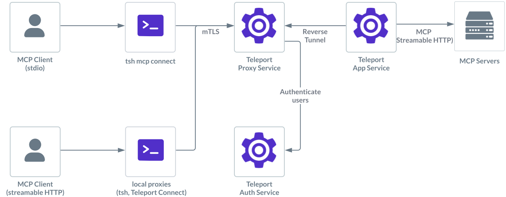

Teleport can provide secure access to MCP servers with streamable-HTTP transport.

This guides shows you how to:

- Enroll a MCP server with streamable-HTTP transport in your Teleport cluster.
- Connect to the stdio MCP server via Teleport.

## How it works



Users can configure their MCP clients such as Claude Desktop to start an MCP
server using `tsh`. Once successfully authorized, `tsh` establishes a session
with the Application Service.

Teleport proxies the MCP protocol between the client and the remote MCP server,
applying additional role-based access controls such as filtering which tools are
available to the user. While proxying, Teleport also logs MCP protocol requests
as audit events, providing visibility into user activity.

## Prerequisites

(!docs/pages/includes/edition-prereqs-tabs.mdx edition="Teleport (v18.3.0 or higher)"!)
- A host, e.g., an EC2 instance, where you will run the Teleport Application
  Service.
- The endpoint of the streamable-HTTP MCP server <Var name="MCP endpoint" initial="http://my-http-server/mcp" />.

## Step 1/3. Configure the Teleport Application Service

(!docs/pages/includes/mcp-access/configure-app-service.mdx!)

## Step 2/3. Configure your Teleport user

(!docs/pages/includes/mcp-access/configure-user-rbac.mdx!)

## Step 3/3. Connect

Log in to Teleport with the user we've just created, <Var name="my_user" />:

```code
$ tsh login --proxy=<Var name="teleport.example.com:443" /> --user=<Var name="my_user" />
```

Now we can inspect available MCP servers:

```code
$ tsh mcp ls
Name       Description           Type            Labels
---------- --------------------- --------------- ----------
everything everything MCP server Streamable HTTP env=dev
```

(!docs/pages/includes/mcp-access/tsh-mcp-config.mdx!)

## Connect with streamable-HTTP client

The `tsh mcp connect` command demonstrated above can be used by any stdio MCP
client to start a MCP session, and Teleport automatically handles the transport
conversion to the remote MCP server.

However, if you wish to connect to the MCP server in streamable-HTTP transport,
you can start a local proxy that creates an authenticated tunnel to the remote
MCP server:
```code
$ tsh proxy mcp everything -p 8888
Proxying connections to everything on 127.0.0.1:8888
```

Then, connect to the MCP server locally with a MCP client that supports
streamable-HTTP, for example:
```code
$ npx @modelcontextprotocol/inspector --transport http --cli --method tools/list http://127.0.0.1:8888
```

Alternatively, instead of `tsh`, you can use [Teleport
Connect](../../connect-your-client/teleport-connect.mdx#connecting-to-an-mcp-server) which can maintain
the local proxies in the background.

## Next Steps

Learn more about protecting MCP servers with Teleport in the following topics:

- [MCP Access Control](./rbac.mdx).
- [JWT Authentication to MCP server](./jwt.mdx)
- [Register MCP servers dynamically](./dynamic-registration.mdx)
- Configuration and CLI [reference](../../reference/agent-services/mcp-access.mdx).
