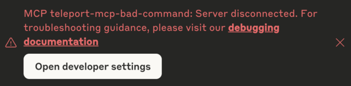

This section describes common issues that you might encounter in managing access
to MCP servers with Teleport and how to work around or resolve them.

## Disabled MCP server or tools missing from the MCP server

By default, no MCP tools are allowed by your Teleport roles.

If a user is assigned the `access` preset role, by default the available MCP
tools are controlled by the `{{internal.mcp_tools}}` source in the role
definition. This value can be populated through user traits:

```yaml
kind: role
metadata:
  name: access
spec:
  allow:
    mcp:
      tools:
      - "{{internal.mcp_tools}}"
```

You can configure this user trait with `tctl`, assigning it to the Teleport user
<Var name="my_user" />:

```code
$ tctl users update <Var name="my_user" /> --set-mcp-tools "*"
```

Alternatively you can define a custom role that explicitly specifies the allowed
MCP tools and assigns them to users. See [RBAC](./rbac.mdx) for more details.

## Server disconnected when starting the MCP server

You may encounter a "Server disconnected" error or similar errors when your MCP
client starts the MCP server.



First, make sure your client configuration is correct and your `tsh` session is
active. See [connect MCP
clients](../../connect-your-client/model-context-protocol/mcp-access.mdx) for
more details.

If the problem persists, follow your MCP client's specific guideline to find the
debug logs of the MCP server execution.

If you encounter a "Lost server connection" error in the debug log, or the `tsh`
command exits immediately, it usually indicates that the command used to launch
the stdio MCP server on the Teleport Application Service instance has failed to
execute properly.

To confirm this, check the Application Service logs for any warnings that
indicate a failure to start the MCP server process — commonly an
`exec.ExitError`, but it may also include other related execution or runtime
errors. These typically appear shortly after the client connection is
established:
```
WARN [APP:SERVICE] Failed to handle client connection. error:[
ERROR REPORT:
Original Error: *exec.ExitError exit status 1
```

To fix the issue, ensure that the Teleport app definition used to start the MCP
server is configured correctly. You can test it by manually running the
`app.mcp.command` and `app.mcp.args` directly on the host where the Teleport
Application Service is running — without using Teleport. Also, make sure the
host user set for `mcp.run_as_host_user` exists on the host  and has the
necessary permissions to execute the configured command.
