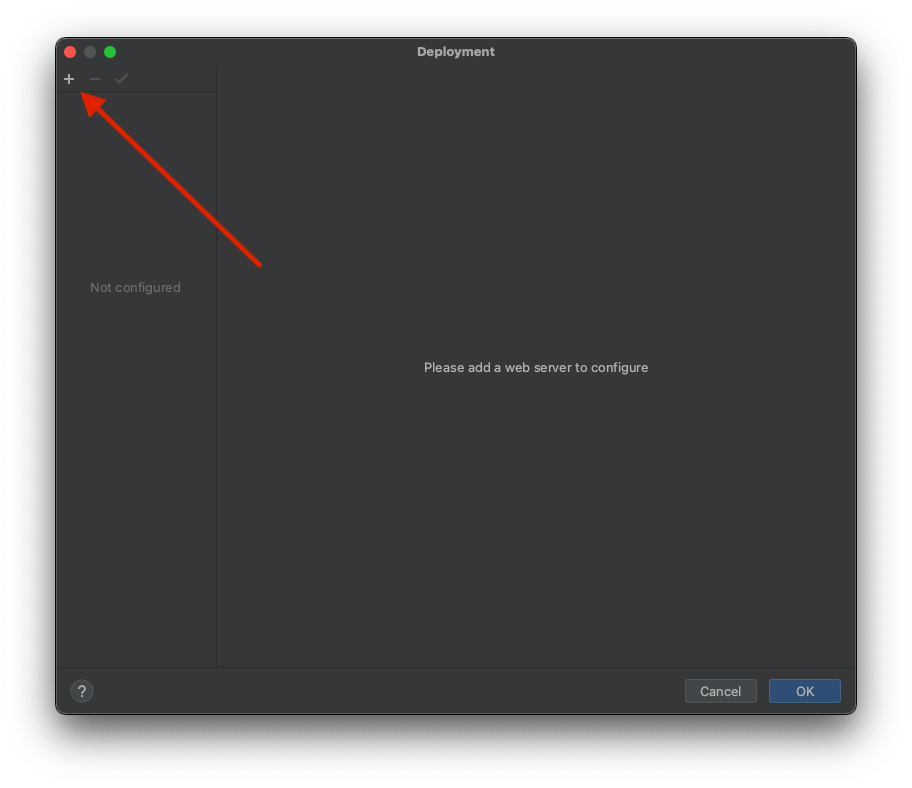
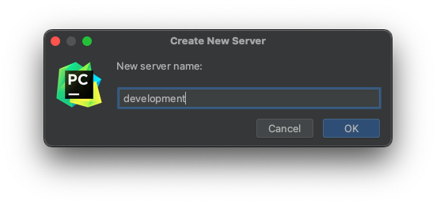
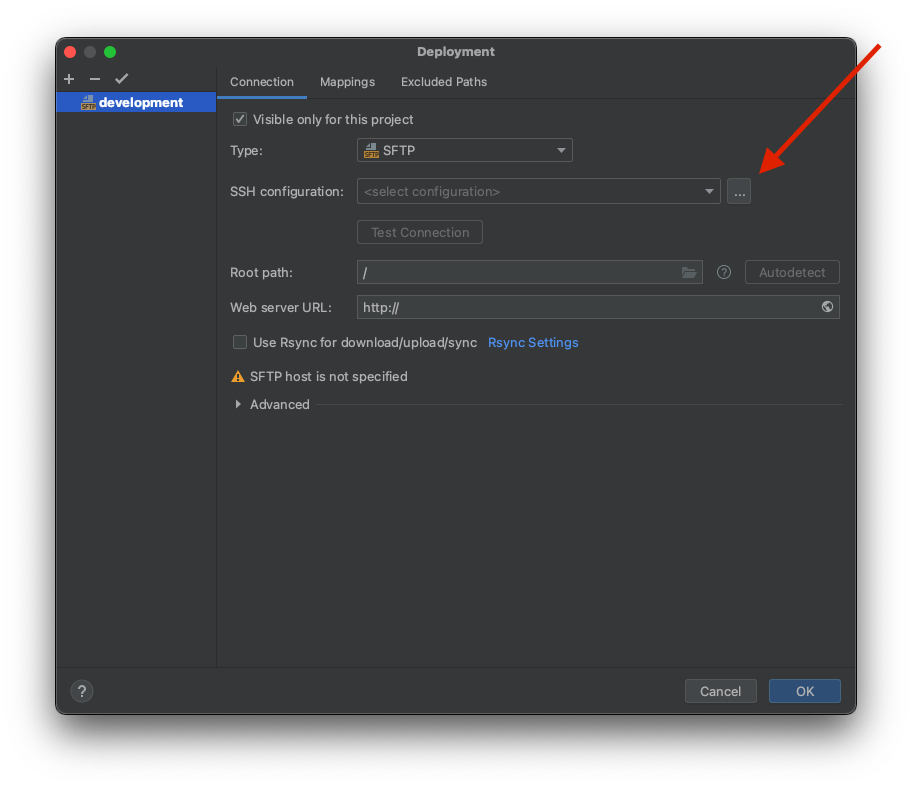
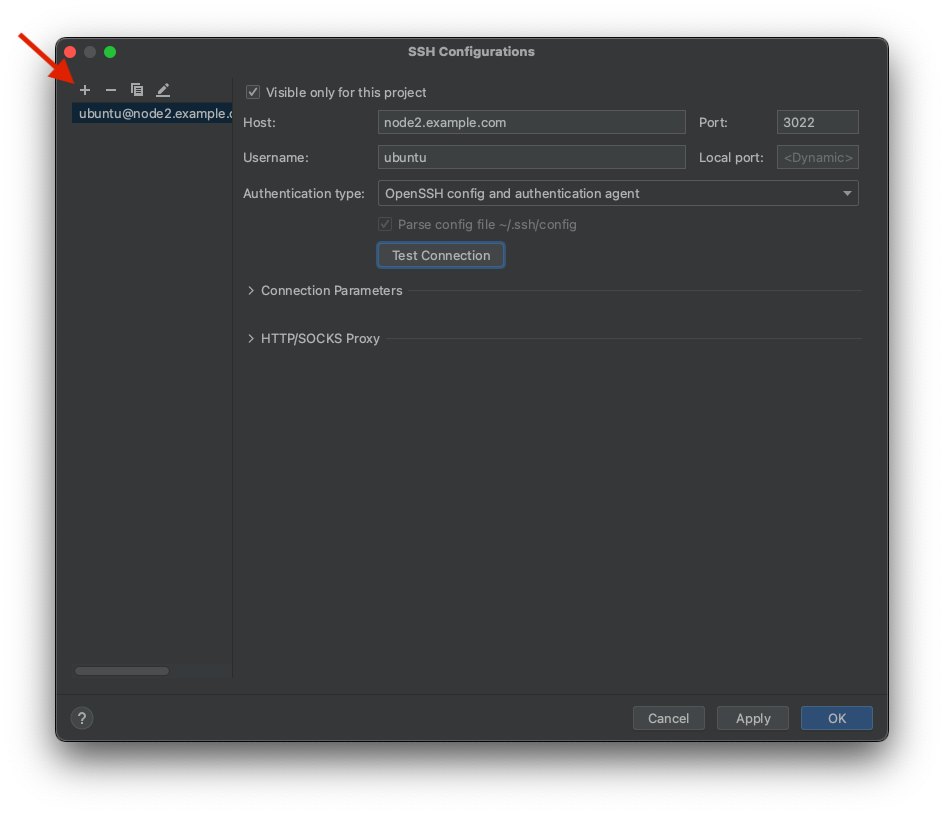
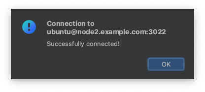
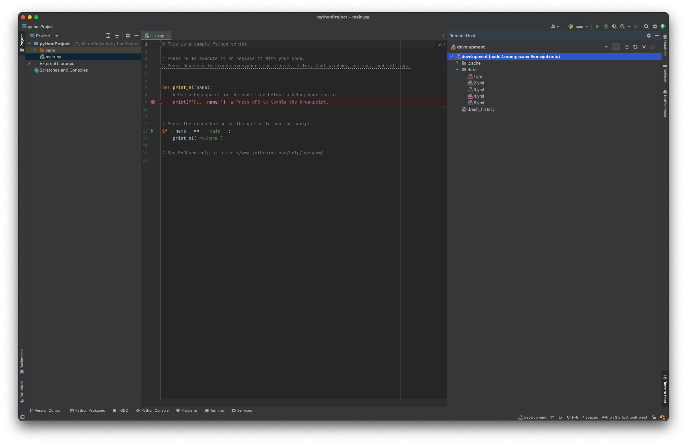

JetBrain's IDEs, like PyCharm, GoLand, and IntelliJ, allow browsing, copying, and editing files on a remote server
using the SFTP protocol. You can integrate Teleport with your IDE so you can copy files to and from a remote
machine without using a third-party client.

This guide explains how to use Teleport and a JetBrains IDE to access files with SFTP.

## Prerequisites

(!docs/pages/includes/edition-prereqs-tabs-not-admin.mdx!)

- JetBrains IDE like PyCharm, IntelliJ, GoLand etc. See [Products](https://www.jetbrains.com/products/#type=ide) for a full list of JetBrains IDEs.
- One or more Teleport SSH Service instances. If you have not yet done this,
  read the [getting started guide](../getting-started.mdx) to
  learn how.

## Step 1/3. First-time setup

Configure your local SSH client to access servers, assigning the `--proxy` flag to the address of your Teleport Proxy Service (e.g., `mytenant.teleport.sh` for Teleport Cloud users).

```code
# log in to your proxy:
$ tsh login --proxy proxy.foo.example.com --user alice

# generate the OpenSSH config for the proxy:
$ tsh config --proxy proxy.foo.example.com
```

Append the resulting configuration snippet into your SSH config file located
in the path below:

<Tabs>
  <TabItem label="Linux/macOS">
    `$HOME/.ssh/config`
  </TabItem>
  <TabItem label="Windows">
    `%UserProfile%\.ssh\config`

    <Admonition type="warning">
      If using PowerShell on Windows to write your SSH config, note that normal
      shell redirection may write the file with the incorrect encoding. To
      ensure it's written properly, try the following:

      ```code
      $ tsh.exe config | out-file .ssh\config -encoding utf8 -append
      ```
    </Admonition>
  </TabItem>
</Tabs>

You should be able to connect to the desired server using the following command, replacing `user` with the username you would like to assume on the server:

```code
$ ssh user@[server name].[cluster name]
```

<details>
<summary>Teleport Cloud</summary>
  The SSH config you generated earlier instructs your SSH client to run `tsh proxy ssh` to access a server in your Teleport cluster.
  However, running an `ssh` command against the Teleport Proxy Service at `yourtenant.teleport.sh` will result in an error.
</details>

<Admonition type="note">
  Include the port number for OpenSSH servers, by default `22`, or you can experience an error.
  See the [OpenSSH guide](../openssh/openssh.mdx) for more information.
  Example connecting to a OpenSSH server:

  ```code
  $ ssh -p 22 user@[server name].[cluster name]
  ```
</Admonition>

## Step 2/3. Configure your JetBrains IDE

After opening your IDE go to `Tools` -> `Deployment` -> `Browse Remote Host`.



Then click the plus sign in the top-left corner to add a new server.



Enter a name for your new server.



Click the three dots next to `SSH configuration` as in the picture above.



Create a new configuration by clicking the plus sign on the top left and providing:

- `Host` - name of the Teleport server.
- `Port` - the Teleport server's SSH port (`3022` by default or `22` for OpenSSH servers).
- `Username` - the system username.

As an `Authentication type` pick `OpenSSH config and authentication agent`.
Next, you can click `Test Connection`.



## Step 3/3. Browse a remote host

After closing the SSH configuration window, you should see `Remote Host` menu in your IDE.



<Admonition type="note">
  Teleport's certificates expire fairly quickly, after which SSH
  attempts will fail with an error like the following:

  ```txt
  alice@proxy.foo.example.com: Permission denied (publickey).
  ERROR: exit status 255

  kex_exchange_identification: Connection closed by remote host
  ```

  When you see this error, re-run `tsh login` to refresh your local certificate.
</Admonition>

## Next steps

### Using OpenSSH clients

This guide makes use of `tsh config`; refer to the
[dedicated guide](../openssh/openssh.mdx) for additional information.

## Further reading
- [JetBrains - Create a remote server configuration](https://www.jetbrains.com/help/idea/creating-a-remote-server-configuration.html#overload)
