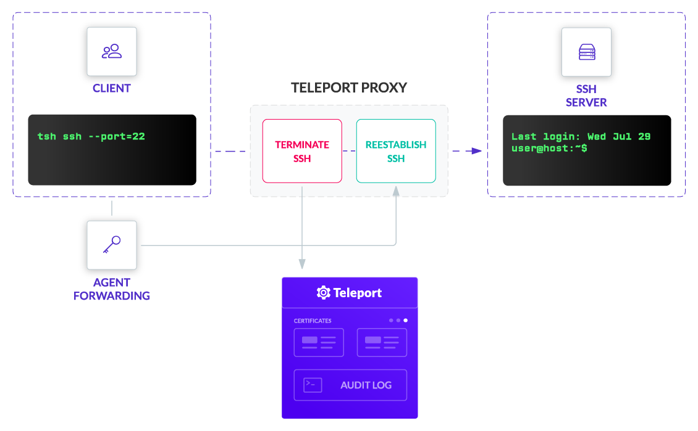

Teleport Recording Proxy Mode was added to allow Teleport users
to enable session recording for servers running `sshd`, which is helpful
when gradually transitioning large server fleets to Teleport.

<Figure
  align="center"
  bordered
  caption="Teleport OpenSSH Recording Proxy"
>
  
</Figure>

<Admonition type="warning">

Teleport Cloud only supports session recording at the Node level. If you are
interested in setting up session recording, read our
[Server Access Getting Started Guide](../getting-started.mdx) so you can start
replacing your OpenSSH servers with Teleport Nodes.

</Admonition>

We consider Recording Proxy Mode to be less secure than recording at the Node
level for two reasons:

- It grants additional privileges to the Teleport Proxy Service. In the default Node Recording mode, the Proxy Service stores no secrets and cannot "see" the decrypted data. This makes a Proxy Server less critical to the security of the overall cluster. But if an attacker gains physical access to a Proxy Server running in Proxy Recording mode, they will be able to see the decrypted traffic and client keys stored in the Proxy Server's process memory.
- Recording Proxy Mode requires the use of SSH agent forwarding. Agent forwarding is required because without it, a Proxy Server will not be able to establish a second connection to the destination node.

The Teleport Proxy Service should be available to clients and set up with TLS.

## Prerequisites

(!docs/pages/includes/self-hosted-prereqs-tabs.mdx!)

- A host where you will run an OpenSSH server.
- (!docs/pages/includes/tctl.mdx!)

## Step 1/3. Configure Teleport

(!docs/pages/includes/permission-warning.mdx!)

(!docs/pages/includes/backup-warning.mdx!)

### Enable Proxy Recording Mode

To enable session recording for `sshd` nodes, the cluster must be switched to
Recording Proxy Mode. In this mode, the recording will be done on the Proxy level.

Edit the Auth Service configuration file as follows:

```yaml
# snippet from /etc/teleport.yaml
auth_service:
   # Session Recording must be set to Proxy to work with OpenSSH
   session_recording: "proxy"  # can also be "off" and "node" (default)
```

### Optional insecure step: Disable strict host checking

When in recording mode, Teleport will check that the host certificate of any
Node a user connects to is signed by a Teleport CA. By default, this is a strict
check. If the Node presents just a key or a certificate signed by a different
CA, Teleport will reject this connection with the error message:

```text
ssh: handshake failed: remote host presented a public key, expected a host
certificate
```

You can disable strict host checks as shown below. However, this opens the
possibility for Person-in-the-Middle attacks and is not recommended.

```yaml
# snippet from /etc/teleport.yaml
auth_service:
  proxy_checks_host_keys: no
```

## Step 2/3. Configure `sshd`

`sshd` must be told to allow users to log in with certificates generated
by the Teleport User CA. Start by exporting the Teleport CA public key.

On your Teleport Node, export the Teleport Certificate Authority certificate
into a file and update your SSH configuration to trust Teleport's CA. Assign <Var name="proxy" /> to the address of your Teleport Proxy Service:

```code
$ curl 'https://<Var name="proxy"/>/webapi/auth/export?type=user' | sed s/cert-authority\ // > teleport_user_ca.pub
$ sudo mv ./teleport_user_ca.pub /etc/ssh/teleport_user_ca.pub
$ echo "TrustedUserCAKeys /etc/ssh/teleport_user_ca.pub" | sudo tee -a /etc/ssh/sshd_config
```

Restart `sshd`.

Now, `sshd` will trust users who present a Teleport-issued certificate.
The next step is to configure host authentication.

The recommended solution is to ask Teleport to issue valid host certificates for
all OpenSSH nodes. To generate a host certificate, run this command:

```code
# Creating host certs, with an array of every host to be accessed.
# Wildcard certs aren't supported by OpenSSH. The domain must be fully 
# qualified.
# Management of the host certificates can become complex. This is another
# reason we recommend using Teleport SSH on nodes.
$ tctl auth sign \
      --host=api.example.com,ssh.example.com,64.225.88.175,64.225.88.178 \
      --format=openssh \
      --out=api.example.com

The credentials have been written to api.example.com, api.example.com-cert.pub

# You can use ssh-keygen to verify the contents.
$ ssh-keygen -L -f api.example.com-cert.pub
#api.example.com-cert.pub:
#        Type: ssh-rsa-cert-v01@openssh.com host certificate
#        Public key: RSA-CERT SHA256:ireEc5HWFjhYPUhmztaFud7EgsopO8l+GpxNMd3wMSk
#        Signing CA: RSA SHA256:/6HSHsoU5u+r85M26Ut+M9gl+HventwSwrbTvP/cmvo
#        Key ID: ""
#        Serial: 0
#        Valid: after 2020-07-29T20:26:24
#        Principals:
#               api.example.com
#               ssh.example.com
#               64.225.88.175
#               64.225.88.178
#        Critical Options: (none)
#        Extensions:
#                x-teleport-authority UNKNOWN OPTION (len 47)
#                x-teleport-role UNKNOWN OPTION (len 8)
```

Then add the following lines to `/etc/ssh/sshd_config` on all OpenSSH nodes, and
restart `sshd`.

```yaml
HostKey /etc/ssh/api.example.com
HostCertificate /etc/ssh/api.example.com-cert.pub
```

## Step 3/3. Use Proxy Recording Mode

Now you can use the `tsh ssh` command to log in to any `sshd` node in the
cluster, and the session will be recorded.

```code
# tsh ssh to use default ssh port:22
$ tsh ssh --port=22 user@host.example.com
# Example for a Amazon EC2 Host
# tsh ssh --port=22 ec2-user@ec2-54-EXAMPLE.us-west-2.compute.amazonaws.com
```

If you want to use the OpenSSH `ssh` client for logging into `sshd` servers behind a proxy
in "recording mode", you have to tell the `ssh` client to use a jump host and
enable SSH agent forwarding, otherwise, a recording proxy will not be able to
terminate the SSH connection to record it:

```code
# Note that agent forwarding is enabled twice: one from a client to a proxy
# (mandatory if using a recording proxy), and then optionally from a proxy
# to the end server if you want your agent running on the end server
$ ssh -o "ForwardAgent yes" \
    -o "ProxyCommand ssh -o 'ForwardAgent yes' -p 3023 %r@p.example.com -s proxy:%h:%p" \
    user@host.example.com
```

<Admonition
  type="tip"
  title="Tip"
>
  To avoid typing all this and use the usual `ssh user@host.example.com`, users can update their `~/.ssh/config` file.
</Admonition>

Verify that a Teleport certificate is loaded into the agent after
logging in:

```code
# Login as Joe
$ tsh login --proxy=proxy.example.com --user=joe
# see if the certificate is present (look for "teleport:joe") at the end of the cert
$ ssh-add -L
```

<Admonition
  type="warning"
  title="GNOME Keyring SSH Agent and GPG Agent"
>
  It is well known that the Gnome Keyring SSH agent, used by many popular Linux desktops like Ubuntu, and `gpg-agent` from GnuPG do not support SSH
  certificates. We recommend using the `ssh-agent` from OpenSSH.
  
  Alternatively, you can disable the SSH agent integration entirely using the
  `--no-use-local-ssh-agent` flag or `TELEPORT_USE_LOCAL_SSH_AGENT=false`
  environment variable with `tsh`.
</Admonition>

## OpenSSH rate limiting

When using a Teleport proxy in "recording mode", be aware of OpenSSH's built-in
rate-limiting. On large numbers of Proxy Service connections, you may encounter errors
like:

```txt
channel 0: open failed: connect failed: ssh: handshake failed: EOF
```

See the `MaxStartups` setting in `man sshd_config`. This setting means that by
default, OpenSSH only allows 10 unauthenticated connections at a time and starts
dropping connections 30% of the time when the number of connections goes over 10.
When it hits 100 authentication connections, all new connections are
dropped.

To increase the concurrency level, increase the value to something like
`MaxStartups 50:30:100`. This allows 50 concurrent connections and a max of 100.

