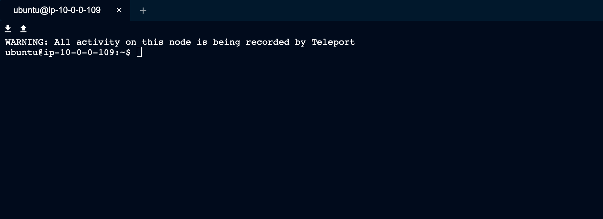

Teleport's SSH Service can be configured to integrate with
Pluggable Authentication Modules (PAM).

Teleport currently supports the `auth`, `account`, and `session` PAM modules. The `auth`
stack is optional and not used by default.

These are a few things leverage PAM for:

- Create a custom Message of the Day (MOTD)
- Create local Unix users on login
- Add authentication steps

## Introduction to Pluggable Authentication Modules

### Background

Pluggable Authentication Modules (PAM) date back to 1995 when Sun Microsystems
implemented a generic authentication framework for Solaris. Since then most GNU/Linux
distributions have adopted PAM.

```code
$ man pam
```

The Pluggable Authentication Modules (PAM) library abstracts several common
authentication-related operations and provides a framework for dynamically loaded
modules that implement these operations in various ways.

### Terminology

In PAM parlance, the application that uses PAM to authenticate a user is the **server**,
and is identified for configuration purposes by a service name, which is often (but
not necessarily) the program name.

The user requesting authentication is called the **applicant**, while the user (usually, root)
charged with verifying their identity and granting them the requested credentials is
called the **arbitrator**.

The sequence of operations the server goes through to authenticate a user and perform
whatever task they requested is a PAM **transaction**. The context within which the server
performs the requested task is called a **session**.

The functionality embodied by PAM is divided into four facilities:
authentication, account management, session management, and password management.

Teleport currently supports account management and session management.

## Set up PAM on a Linux Machine running Teleport

(!docs/pages/includes/permission-warning.mdx!)

(!docs/pages/includes/backup-warning.mdx!)

To enable PAM on a Linux machine, update `/etc/teleport.yaml` with:

```yaml
ssh_service:
  # Enabled SSH Service
  enabled: true
  # Enable PAM integration
  pam:
    # "no" by default
    enabled: true
    # use /etc/pam.d/sshd configuration (the default)
    service_name: "sshd"
    # use the "auth" modules in the PAM config
    # "false" by default
    # use_pam_auth: false
```

Please note that most Linux distributions come with several PAM services in
`/etc/pam.d`, and Teleport will try to use `/etc/pam.d/sshd` by default. This
file will be removed if you uninstall the `openssh-server` package. We recommend
creating your own PAM service file like `/etc/pam.d/teleport` and specifying it
as `service_name` above.

## Get and set environment variables for PAM modules

Teleport supports setting arbitrary environment variables for PAM modules as of
version 6.1. These variables can also be role-style SSO claims in the form
`{{ external.email }}`, where `email` is a claim made by the configured SSO IdP.

To set custom environment variables, update `/etc/teleport.yaml` with:

```yaml
ssh_service:
  enabled: true
  pam:
    # disabled by default
    enabled: true
    # use /etc/pam.d/sshd configuration (the default)
    service_name: "sshd"
    # use the "auth" modules in the PAM config
    # "false" by default
    use_pam_auth: true
    # sets custom environment variables for PAM modules
    environment:
      FOO: "bar"
      EMAIL: "{{ external.email }}"
```

Teleport can also read PAM environment variables from the PAM **handle**, an
opaque data structure that is used by PAM to store state. These variables
include:

- `TELEPORT_USERNAME`: The Teleport username of the user who is logging into a Node. This is usually an email address (such as `user@example.com`) if using SAML/OIDC identities with Teleport Enterprise, or a more standard `exampleuser` if using local Teleport users.
- `TELEPORT_LOGIN`: The name of the Linux/Unix username that the Teleport user assumes when logging into the Teleport Node, e.g., `root`, `developer`, `ubuntu`, `ec2-user`,or similar.
- `TELEPORT_ROLES`: A space-separated list of Teleport roles which the Teleport user has, e.g., `developer tester access`.

## Display a Message of the Day (MOTD) with Teleport

<Tabs>
<TabItem scope={["oss", "enterprise"]} label="Self-Hosted">

A cluster-wide Message of the Day can be set in the `auth_service` configuration.

```yaml
auth_service:
    message_of_the_day: "Welcome to the cluster. All activity will be logged."
```

This will be shown during the `tsh login` process, and must be positively acknowledged
before the user is allowed to log in to the cluster.

```code
$ tsh login --proxy teleport.example.com
# Welcome to the cluster. All activity will be logged.
# Press [ENTER] to continue.
```

Alternatively, a per-Node Message of the Day can be set using
the traditional Unix `/etc/motd` file. The `/etc/motd` file is normally
displayed by login(1) after a user has logged in but before the shell is run. It
is generally used for important system-wide announcements.

</TabItem>
<TabItem scope={["cloud"]} label="Teleport Enterprise Cloud">

You can set a per-Node Message of the Day using the traditional Unix `/etc/motd`
file. The `/etc/motd` file is normally displayed by login(1) after a user has
logged in but before the shell is run. It is generally used for important
system-wide announcements.

</TabItem>

</Tabs>

This feature can help you inform users that activity on the Node is being audited
and recorded.

The default `sshd` PAM configuration will call two `pam_motd` files, one dynamic
MOTD that prints the machine info, and a static MOTD that can be set by an
admin.

```txt
session    optional     pam_motd.so  motd=/run/motd.dynamic
session    optional     pam_motd.so noupdate
```

By updating `/etc/motd` you can provide a message to users accessing Nodes via Teleport.

```code
$ cat /etc/motd
# WARNING: All activity on this node is being recorded by Teleport
```

<Figure
  align="center"
  bordered
  caption="Teleport SSH with updated MOTD"
>
  
</Figure>

## Create local Unix users on login

Teleport has the ability to create local Unix users on login. This is
very helpful if you're a large organization and want to provision local users and home
directories on the fly.

Using `pam_exec.so` is the easiest way to use the PAM stack to create a user if
the user does not already exist. `pam_exec.so` usually ships with the operating
system. If you do not already use the PAM stack, you may alternatively use
Teleport's built in support for [automatically provisioning users](./host-user-creation.mdx).

You can either add `pam_exec.so` to the existing PAM stack for your application or
write a new one for Teleport. In this example, we'll write a new one to simplify how
to use `pam_exec.so` with Teleport.

Start by creating a file called `/etc/pam.d/teleport` with the following contents:

```txt
account   required   pam_exec.so /etc/pam-exec.d/teleport_acct
session   required   pam_motd.so
session   required   pam_permit.so
```

<Admonition type="note">

  Pay attention to the inclusion of `pam_motd.so` under the `session` facility.
  While `pam_motd.so` is not required for user creation, Teleport requires at
  least one module to be set under both the `account` and `session` facilities
  for it to work.

</Admonition>

Next, create a script that will be run by `pam_exec.so`.

Create a directory where you will store the script:

```code
$ mkdir -p /etc/pam-exec.d
```

In `/etc/pam-exec.d`, add a file called `teleport_acct` with the following
content:

```text
#!/bin/sh
COMMENT="User ${TELEPORT_LOGIN} for ${TELEPORT_USERNAME} with roles ${TELEPORT_ROLES} created by Teleport."
/bin/id -u "${TELEPORT_LOGIN}" > /dev/null 2>&1 || /sbin/useradd -m -s /bin/bash -c "${COMMENT}" "${TELEPORT_LOGIN}" 2>> /tmp/pam.error
exit 0
```

Ensure that your script is executable:

```code
$ chmod +x /etc/pam-exec.d/teleport_acct
```

This script will check if the login assigned to `TELEPORT_LOGIN` exists and, if
it does not, it will create it. Any error from `useradd` will be written to
`/tmp/pam.error`.

The environment variables `TELEPORT_USERNAME` and `TELEPORT_ROLES` can be used
to write richer scripts that may change the system in other ways based on
identity information.

<Admonition type="note">

  The `useradd` command can have a different path than the example above
  depending on your Linux distribution. Adjust to your particular system as needed
  depending on the result of the following command:

  ```code
  $ which useradd
  ```

</Admonition>

Next, update `/etc/teleport.yaml` to call the above PAM stack by both enabling PAM and
setting the service_name.

```yaml
ssh_service:
  enabled: true
  pam:
    enabled: true
    service_name: "teleport"
```

Now attempting to log in as an existing user should result in the creation of the
user and a successful login.

The `/etc/pam-exec.d/teleport_acct` script can set the user's groups as an option to auto-populate
the user's permissions.  The user's roles are populated as space-delimited `TELEPORT_ROLES` variables.
These could be used to map to a particular `sudo` group with additional scripting.

## Add authentication steps

By using the PAM `auth` modules, it is possible to add authentication steps
during user login. These can include passwords, second authentication factor, or
even biometrics.

Note that Teleport enables strong SSH authentication out of the box using
certificates. For most users, hardening [the initial Teleport
authentication](../../../reference/access-controls/authentication.mdx) (e.g. `tsh login`) is preferred.

By default, `auth` modules are not used to avoid the default system behavior
(usually using local Unix passwords). You can enable them by setting
`use_pam_auth` in the `pam` section of your `teleport.yaml`.

```yaml
ssh_service:
  enabled: true
  pam:
    enabled: true
    # use /etc/pam.d/sshd configuration (the default)
    service_name: "sshd"
    # use the "auth" modules in the PAM config
    use_pam_auth: true
```
