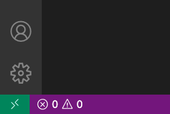
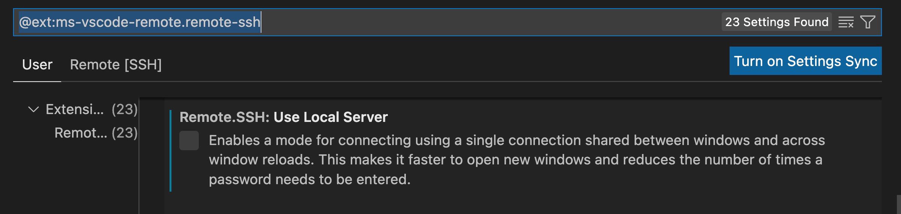
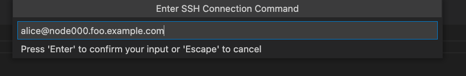
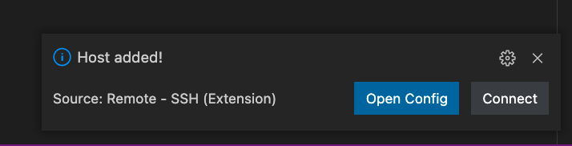
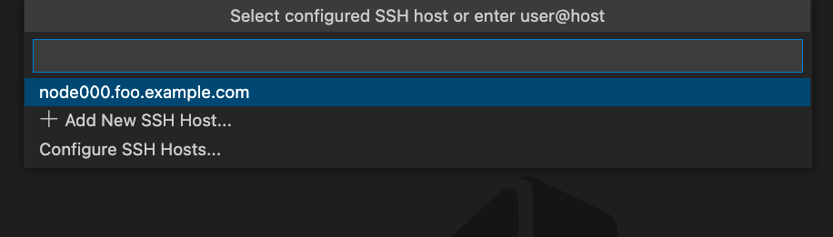
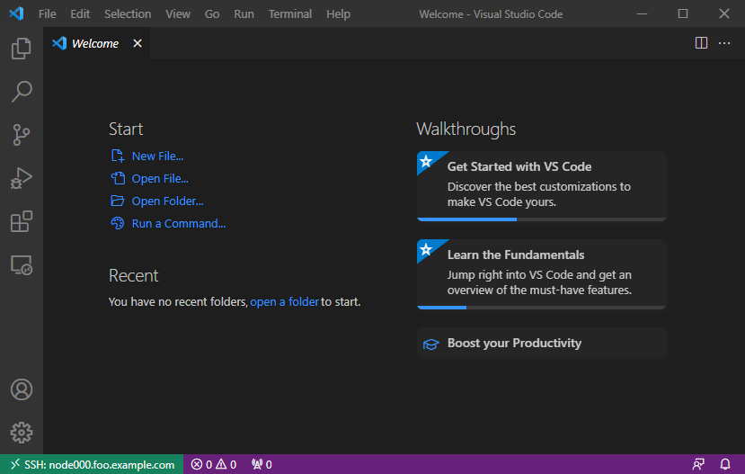

This guide explains how to use Teleport and Visual Studio Code's remote SSH extension.

## Prerequisites

(!docs/pages/includes/edition-prereqs-tabs-not-admin.mdx!)

- OpenSSH client.
- Visual Studio Code with the [Remote - SSH extension](https://code.visualstudio.com/docs/remote/ssh#_system-requirements)
  for the Remote - SSH extension.
- One or more Teleport Agents running the Teleport SSH Service. If you have not yet
  done this, read the
  [getting started guide](../getting-started.mdx) to learn how.

<Admonition type="note">
Linux and macOS clients should rely on their operating system-provided OpenSSH
packages. Windows 10 clients should refer to Microsoft's [OpenSSH guide][win10];
older clients can use `ssh.exe` from either [Git for Windows][git] or
Microsoft's [Win32-OpenSSH project][win32-openssh].
</Admonition>

## Step 1/3. First-time setup

Configure your local SSH client to access Teleport Nodes. Replace <Var name="teleport.example.com" description="Path to your Teleport Proxy Service or Cloud tenant"/> with the address of your Teleport Proxy Service (e.g., `mytenant.teleport.sh` for Teleport Cloud users), and replace <Var name="alice" description="Your teleport user"/> with your Teleport user.

```code
# log in to your proxy:
$ tsh login --proxy <Var name="teleport.example.com"/> --user <Var name="alice"/>

# generate the OpenSSH config for the proxy:
$ tsh config --proxy <Var name="teleport.example.com"/>
```

Append the resulting configuration snippet into your SSH config file located
in the path below:

<Tabs>
<TabItem label="Linux/macOS">
`$HOME/.ssh/config`
</TabItem>
<TabItem label="Windows">
`%UserProfile%\.ssh\config`

<Admonition type="warning">

If using PowerShell on Windows to write your SSH config, note that normal
shell redirection may write the file with the incorrect encoding. To
ensure it's written properly, try the following:

```code
$ tsh.exe config | out-file .ssh\config -encoding utf8 -append
```

</Admonition>
</TabItem>
</Tabs>

You should be able to connect to the desired node using following command,
replacing <Var name="user" /> with the username you would like to assume on the
node and <Var name="example-node" /> with the node name:

```code
$ ssh <Var name="user" />@<Var name="example-node" description="An SSH node in your Teleport cluster"/>.<Var name="teleport.example.com"/>
```

<Details scopeOnly={true} scope={["cloud"]} title="Teleport Cloud">
The SSH config you generated earlier instructs your SSH client to run `tsh proxy ssh` to access a Node in your Teleport cluster. However, running an `ssh` command against the Teleport Proxy Service at `yourtenant.teleport.sh` will result in an error.
</Details>

<Admonition type="note">
Teleport's certificates expire fairly quickly, after which SSH
attempts will fail with an error like the following:

```txt
alice@proxy.foo.example.com: Permission denied (publickey).
ERROR: exit status 255

kex_exchange_identification: Connection closed by remote host
```

When you see this error, re-run `tsh login` to refresh your local certificate.
</Admonition>

## Step 2/3. Configure Visual Studio Code

Install the [Remote - SSH extension][remote-ssh] in your local VS Code instance.
A new "Window Indicator" (icon with two arrows) should appear in the bottom left of your VS Code window.

<Figure align="left" bordered caption="Window Indicator">

</Figure>

Prior to connecting with a host, set the `Remote.SSH: Use Local Server` setting
to false in the extension setting. You can search for
`@ext:ms-vscode-remote.remote-ssh ` to find the plugin-specific settings.

<Figure align="left" bordered caption="VSCode Setting">

</Figure>

To connect, click on the icon with two arrows and select "Connect to Host...".
Select "+ Add New SSH Host..."

For each host you wish to remotely develop on, add an entry like the following:

```txt
alice@node000.foo.example.com
```

<Figure align="left" bordered caption="Adding new Node">

</Figure>

When prompted to choose which SSH Configuration file to update select the one we generated during Step 1.

This will write a new node into your SSH Configuration file. You can edit and manage all your nodes in this file.

## Step 3/3. Start a Remote Development session

Start a Remote Development session by either:

1. Clicking "Connect" on the notification that opens after adding a new host.

<Figure align="left" bordered caption="Host added notification">

</Figure>

2. Clicking on the Window Indicator again and selecting "Connect to Host".
You should see the host you just added and any others in your Configuration file in the drop down.

<Figure align="left" bordered caption="Connect to a Node">

</Figure>

On first connect, you'll be prompted to configure the remote OS. Select the
proper platform and VS Code will install its server-side component. When it
completes, you should be left with a working editor:

<Figure align="left" bordered caption="Connected VS Code">

</Figure>

The Window Indicator in the bottom left highlights the currently connected remote host.

## Next Steps

### Connecting to OpenSSH Hosts

It's possible to remotely develop on any OpenSSH host joined to a Teleport
cluster so long as its host OS is supported by VS Code. Refer to the
[OpenSSH guide](../openssh/openssh.mdx) to configure the remote host to authenticate via
Teleport certificates, after which the procedure outlined above can be used to
connect to the host in VS Code.

### Using OpenSSH clients

This guide makes use of `tsh config`; refer to the
[dedicated guide](../openssh/openssh.mdx) for additional information.

## Further reading
- [VS Code Remote Development](https://code.visualstudio.com/docs/remote/remote-overview)

[remote-ssh]: https://marketplace.visualstudio.com/items?itemName=ms-vscode-remote.remote-ssh
[win10]: https://docs.microsoft.com/en-us/windows-server/administration/openssh/openssh_install_firstuse
[git]: https://git-scm.com/downloads
[remote-ssh-docs]: https://code.visualstudio.com/docs/remote/ssh
[win32-openssh]: https://github.com/powershell/Win32-OpenSSH
