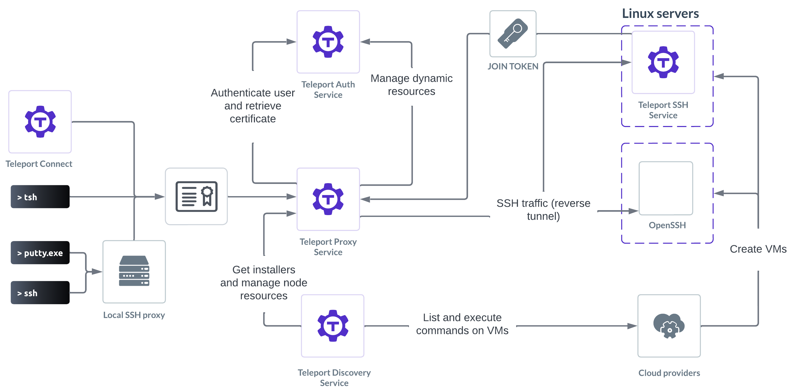

Teleport consolidates SSH access across all environments, decreases
configuration complexity, supports industry best practices and compliance while
giving complete visibility over all sessions and events.

Teleport server access is designed for the following kinds of scenarios:

- When up to a vast number of clusters must be managed using the command-line (`tsh`) or programmatically (through the Teleport API) and you want to simplify your stack, security, and configuration complexity.
- When security team members must track and audit every user session. 
- When Teleport users require a complete, dedicated, and secure SSH option (Teleport Node running in SSH mode) and more than a certificate authority (Teleport Auth) with proxy (Teleport Proxy).
- When resource and network security must be maximized: SSH certificates over secret keys, multi-factor authentication (MFA), Single Sign-On (SSO), and short-lived certificates.

Teleport protects servers through the Teleport SSH Service, which is a Teleport
agent service. For more information on agent services, read [Teleport Agent
Architecture](../../reference/architecture/agents.mdx). You can also learn how to deploy a
[pool of Teleport Agents](../agents/agents.mdx) to run multiple agent
services.

## Getting started

- [Get started](getting-started.mdx): Get started using Teleport server access
  in 10 minutes. Server access for most common SSH use-cases.

## Enrolling OpenSSH servers

You can protect OpenSSH servers with Teleport, which makes it easier to protect
legacy infrastructure, using an [agentless architecture](openssh/openssh-agentless.mdx).
Read the [Teleport OpenSSH guides](openssh/openssh.mdx) to learn more.

## Guides

- [Using Teleport with PAM](./guides/ssh-pam.mdx): How to configure Teleport SSH with PAM (Pluggable Authentication Modules).
- [Recording Proxy Mode](./guides/recording-proxy-mode.mdx): How to use Teleport Recording Proxy Mode to capture activity on OpenSSH servers.
- [BPF Session Recording](./guides/bpf-session-recording.mdx): How to use BPF to record SSH session commands, modified files and network connections.
- [Visual Studio Code](./guides/vscode.mdx): How to remotely develop with Visual Studio Code and Teleport.
