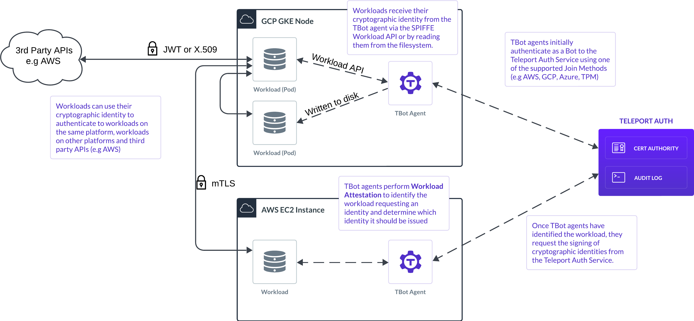

(!/docs/pages/includes/workload-id-preview.mdx!)

Teleport Workload Identity securely issues short-lived cryptographic identities
to workloads. It is a flexible foundation for workload identity across your 
infrastructure, creating a uniform way for your workloads to authenticate 
regardless of where they are running.

The flexible nature of Teleport Workload Identity enables it to be used for a
range of purposes, including:

- Workload authentication to third-party APIs on cloud platforms such as AWS, 
  GCP and Azure.
- Providing X.509 certificates for mutual TLS authentication between workloads
  within your infrastructure as part of a Zero Trust strategy.
- Workload authentication between services within your infrastructure. 

Teleport Workload Identity is compatible with the open-source
[Secure Production Identity Framework For Everyone (SPIFFE)](./spiffe.mdx)
standard. This enables interoperability between workload identity
implementations and also provides a wealth of off-the-shelf tools and SDKs to
simplify integration with your workloads. 

There's a whole host of benefits to adopting Teleport Workload Identity, but
here's some of the key ones:

- Eliminate the use of long-lived shared secrets within your infrastructure, and
  reduce the risk of exfiltration and time spent by engineers creating and 
  rotating these secrets.
- Establish an out of the box universal form of identity for your workloads,
  enabling your engineers to get on with building new services without needing 
  to think about how they'll authenticate.
- Converge on a first-class form of identity for your workloads, simplifying
  infrastructure by reducing the number of different ways workloads authenticate.

## How it works

Teleport Workload Identity establishes a root certificate authority within your
Teleport cluster that will be responsible for issuing the short-lived JWTs and
X509 certificates to workloads.

These identities are also known as SPIFFE Verifiable Identity Documents (SVIDs)
and contain the identity of the workload encoded as a URI, also known as a 
SPIFFE ID. The structure of this SPIFFE ID is up to you and can encode any
information you need to uniquely identify your workload.

The ability to request these identities is controlled by Teleport's Role-Based
Access Control system. Users and Bots are granted roles which will allow them to
request identities with specific SPIFFE IDs.

The `tbot` agent is installed in close proximity to workloads which require an
identity. It manages the process of requesting and renewing the identities for
the workloads. The `tbot` agent authenticates to the Teleport cluster using one
of our support join methods, which in many cases enable it to authenticate 
on the basis of federated trust rather than the use of long-lived secrets.

Workloads can receive their identities in one of two ways:

- The `tbot` agent can write these identities to a directory on the local
  filesystem, or, to a Kubernetes secret.
- The `tbot` agent can expose a SPIFFE Workload API. A standardized gRPC API
  that allows workloads to request their identities directly from the `tbot`
  agent.

When using the Workload API, the `tbot` agent can perform an additional process
called Workload Attestation. This allows the issuance of identities to be 
restricted to specific workloads. For example, you can restrict an identity to
only be issued to a Linux process with a specific UID or GID, or restrict an
identity to only be issued to a specific Kubernetes pod. The Workload
Attestation process eliminates the need for a "bootstrapping" secret to be 
provided to the workloads.

Once the workload has its identity, it can be used for a range of purposes. The
X.509 certificates can be used to establish Mutual TLS, and the JWTs can be used
to authenticate with a range of third-party APIs.

## Teleport Workload Identity vs Machine ID

Teleport Machine ID issues short-lived credentials to workloads to enable them
to access resources secured by the Teleport cluster. The credentials issued are
only compatible with Teleport itself, and access to resources must be through
the Teleport Proxy.

Teleport Workload Identity issues cryptographic identities that are compatible
with the popular SPIFFE standard for interoperable workload identity. These 
identities are flexible enough to be used for a range of purposes. The 
Teleport Proxy is not used for securing workload-to-workload communication.

## Next steps

Learn more about Teleport Workload Identity:

- [SPIFFE](./spiffe.mdx): Learn about the SPIFFE specification and how it is implemented by Teleport Workload Identity.
- [Federation](./federation.mdx): Learn about using Federation to allow workloads to trust workloads from other trust domains.
- [JWT SVIDs](./jwt-svids.mdx): Learn about the short-lived JWTs issued by Workload Identity.
- [Best Practices](./best-practices.mdx): Best practices for using Workload Identity in Production.
- [Workload Identity Resource](../../reference/workload-identity/workload-identity-resource.mdx): The full reference for the Workload Identity resource.
- [Workload Identity API and Workload Attestation](../../reference/workload-identity/workload-identity-api-and-workload-attestation.mdx): To learn more about the Workload Identity API and Workload Attestation.

Learn how to configure Teleport Workload Identity for specific use-cases:

- [Getting Started](./getting-started.mdx): How to configure Teleport for Workload Identity.
- [TSH Support](./tsh.mdx): How to use `tsh` with Workload Identity to issue SVIDs to users.
- [AWS Roles Anywhere](./aws-roles-anywhere.mdx): Configuring AWS to accept Workload Identity certificates as authentication using AWS Roles Anywhere.
- [AWS OIDC Federation](./aws-oidc-federation.mdx): Configuring AWS to accept Workload Identity JWTs as authentication using AWS OIDC Federation.
- [GCP Workload Identity Federation](./gcp-workload-identity-federation-jwt.mdx): Configuring GCP to accept Workload Identity JWTs as authentication using GCP Workload Identity Federation.
- [Azure Federated Credentials](./azure-federated-credentials.mdx): Configuring Azure to accept Workload Identity JWTs as authentication using Azure Federated Credentials.

### Other resources

- [SPIFFE Specification](https://github.com/spiffe/spiffe/blob/main/standards/SPIFFE.md): The official SPIFFE specification. Useful for understanding the SPIFFE ID and SVID formats.
- [Solving The Bottom Turtle](https://spiffe.io/pdf/Solving-the-bottom-turtle-SPIFFE-SPIRE-Book.pdf): A book covering the fundamentals and details of SPIFFE.
