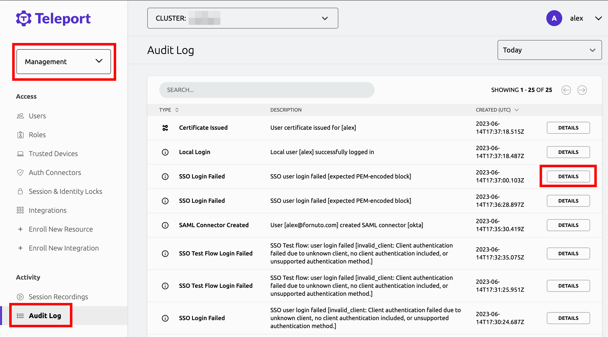

Users of the Enterprise edition of Teleport can log in to servers, Kubernetes
clusters, databases, web applications, and Windows desktops through their
organization's Single Sign-On (SSO) provider.

<TileSet>
  <Tile icon="bolt" title="Azure Active Directory (AD)" href="./sso/azuread.mdx">
    Configure Azure Active Directory SSO for SSH, Kubernetes, databases, desktops and web apps.
  </Tile>
  <Tile icon="bolt" title="Active Directory (ADFS)" href="./sso/adfs.mdx">
    Configure Windows Active Directory SSO for SSH, Kubernetes, databases, desktops and web apps.
  </Tile>
  <Tile icon="bolt" title="Google Workspace" href="./sso/google-workspace.mdx">
    Configure Google Workspace SSO for SSH, Kubernetes, databases, desktops and web apps.
  </Tile>
  <Tile icon="bolt" title="GitLab" href="./sso/gitlab.mdx">
    Configure GitLab SSO for SSH, Kubernetes, databases, desktops and web apps.
  </Tile>
  <Tile icon="bolt" title="OneLogin" href="./sso/one-login.mdx">
    Configure OneLogin SSO for SSH, Kubernetes, databases, desktops and web apps.
  </Tile>
  <Tile icon="bolt" title="OIDC" href="./sso/oidc.mdx">
    Configure OIDC SSO for SSH, Kubernetes, databases, desktops and web apps.
  </Tile>
  <Tile icon="bolt" title="Okta" href="./sso/okta.mdx">
    Configure Okta SSO for SSH, Kubernetes, databases, desktops and web apps.
  </Tile>
</TileSet>

## How does SSO work?

Execute the following command to log in to your Teleport cluster using the CLI.

```code
# This command will automatically open the default web browser and take a user
# through the login process with an SSO provider
$ tsh login --proxy=proxy.example.com --auth=github
```

The command opens a browser window and shows a URL the user can visit in the
terminal to complete their SSO flow:

```text
If browser window does not open automatically, open it by clicking on the link:
http://127.0.0.1:45235/055a310a-1099-43ea-8cf6-ffc41d88ad1f
```

Teleport will wait for up to 3 minutes for a user to authenticate. If
authentication succeeds, Teleport will retrieve SSH and X.509 certificates and
store them in the `~/.tsh/keys/<clustername>` directory. The tool will also will
add SSH cert to an SSH agent if there's one running.

## Configuring SSO

Teleport works with SSO providers by relying on the concept of an
**authentication connector**. An authentication connector is a plugin that
controls how a user logs in and which group they belong to.

### Supported connectors

The following authentication connectors are supported:

- `local` connector type uses the built-in user database. This database can be
  manipulated by the `tctl users` command.
- `saml` connector type uses the [SAML protocol](https://en.wikipedia.org/wiki/Security_Assertion_Markup_Language)
  to authenticate users and query their group membership.
- `oidc` connector type uses the [OpenID Connect protocol](https://en.wikipedia.org/wiki/OpenID_Connect)
  to authenticate users and query their group membership.

### Creating an authentication connector

Before you can create an authentication connector, you must enable
authentication via that connector's protocol.

To set the default authentication type as `saml` or `oidc`, <ScopedBlock
scope={["oss", "enterprise"]}>either modify your Auth Service configuration file
or </ScopedBlock>create a `cluster_auth_preference` resource.

<Tabs>
  <TabItem label="Static Config (Self-Hosted)" scope={["oss", "enterprise"]}>
 Update `/etc/teleport.yaml` in the `auth_service` section and restart the `teleport` daemon.
  ```yaml
  auth_service:
    authentication:
      # Set as saml or oidc
      type: saml|oidc
  ```
  </TabItem>
  <TabItem scope={["cloud"]} label="Dynamic Resources (All Editions)">
  Create a file called `cap.yaml`:
  ```yaml
  kind: cluster_auth_preference
  metadata:
    name: cluster-auth-preference
  spec:
    authentication:
      # set as saml or oidc
      type: saml|oidc
  version: v2
  ```

  Create the resource:

  <ScopedBlock scope={["oss", "enterprise"]}>

  ```code
  # Log in to your cluster with tsh so you can run tctl commands.
  # You can also run tctl directly on the Auth Service host.
  $ tsh login --proxy=teleport.example.com --user=myuser
  $ tctl create -f cap.yaml
  ```

  </ScopedBlock>
  <ScopedBlock scope={["cloud"]}>

  ```code
  # Log in to your cluster with tsh so you can run tctl commands.
  $ tsh login --proxy=mytenant.teleport.sh --user=myuser
  $ tctl create -f cap.yaml
  ```

  </ScopedBlock>
  </TabItem>
</Tabs>


Next, define an authentication connector. Create a file called `connector.yaml`
based on one of the following examples.

<Tabs>
<TabItem label="Okta">

```yaml
# connector.yaml
kind: saml
version: v2
metadata:
  name: corporate
spec:
  # display allows to set the caption of the "login" button
  # in the Web interface
  display: "Okta"

  acs: https://teleport-proxy.example.com:3080/v1/webapi/saml/acs
  attributes_to_roles:
    - {name: "groups", value: "okta-admin", roles: ["access"]}
    - {name: "groups", value: "okta-dev", roles: ["dev"]}

     # note that wildcards can also be used. the next line instructs Teleport
     # to assign "access" role to any user who has the SAML attribute that begins with "admin":
     - { name: "group", value: "admin*", roles: ["access"] }
     # regular expressions with capture are also supported. the next line instructs Teleport
     # to assign users to roles `admin-1` if his SAML "group" attribute equals 'ssh_admin_1':
     - { name: "group", value: "^ssh_admin_(.*)$", roles: ["admin-$1"] }

  entity_descriptor: |
    <paste SAML XML contents here>```

</TabItem>
<TabItem label="OneLogin">

```yaml
(!/examples/resources/onelogin-connector.yaml!)
```

</TabItem>
<TabItem label="OIDC">

```yaml
(!/examples/resources/oidc-connector.yaml!)
```

</TabItem>
<TabItem label="Google Workspace">

```yaml
(!/examples/resources/gworkspace-connector-inline.yaml!)
```

</TabItem>
<TabItem label="ADFS">

```yaml
(!/examples/resources/adfs-connector.yaml!)
```

</TabItem>
<TabItem label="SAML">

```yaml
(!/examples/resources/saml-connector.yaml!)
```

</TabItem>
</Tabs>


You may use `entity_descriptor_url`, in lieu of `entity_descriptor`, to fetch
the entity descriptor from your IDP. 

We recommend "pinning" the entity descriptor by including the XML rather than
fetching from a URL.

Create the connector: 

```code
$ tctl create -f connector.yaml
```

### User logins

Often it is required to restrict SSO users to their unique UNIX logins when they
connect to Teleport Nodes. To support this:

- Use the SSO provider to create a field called `unix_login` (you can use another name).
- Make sure the `unix_login` field is exposed as a claim via SAML/OIDC.
- Update a Teleport role to include the `{{external.unix_login}}` variable in the list of allowed logins:

```yaml
kind: role
version: v5
metadata:
  name: sso_user
spec:
  allow:
    logins:
    - '{{external.unix_login}}'
    node_labels:
      '*': '*'
```

### Provider-Specific Workarounds

Certain SSO providers may require or benefit from changes to Teleport's SSO
flow. These provider-specific changes can be enabled by setting the
`spec.provider` property of the connector definition to one of the following
values to match your identity provider:

- `adfs` (SAML): Required for compatibility with Active Directory (ADFS); refer
  to the full [ADFS guide](./sso/adfs.mdx#create-teleport-roles) for details.
- `netiq` (OIDC): Used to enable NetIQ-specific ACR value processing; refer to
  the [OIDC guide](./sso/oidc.mdx#optional-acr-values) for details.
- `ping` (SAML and OIDC): Required for compatibility with Ping Identity (including
  PingOne and PingFederate).
- `okta` (OIDC): Required when using Okta as an OIDC provider.

At this time, the `spec.provider` field should not be set for any other identity providers.

## Working with External Email Identity

Along with sending groups, an SSO provider will also provide a user's email address.
In many organizations, the username that a person uses to log in to a system is the
same as the first part of their email address, the "local" part. For example, `dave.smith@acme.com` might log in with the username `dave.smith`. Teleport provides an easy way to extract the first part of an email address so it can be used as a username. This is the `{{email.local}}` function.

If the email claim from the identity provider (which can be accessed via `{{external.email}}`) is sent and contains an email address, you can extract the "local" part of the email address before the @ sign like this: `{{email.local(external.email)}}`

Here's how this looks in a Teleport role:

```yaml
kind: role
version: v5
metadata:
  name: sso_user
spec:
  allow:
    logins:
    # Extracts the local part of dave.smith@acme.com, so the login will
    # now support dave.smith.
    - '{{email.local(external.email)}}'
    node_labels:
      '*': '*'
```

## Multiple SSO Providers

Teleport can also support multiple connectors, i.e. a Teleport administrator
can define and create multiple connector resources using `tctl create` as shown above.

To see all configured connectors, execute this on the auth server:

```code
$ tctl get connectors
```

To delete/update connectors, use the usual `tctl rm` and `tctl create` commands
as described in the [Resources Reference](../setup/reference/resources.mdx).

If multiple authentication connectors exist, the clients must supply a
connector name to `tsh login` via `--auth` argument:

```code
# use "okta" SAML connector:
$ tsh --proxy=proxy.example.com login --auth=okta

# use local Teleport user DB:
$ tsh --proxy=proxy.example.com login --auth=local --user=admin
```

Refer to the following guides to configure authentication connectors of both
SAML and OIDC types:

- [SSH Authentication with Okta](./sso/okta.mdx)
- [SSH Authentication with OneLogin](./sso/one-login.mdx)
- [SSH Authentication with ADFS](./sso/adfs.mdx)
- [SSH Authentication with OAuth2 / OpenID Connect](./sso/oidc.mdx)

## SSO Customization

| Provider | YAML | Example |
| - | - | - |
| GitHub | `display: GitHub` |  |
| Microsoft | `display: Microsoft` |  |
| Google | `display: Google` |  |
| BitBucket | `display: Bitbucket` |  |
| OpenID | `display: Okta` |  |

## Troubleshooting

Troubleshooting SSO configuration can be challenging. Usually a Teleport administrator
must be able to:

<ScopedBlock scope={["oss","enterprise"]}>
- Ensure that HTTP/TLS certificates are configured properly for both Teleport
  proxy and the SSO provider.
</ScopedBlock>
- Be able to see what SAML/OIDC claims and values are getting exported and passed
  by the SSO provider to Teleport.
- Be able to see how Teleport maps the received claims to role mappings as defined
  in the connector.

If something is not working, we recommend to:

- Double-check the host names, tokens and TCP ports in a connector definition.


### Using the Web UI

If you get "access denied" or other login errors, the number one place to check is the Audit
Log. You can access it in the **Activity** tab of the Teleport Web UI.



Example of a user being denied because the role `clusteradmin` wasn't set up:

```json
{
  "code": "T1001W",
  "error": "role clusteradmin is not found",
  "event": "user.login",
  "method": "oidc",
  "success": false,
  "time": "2019-06-15T19:38:07Z",
  "uid": "cd9e45d0-b68c-43c3-87cf-73c4e0ec37e9"
}
```

### Teleport does not show the expected Nodes

(!docs/pages/includes/node-logins.mdx!)

When configuring SSO, ensure that the identity provider is populating each user's
traits correctly. For a user to see a Node in Teleport, the result of populating a
 template variable in a role's `allow.logins` must match at least one of a user's
 `traits.logins`.

In this example a user will have usernames `ubuntu`, `debian` and usernames from the SSO trait `logins` for Nodes that have a `env: dev` label.  If the SSO trait username is `bob` then the usernames would include `ubuntu`, `debian`, and `bob`.

```yaml
kind: role
metadata:
  name: example-role
spec:
  allow:
    logins: ['{{external.logins}}', ubuntu, debian]
    node_labels:
      'env': 'dev'
version: v5
```
