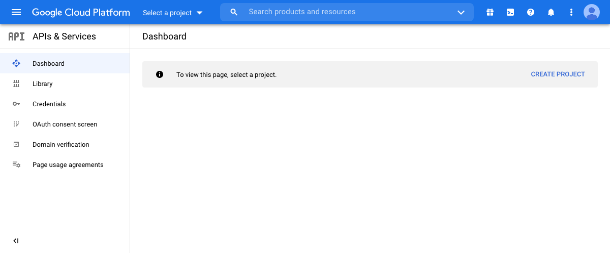
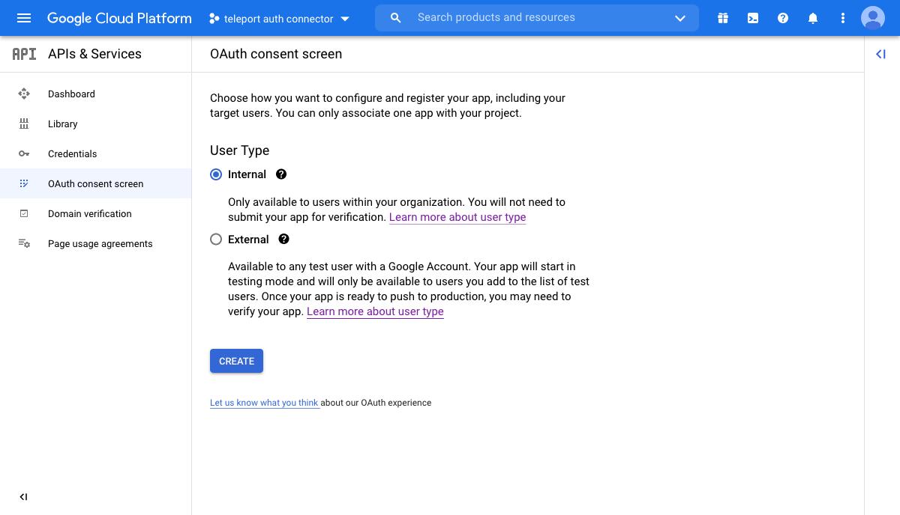
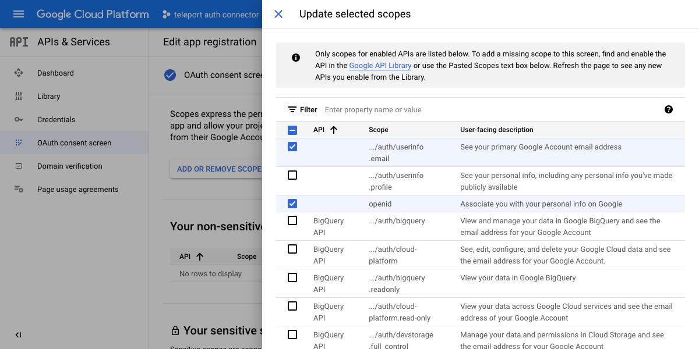
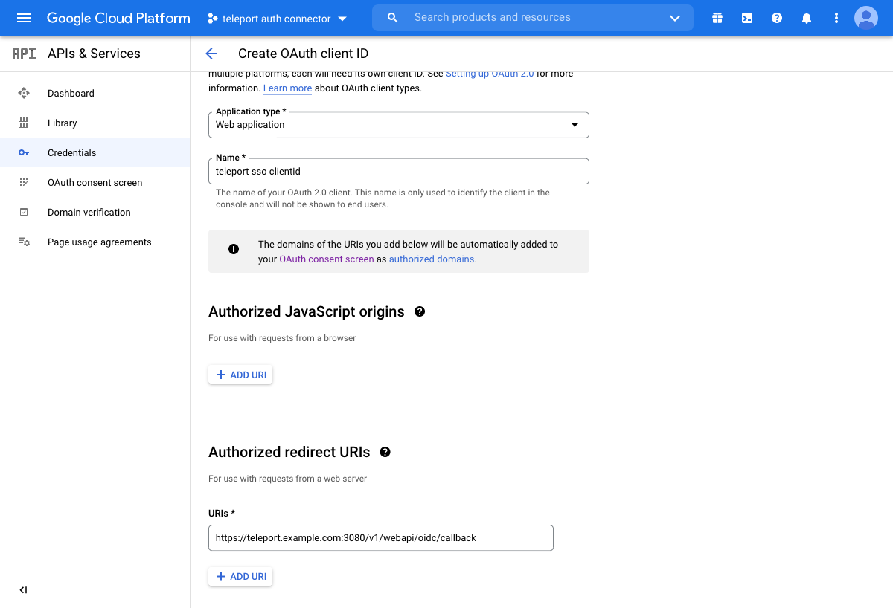
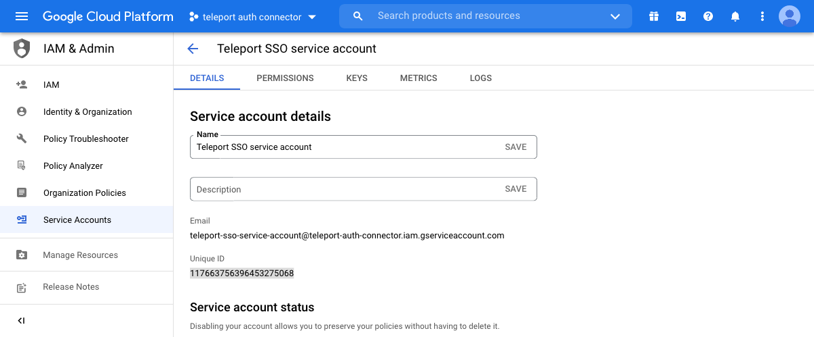
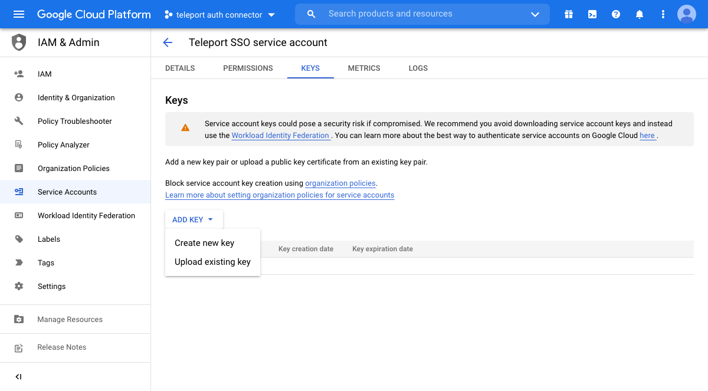
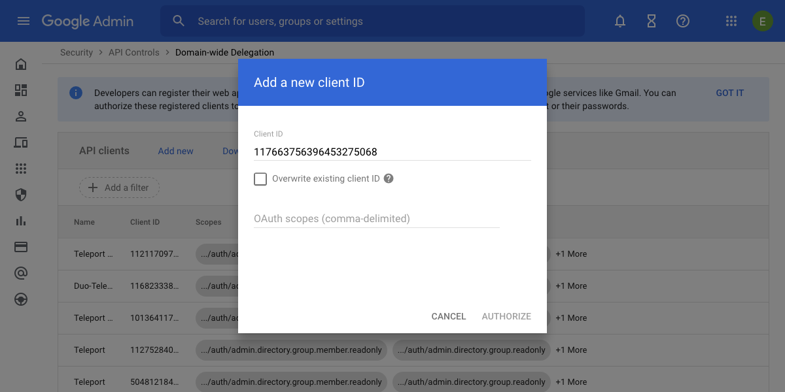

## Google Workspace as SSO for SSH

This guide will cover how to configure [Google Workspace](https://workspace.google.com/) to be a
single sign-on (SSO) provider to issue SSH credentials to specific groups of users.
When used in combination with role based access control (RBAC) it allows SSH administrators
to define policies like:

- Only members of "DBA" Google group can SSH into machines running PostgreSQL.
- Developers must never SSH into production servers.
- ... and many others.

<Admonition
  type="warning"
  title="Version Warning"
>
  This guide requires an enterprise version of Teleport.
</Admonition>

## Prerequisites

Before you get started you’ll need:

- An Enterprise version of Teleport downloaded from [https://dashboard.gravitational.com/](https://dashboard.gravitational.com/).
- A Google Workspace Super administrator account. We recommend setting up a separate super admin account with 2FA as opposed to granting your daily user super admin privileges.
- Ability to create a Google Cloud Platform project.
   This might require signing up to GCP, but the created project will not require using any paid services. It’s just a side effect of Google Workspace and GCP being closely related.
- Ability to setup Google Workspace groups.

## Configuring Google Workspace

The setup will consist of creating a new project on Google Cloud Platform,
configuring its OAuth consent screen, creating an OAuth client ID to allow
Google Workspace users to log in to your Teleport cluster, and creating a service
account for Teleport to fetch the additional Google Groups data.

The Google Workspace integration in Teleport supports mapping roles to the
groups that a user belongs to both directly and indirectly (by virtue of
belonging to a group that belongs to another group). However, fetching the
complete list of so-called *transitive* groups requires a Google Workspace
Enterprise subscription or a Cloud Identity Premium subscription (see the Google Cloud [API
docs](https://cloud.google.com/identity/docs/reference/rest/v1/groups.memberships/searchTransitiveGroups)
for more info).

As an alternative that works with all Google Workspace accounts,
fetching just the groups with direct membership is also supported. The preferred
behavior is selected depending on the OAuth scopes granted to the service
account associated with the connector.

<Details title="Version Warning: Before 8.1.2" opened={false}>

Teleport versions prior to 8.1.2 only support fetching groups with direct
membership with the
`https://www.googleapis.com/auth/admin.directory.group.readonly` scope.
Furthermore, the list of groups is filtered by domain name, and any group registered
on a different domain or subdomain than the user's will be ignored.

To avoid
unexpected changes in how access is granted to users for preexisting SSO
connectors, this behavior will persist even after upgrading, until the `version`
field of the [connector resource](#create-a-oidc-connector) is changed from `v2`
to `v3`.

</Details>

- [Create a new project](https://console.cloud.google.com/projectselector2/apis/dashboard).
  
- [Configure the OAuth consent screen](https://console.cloud.google.com/apis/credentials/consent):
  - Select "Internal" as your User Type.
    
  - Configure the appearence of your connector by picking a visible name, user support email, etc.
  - Select the `.../auth/userinfo.email` and `openid` scopes.
    
- Enable the [Cloud Identity API](https://console.cloud.google.com/apis/library/cloudidentity.googleapis.com) or the [Admin SDK API](https://console.cloud.google.com/apis/library/admin.googleapis.com) for transitive and direct group membership, respectively. Enabling both is fine.
- [Create an OAuth client ID](https://console.cloud.google.com/apis/credentials/oauthclient):
  - Select "Web application" as the Application type, pick a name, then add `https://<address of proxy server>:3080/v1/webapi/oidc/callback` as an authorized redirect URI.
    
  - Copy the Client ID and Client Secret from the next screen or by clicking "Download OAuth client".
    
- [Create a service account](https://console.cloud.google.com/iam-admin/serviceaccounts/create):
  - Pick a name for your service account. Leave project access grants and user access grants empty.
    
  - Click the newly-created account to view its details, and copy the Unique ID for later.
    
  - Create a new key for the service account, select JSON as the key type, and save the resulting JSON file.
    
    This JSON file will need to be uploaded to the Teleport Auth Server, and will be later referenced by
    the OIDC Connector, under `google_service_account_uri` or inline with `google_service_account`.

<Admonition type="note">
  Teleport requires the service account JSON to be uploaded to all Teleport Auth Servers when setting
  up in a High Availability config.
</Admonition>

- Configure [domain-wide
  delegation](https://admin.google.com/ac/owl/domainwidedelegation) for your
  newly-created service account:
  - Click "Add new" and add the numeric Unique ID that you've copied earlier.
    
  - Add either the
    `https://www.googleapis.com/auth/cloud-identity.groups.readonly` scope or
    the `https://www.googleapis.com/auth/admin.directory.group.readonly` scope.
    The scope granted to the service account will determine if Teleport will
    fetch both direct and indirect groups or just direct groups, respectively.

<Admonition
  type="tip"
  title="Warning"
>
  Do not use the email of the service account. The configuration display will look the same but the service account will not have the domain-wide delegation required. The `client_id` field must be the unique ID number captured from the Google Cloud Platform UI. An indicator that this is misconfigured is if you see "invalid Google Workspace credentials for scopes [...]" in your log.
</Admonition>

<Admonition
  type="tip"
  title="Note"
>
  The email that you set for `google_admin_email` **must** be the email address of a user that has permission to list all groups, users, and group membership in your Google Workspace account. This user will generally need super admin or group admin privileges.
</Admonition>

## Create a OIDC Connector

Now, create a OIDC connector [resource](../../setup/reference/resources.mdx).
There are two options for setting the `google_service_account` value.  You can set the JSON file in the auth server and give a URI to the file.
The second is populating the contents via inline.  Inline is required for Teleport Cloud.
Write down this template as `gworkspace-connector.yaml`:


<Tabs>
  <TabItem label="Google Service Account via URI">
    ```yaml
    (!examples/resources/gworkspace-connector.yaml!)
    ```
  </TabItem>

  <TabItem label="Google Service Account via inline (required for Teleport Cloud)">
    ```yaml
    (!examples/resources/gworkspace-connector-inline.yaml!)
    ```
  </TabItem>
</Tabs>


Create the connector using `tctl` tool:

```code
$ tctl create gworkspace-connector.yaml
```

If you have a configured connector from a version of Teleport older than 8.1.2, you can upgrade your connector from `v2` to `v3`:

First, fetch the connector data:
```code
$ umask 077
$ tctl get --with-secrets oidc/connectorname > connector.yaml
```

Next, edit `connector.yaml` to change the version number from `v2` to `v3`, and then update the connector:

```code
$ tctl create -f connector.yaml
$ rm connector.yaml
```

Then, to start fetching transitive groups instead of just direct groups, edit
the [domain-wide
delegation](https://admin.google.com/ac/owl/domainwidedelegation) for your
service account and swap out the OAuth scopes for
`https://www.googleapis.com/auth/cloud-identity.groups.readonly`. To undo the
change, remove that scope and add
`https://www.googleapis.com/auth/admin.directory.group.readonly` again.

While a `v3` connector is configured, you can no longer downgrade Teleport to a
version before 8.1.2. Before such a downgrade, follow the above instructions and
change the version number back to `v2`.

## Testing

The Web UI will now contain a new button: "Login with Google". The CLI is
the same as before:

```code
$ tsh --proxy=proxy.example.com login
```

This command will print the SSO login URL (and will try to open it
automatically in a browser).

<Admonition
  type="tip"
  title="Tip"
>
  Teleport can use multiple OIDC connectors. In this case a connector name
  can be passed via `tsh login --auth=google`
</Admonition>

## Troubleshooting

If you get "access denied" errors the number one place to check is the audit
log on the Teleport auth server. It is located in `/var/lib/teleport/log` by
default and it will contain the detailed reason why a user's login was denied.

Example of a user being denied due as the role `clusteradmin` wasn't setup.

```json
{"code":"T1001W","error":"role clusteradmin is not found","event":"user.login","method":"oidc","success":false,"time":"2019-06-15T19:38:07Z","uid":"cd9e45d0-b68c-43c3-87cf-73c4e0ec37e9"}
```

Some errors (like filesystem permissions or misconfigured network) can be
diagnosed using Teleport's `stderr` log, which is usually available via:

```code
$ sudo journalctl -fu teleport
```

If you wish to increase the verbosity of Teleport's syslog, you can pass the
[`--debug`](../../setup/reference/cli.mdx#teleport-start) flag to `teleport start` command.
