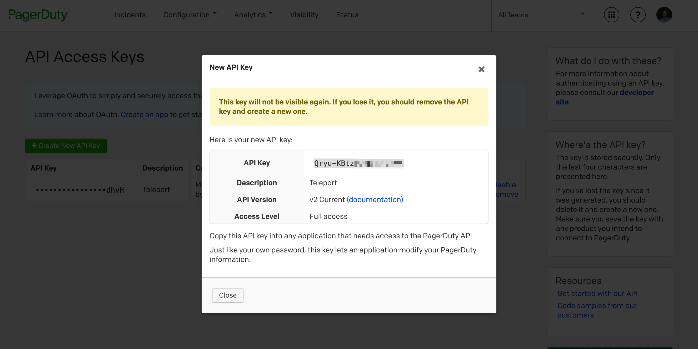
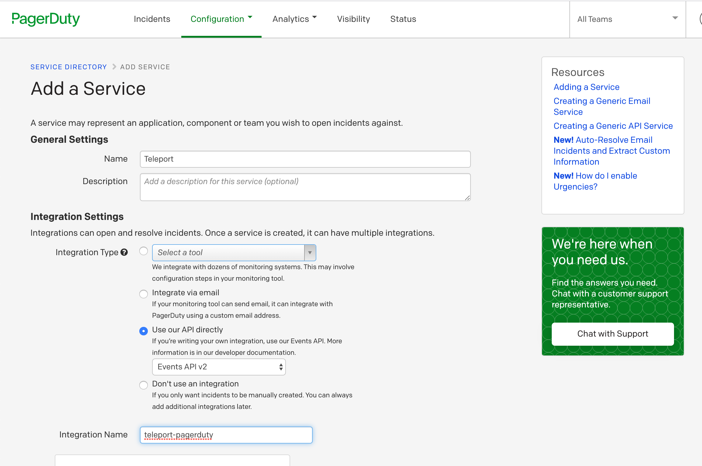

This guide will talk through how to setup Teleport with PagerDuty. Teleport's
PagerDuty integration allows you to treat Teleport access and permission
requests as PagerDuty incidents, notify the appropriate team, and approve
or deny the requests via PagerDuty special action.

## Setup

### Prerequisites

This guide assumes that you have:

- A running Teleport Cluster
- Admin privileges with access to `tctl`
- A PagerDuty account, with access to creating a new API token
- A node to run the plugin. We recommend running it alongside the Teleport Proxy for convenience

Teleport Cloud requires that plugins connect through the Proxy Service (`mytenant.teleport.sh:443`). Open Source and Enterprise installations can connect to the Auth Service (`auth.example.com:3025`) directly.

(!docs/pages/includes/tctl.mdx!)

### Create a user and role for access

(!docs/pages/includes/plugins/rbac.mdx!)

### Export the access-plugin certificate

(!docs/pages/includes/plugins/identity-export.mdx!)

We'll reference these files later when [configuring the plugins](#config-file).


### Setting up a PagerDuty API key

In your PagerDuty dashboard, go to **Configuration → API Access → Create New API Key**, add a key description, and save the key. We'll use the key in the plugin config file later.

**Create a PagerDuty API key**


**Create a service account**


## Downloading and installing the plugin

We recommend installing Teleport plugins alongside the Teleport Proxy. This is an ideal
location as plugins have a low memory footprint, and will require both public internet access
and Teleport Auth Service access. 

<Tabs>
<TabItem label="Download">
  ```code
  $ curl -L -O https://get.gravitational.com/teleport-access-pagerduty-v(=teleport.plugin.version=)-linux-amd64-bin.tar.gz
  $ tar -xzf teleport-access-pagerduty-v(=teleport.plugin.version=)-linux-amd64-bin.tar.gz
  $ cd teleport-access-pagerduty
  $ ./install
  ```
</TabItem>
<TabItem label="From Source">
  To install from source you need `git` and `go` installed. If you do not have Go installed, visit the Go [downloads page](https://go.dev/dl/).

  ```code
  # Checkout teleport-plugins
  $ git clone https://github.com/gravitational/teleport-plugins.git
  $ cd teleport-plugins/access/pagerduty
  $ make
  ```
Run `./install` from `teleport-pagerduty` or place the executable in the appropriate `/usr/bin` or `/usr/local/bin` on the server installation.
</TabItem>
<TabItem label="Docker">
  ```code
  $ docker pull quay.io/gravitational/teleport-plugin-pagerduty:(=teleport.plugin.version=)
  ```
</TabItem>
</Tabs>

### Config file

Teleport's PagerDuty plugin has its own configuration file in TOML format. Before starting the plugin for the first time, you'll need to generate and edit that config file.

```code
$ teleport-pagerduty configure > teleport-pagerduty.toml
$ sudo mv teleport-pagerduty.toml /etc
```

#### Editing the config file

After generating the config, edit it as follows:

<Tabs>
<TabItem scopes={["oss", "enterprise"]} label="Self-Hosted">
```yaml
(!examples/resources/plugins/teleport-pagerduty-self.toml!)
```
</TabItem>
<TabItem scopes={["cloud"]} label="Cloud">
```yaml
(!examples/resources/plugins/teleport-pagerduty-cloud.toml!)
```
</TabItem>
</Tabs>

### Testing the plugin

With the config above, you should be able to run the plugin invoking
`teleport-pagerduty start -d`. The will provide some debug information to make sure
the bot can connect to PagerDuty.

```code
$ teleport-pagerduty start -d
# DEBU   DEBUG logging enabled logrus/exported.go:117
# INFO   Starting Teleport Access PagerDuty extension 0.1.0-dev.1: pagerduty/main.go:124
# DEBU   Checking Teleport server version pagerduty/main.go:226
# DEBU   Starting a request watcher... pagerduty/main.go:288
# DEBU   Starting PagerDuty API health check... pagerduty/main.go:170
# DEBU   Starting secure HTTPS server on :8081 utils/http.go:146
# DEBU   Watcher connected pagerduty/main.go:252
# DEBU   PagerDuty API health check finished ok pagerduty/main.go:176
# DEBU   Setting up the webhook extensions pagerduty/main.go:178
```

By default, `teleport-pagerduty` will assume its config is in `/etc/teleport-pagerduty.toml`, but you can override it with `--config` option.

### Set up systemd

In production, we recommend starting the Teleport plugin daemon via an init system like systemd. Here's the recommended Teleport plugin service unit file for systemd:

```code
(!examples/systemd/plugins/teleport-pagerduty.service!)
```

Save this as `teleport-pagerduty.service`.

#### Example PagerDuty request

<video controls>
  <source
    src="../../../img/enterprise/plugins/pagerduty/pagerduty-demo.mp4"
    type="video/mp4"
  />

  <source
    src="../../../img/enterprise/plugins/pagerduty/pagerduty-demo.webm"
    type="video/webm"
  />

  Your browser does not support the video tag.
</video>

## On-call auto-approval

The PagerDuty plugin has an option to auto-approve access requests. This
feature will map an external SSO identity to a PagerDuty on-call email address.
If the user requesting matches the person on call the request will be
automatically approved.

This feature can be enabled via the PagerDuty config file using `auto_approve = true`.

```
# Example teleport-pagerduty.toml snippet
#...
[pagerduty]
api_key = "key"               # PagerDuty API Key
user_email = "me@example.com" # PagerDuty bot user email (Could be admin email)
service_id = "PIJ90N7"        # PagerDuty service id
auto_approve = true           # Auto approve
```

## Audit log

The plugin will let anyone with access to the PagerDuty account so it's
important to review Teleport's audit log.

## Feedback

If you have any issues with this plugin please create an [issue here](https://github.com/gravitational/teleport-plugins/issues/new).
