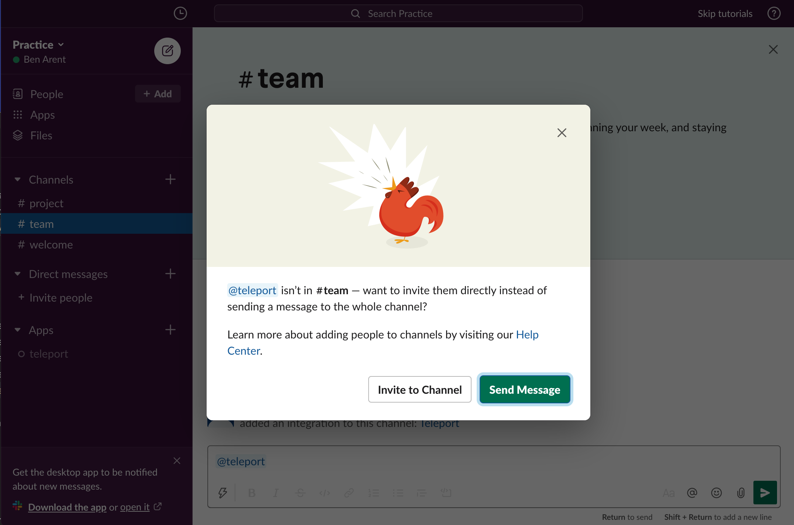

This guide will talk through how to set up Teleport with Slack. Teleport's Slack integration notifies individuals and channels of Access Requests.

#### Example Slack Request

<video controls>
  <source
    src="../../../img/enterprise/plugins/slack/slack.mp4"
    type="video/mp4"
  />

  <source
    src="../../../img/enterprise/plugins/slack/slack.webm"
    type="video/webm"
  />

  Your browser does not support the video tag.
</video>

## Setup

### Prerequisites

This guide assumes that you have:

- A running Teleport Cluster
- Admin privileges with access to `tctl`
- Slack admin privileges to create an app and install it to your workspace

Teleport Cloud requires that plugins connect through the proxy service (`mytenant.teleport.sh:443`). Open Source and Enterprise installations can connect to the auth service (`auth.example.com:3025`) directly.


### Create User and Role for access
(!docs/pages/includes/plugins/rbac.mdx!)

### Export access-plugin Certificate
(!docs/pages/includes/plugins/identity-export.mdx!)

We'll reference these files later when [configuring the plugins](#configuring-teleport-slack).

### Create Slack App

We'll create a new Slack app and set up auth tokens and callback URLs, so that Slack knows how to notify the Teleport plugin when Approve / Deny buttons are clicked.

You'll need to:

1. Create a new app, pick a name and select a workspace it belongs to.
2. Add OAuth Scopes. This is required by Slack for the app to be installed—we'll only need a single scope to post messages to your Slack account.
3. Obtain an OAuth token

#### Creating a New Slack app

Visit [https://api.slack.com/apps](https://api.slack.com/apps) to create a new Slack App.

**App Name:** Teleport<br/>
**Development Slack Workspace:** Pick the workspace you'd like the requests to show up in. <br/>
**App Icon:** <a href="../../../img/enterprise/plugins/teleport_bot@2x.png" download>Download Teleport Bot Icon</a>


#### Selecting OAuth Scopes

On the App screen, go to “OAuth and Permissions” under Features in the sidebar menu. Then scroll to Scopes, and add `chat:write, incoming-webhook, users:read, users:read.email` scopes so that our plugin can post messages to your Slack channels.


#### Obtain OAuth Token


#### Add to Workspace


After adding to the workspace, you still need to invite the bot to the channel. Do this by using the @ command,
and inviting them to the channel.


## Installing the Teleport Slack Plugin

We recommend installing the Teleport Plugins alongside the Teleport Proxy. This is an ideal
location as plugins have a low memory footprint, and will require both public internet access
and Teleport Auth access.  We currently only provide linux-amd64 binaries, you can also
compile these plugins from [source](https://github.com/gravitational/teleport-plugins/tree/master/access/slack).

**Install the plugin**

<Tabs>
<TabItem label="Download">
  ```code
  $ curl -L https://get.gravitational.com/teleport-access-slack-v(=teleport.version=)-linux-amd64-bin.tar.gz
  $ tar -xzf teleport-access-slack-v(=teleport.version=)-linux-amd64-bin.tar.gz
  $ cd teleport-access-slack
  $ ./install
  ```
</TabItem>
<TabItem label="From Source">
  To install from source you need `git` and `go >= (=teleport.golang=)` installed.

  ```code
  # Checkout teleport-plugins
  $ git clone https://github.com/gravitational/teleport-plugins.git
  $ cd teleport-plugins/access/slack
  $ make
  ```
</TabItem>
</Tabs>


Run `./install` from `teleport-slack` or place the executable in the appropriate `/usr/bin` or `/usr/local/bin` on the server installation.

### Configuring Teleport Slack

Teleport Slack uses a config file in TOML format. Generate a boilerplate config by
running the following command:

```code
$ teleport-slack configure > teleport-slack.toml
$ sudo mv teleport-slack.toml /etc
```

#### Editing the config file

In the Teleport section, use the identity file(s) you generated with `tctl auth sign`. The plugin installer creates a folder for those files in `/var/lib/teleport/plugins/slack/`. 

Move the certificates to this folder, then edit the configuration file (`teleport-slack.toml`) based on the reference below to ensure that the appropriate settings point to your identity file(s). 

<Tabs>
  <TabItem label="OpenSource, Enterprise" scope={["oss","enterprise"]}>
```conf
(!examples/resources/plugins/teleport-slack.toml!)
```
</TabItem>

  <TabItem label="Cloud" scope={["cloud"]}>

```conf
(!examples/resources/plugins/teleport-slack-proxy.toml!)
```
</TabItem>
</Tabs>

## Test Run

Assuming that Teleport is running, and you've created the Slack app, the plugin config,
and provided all the certificates — you can now run the plugin and test the workflow!

```code
$ teleport-slack start
```

If everything works fine, the log output should look like this:

```code
$ teleport-slack start
INFO   Starting Teleport Access Slack Plugin 7.2.1: slack/app.go:80
INFO   Plugin is ready slack/app.go:101
```

### Testing the approval workflow

You can create a test permissions request with `tctl` and check if the plugin works as expected like this:

#### Create a test permissions request behalf of a user

```code
# Replace USERNAME with a Teleport local user, and TARGET_ROLE with a Teleport Role
$ tctl request create USERNAME --roles=TARGET_ROLE
```

A user can also try using `--request-roles` flag.

```code
# Example with a user trying to request a role DBA.
$ tsh login --request-roles=dba
```

#### Approve or deny the request on Slack

The messages should automatically get updated to reflect the action you just clicked. You can also check the request status with `tctl`:

```code
$ tctl request ls
```

### TSH User Login and Request Role

You can also test the full workflow from the user's perspective using `tsh`:

```code
# tsh login --request-roles=REQUESTED_ROLE
Seeking request approval... (id: 8f77d2d1-2bbf-4031-a300-58926237a807)
```

You should now see a new request in Teleport, and a message about the request on Slack with instructions.

### Setup with SystemD

In production, we recommend starting the Teleport plugin daemon via an init system like systemd.
Here's the recommended Teleport Plugin service unit file for systemd:

```ini
(!examples/systemd/plugins/teleport-slack.service!)
```

Save this as `teleport-slack.service`.

## Audit Log

The plugin will let anyone with access to the Slack Channel so it's
important to review Teleport' audit log.

## Feedback

If you have any issues with this plugin please create an [issue here](https://github.com/gravitational/teleport-plugins/issues/new).
