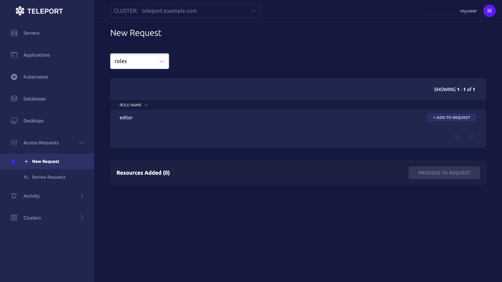

This guide will explain how to set up Slack to receive Access Request messages
from Teleport. Teleport's Slack integration notifies individuals and channels of
Access Requests. Users can then approve and deny Access Requests from within
Slack, making it easier to implement security best practices without
compromising productivity.

Here is an example of sending an Access Request via Teleport's Slack plugin:

<video controls>
  <source
    src="../../../img/enterprise/plugins/slack/slack.mp4"
    type="video/mp4"
  />

  <source
    src="../../../img/enterprise/plugins/slack/slack.webm"
    type="video/webm"
  />

  Your browser does not support the video tag.
</video>

## Prerequisites

(!/docs/pages/includes/commercial-prereqs-tabs.mdx!)

- Slack admin privileges to create an app and install it to your workspace. Your
  Slack profile must have the "Workspace Owner" or "Workspace Admin" banner
  below your profile picture.

(!/docs/pages/includes/tctl.mdx!)

## Step 1/8. Define RBAC resources

Before you set up the Slack plugin, you will need to enable Access Requests in
your Teleport cluster. For the purpose of this guide, we will define an
`editor-requester` role, which can request the built-in `editor` role, and
an `editor-reviewer` role that can review requests for the `editor` role. 

Create a file called `editor-request-rbac.yaml` with the following content:

```yaml
kind: role
version: v5
metadata:
  name: editor-reviewer
spec:
  allow:
    review_requests:
      roles: ['editor']
---
kind: role
version: v5
metadata:
  name: editor-requester
spec:
  allow:
    request:
      roles: ['editor']
      thresholds:
        - approve: 1
          deny: 1
```

Create the roles  you defined:

```code
$ tctl create -f editor-request-rbac.yaml
role 'editor-reviewer' has been created
role 'editor-requester' has been created
```

Allow yourself to review requests by users with the `editor-requester` role by
assigning yourself the `editor-reviewer` role. First, retrieve your user
definition:

```code
$ TELEPORT_USER=$(tsh status | awk -F "      " '/Logged in as/{print $2}')
$ tctl get user/${TELEPORT_USER?} > user.yaml
```

Edit `user.yaml` to add the `editor-reviewer` role:

```diff
 spec:
   roles:
   - access
   - editor
+  - editor-reviewer
```

Update your user definition:

```code
$ tctl create -f user.yaml
```

Log out of Teleport and log in again. You will now have the ability to review
requests for the `editor` role.

Create a user called `myuser` who has the `editor-requester` role as well as the
built-in `access` role and the `ubuntu` login. This user cannot edit your
cluster configuration unless they request the `editor` role:

```code
$ tctl users add myuser --roles=access,editor-requester --logins=ubuntu
```

`tctl` will print an invitation URL to your terminal. Visit the URL and log in
as `myuser` for the first time, registering credentials as configured for your
Teleport cluster.

Later in this guide, you will have `myuser` request the `editor` role so you can
review the request using the Teleport plugin.

## Step 2/8. Install the Teleport Slack plugin

We currently only provide `linux-amd64` binaries. You can also compile these
plugins from source. You can run the plugin from a remote host or your local
development machine.

<Notice scope={["enterprise"]} type="tip">
We recommend installing Teleport plugins on the same host as the Teleport
Proxy Service. This is an ideal location as plugins have a low memory footprint
and will require access to both the public internet and the Teleport Auth Service.
</Notice>

<Tabs>
<TabItem label="Download">
  ```code
  $ curl -L -O https://get.gravitational.com/teleport-access-slack-v(=teleport.version=)-linux-amd64-bin.tar.gz
  $ tar -xzf teleport-access-slack-v(=teleport.version=)-linux-amd64-bin.tar.gz
  $ ./teleport-access-slack/install
  ```
</TabItem>
<TabItem label="From Source">
  To install from source you need `git` and `go` >= (=teleport.golang=)
  installed.

  ```code
  # Check out the teleport-plugins repository
  $ git clone https://github.com/gravitational/teleport-plugins.git
  $ cd teleport-plugins/access/slack
  $ make
  ```
  
  Place the `teleport-slack` binary into an appropriate location
  within the sytem's `PATH`, e.g., `/usr/local/bin`:

  ```code 
  $ mv ./build/teleport-slack /usr/local/bin 
  ```

</TabItem> 
</Tabs>

  Make sure the binary is installed:

  ```code
  $ teleport-slack version
  teleport-slack v(=teleport.plugin.version=) git:teleport-slack-v(=teleport.plugin.version=)-fffffffff go(=teleport.golang=)
  ```

## Step 3/8. Create a user and role for the plugin

(!docs/pages/includes/plugins/rbac.mdx!)

## Step 4/8. Export the access plugin identity

(!docs/pages/includes/plugins/identity-export.mdx!)

The rest of this guide assumes that you have placed any files generated by this
command into `/var/lib/teleport/plugins/slack` for later reference when
configuring the plugin:

```code
# create a data directory to hold certificate files for the plugin.
$ sudo mkdir -p /var/lib/teleport/plugins/slack
$ sudo mv auth.* /var/lib/teleport/plugins/slack
```

## Step 5/8. Register a Slack app

The Access Request plugin for Slack receives Access Request events from the
Teleport Auth Service, formats them into Slack messages, and sends them to the
Slack API to post them in your workspace. For this to work, you must register a
new app with the Slack API.

### Create your app

Visit [https://api.slack.com/apps](https://api.slack.com/apps) to create a new
Slack app. Click "Create an App", then "From scratch". Fill in the form as shown
below:


The "App Name" should be "Teleport". Click the "Development Slack Workspace"
dropdown and choose the workspace where you would like to see Access Request
messages.

### Generate an OAuth token with scopes

Next, configure your application to authenticate to the Slack API. We will do
this by generating an OAuth token that the plugin will present to the Slack API.

We will restrict the plugin to the norrowest possible permissions by using OAuth
scopes. The Slack plugin needs to post messages to your workspace. It also needs
to read usernames and email addresses in order to direct Access Request
notifications from the Auth Service to the appropriate Teleport users in Slack.

After creating your app, the Slack website will open a console where you can
specify configuration options. On the sidebar menu under "Features", click
"OAuth & Permissions".

Scroll to the "Scopes" section and click "Add an OAuth Scope" for each of the
following scopes:

- `chat:write`
- `incoming-webhook`
- `users:read`
- `users:read.email`

The result should look like this:


After you have configured scopes for your plugin, scroll back to the top of the
OAuth & Permissions page, find the "OAuth Tokens for Your Workspace" section,
and click "Install to Workspace". You will see a summary of the permission you
configured for the Slack plugin earlier.

In "Where should Teleport post?", choose "Slackbot" as the default channel the
plugin will post to. The plugin will post here when sending direct messages.
Later in this guide, we will configure the plugin to post in other channels as
well.

After submitting this form, you will see an OAuth token in the "OAuth &
Permissions" tab under "Tokens for Your Workspace": 


You will use this token later when configuring the Slack plugin.

## Step 6/8. Configure the Teleport Slack plugin

At this point, the Teleport Slack plugin has the credentials it needs to
communicate with your Teleport cluster and the Slack API. In this step, you will
configure the Slack plugin to use these credentials. You will also configure the
plugin to notify the right Slack channels when it receives an Access Request
update.

### Generate a config file

The Teleport Slack plugin uses a config file in TOML format. Generate a
boilerplate config by running the following command (the plugin will not run
unless the config file is in `/etc/teleport-slack.toml`):

```code
$ teleport-slack configure | sudo tee /etc/teleport-slack.toml > /dev/null
```

This should result in a config file like the one below:

```toml
(!examples/resources/plugins/teleport-slack.toml!)
```

### Edit the config file

Edit the `teleport-slack.toml` file you created earlier to update the following
fields:

**`[teleport]`**

The Slack plugin uses this section to connect to the Teleport Auth Service. 

<ScopedBlock scope={["oss", "enterprise"]}>

The address and credentials you configure depend on whether your plugin can
access the Auth Service directly:

<Tabs>
  <TabItem label="Connect to the Auth Service"> 
    
Set `addr` to the address and port of your Auth Service. This address must be
reachable from the Teleport Slack Plugin.

Set `client_key`, `client_crt`, and `root_cas` to the identity files
generated earlier:

```toml
[teleport]
addr = "localhost:3025"
client_key = "/var/lib/teleport/plugins/slack/auth.key" # Teleport GRPC client secret key
client_crt = "/var/lib/teleport/plugins/slack/auth.crt" # Teleport GRPC client certificate
root_cas = "/var/lib/teleport/plugins/slack/auth.cas"   # Teleport cluster CA certs
```
</TabItem>
  <TabItem label="Connect to the Proxy Service">

Set `addr` to  your Proxy Service address with port `443`.

Set `identity` to the identity file generated earlier:

```toml
[teleport]
addr = "mytenant.teleport.sh:443"
identity = "/var/lib/teleport/plugins/slack/auth.pem"
```
  </TabItem>
</Tabs>

</ScopedBlock>
<ScopedBlock scope="cloud">

Set `addr` to  your Teleport Cloud tenant address with port `443`.

Set `identity` to the identity file generated earlier:

```toml
[teleport]
addr = "mytenant.teleport.sh:443"
identity = "/var/lib/teleport/plugins/slack/auth.pem"
```

</ScopedBlock>
 
**`[slack]`**

`token`: Open [`https://api.slack.com/apps`](https://api.slack.com/apps), find
the Slack app you created earlier, navigate to the "OAuth & Permissions" tab,
copy the "Bot User OAuth Token", and paste it into this field.

**`[role_to_recipients]`**

The `role_to_recipients` map configure the channels that the Slack plugin will
notify when a user requests access to a specific role. When the Slack plugin
receives an Access Request from the Auth Service, it will look up the role being
requested and identify the Slack channels to notify.

Here is an example of a `role_to_recipients` map:

```toml
[role_to_recipients]
"*" = "admin-slack-channel"
"dev" = ["dev-slack-channel", "admin-slack-channel"]
"dba" = "alex@gmail.com"
```

In the `role_to_recipients` map, each key is the name of a Teleport role. Each
value configures the Slack channel (or channels) to notify. The value can be a
single string or an array of strings. Each string must be either the name of a
Slack channel (including a user's direct message channel) or the email address
of a Slack user. If the recipient is an email address, the Slack plugin will
use that email address to look up a direct message channel.

The `role_to_recipients` map must also include an entry for `"*"`, which the
plugin looks up if no other entry matches a given role name. In the example
above, requests for roles aside from `dev` and `dba` will notify the
`admin-slack-channel` channel.

<Details title="Suggested reviewers">

Users can suggest reviewers when they create an Access Request, e.g.,:

```code
$ tsh request create --roles=dbadmin --reviewers=alice@example.com,ivan@example.com
```

If an Access Request includes suggested reviewers, the Slack plugin will add
these to the list of channels to notify. If a suggested reviewer is an email
address, the plugin will look up the the direct message channel for that
address and post a message in that channel.

</Details>

Configure the Slack plugin to notify you when a user requests the `editor` role
by adding the following to your `role_to_recipients` config (replace
`TELEPORT_USERNAME` with the user you assigned the `editor-reviewer` role
earlier):

```toml
[role_to_recipients]
"*" = "access-requests"
"editor" = "TELEPORT_USERNAME"
```

Either create an `access-requests` channel in your Slack workspace or rename the
value of the `"*"` key to an existing channel.

### Invite your Slack app

Once you have configured the channels that the Slack plugin will notify when it
receives an Access Request, you will need to ensure that the plugin can post in
those channels.

You have already configured the plugin to send direct messages as Slackbot. For
any other channel you mention in your `role_to_recipients` map, you will need
to invite the plugin to that channel. Navigate to each channel and enter `/invite
@teleport` in the message box. 

## Step 7/8. Test your Slack app

Once Teleport is running, you've created the Slack app, and the plugin is
configured, you can now run the plugin and test the workflow.

Start the plugin:

```code
$ teleport-slack start
```

If everything works fine, the log output should look like this:

```code
$ teleport-slack start
INFO   Starting Teleport Access Slack Plugin 7.2.1: slack/app.go:80
INFO   Plugin is ready slack/app.go:101
```

Create an Access Request and check if the plugin works as expected with the
following steps.

### Create an Access Request

<Tabs>
<TabItem label="As admin">
  A Teleport admin can create an Access Request for another user with `tctl`.
  ```code
  $ tctl request create myuser --roles=editor
  ```
</TabItem>
<TabItem label="As user">
  Users can use `tsh` to create an Access Request and log in with approved roles.
  ```code
  $ tsh request new --roles=editor
  Seeking request approval... (id: 8f77d2d1-2bbf-4031-a300-58926237a807)
  ```
</TabItem>
<TabItem label="From the Web UI">

  Users can request access using the Web UI by visiting the "Access Requests"
  tab and clicking "New Request":

  

</TabItem>
</Tabs>

The user you configured earlier to review the request should receive a direct
message from "Teleport" in Slack allowing them to visit a link in the Teleport
Web UI and either approve or deny the request.

### Resolve the request

Once you receive the review request in Slack, click the link to visit the Web UI
and approve or deny the request:


<Details title="Reviewing from the command line">

You can also review an Access Request from the command line:

<Tabs>
<TabItem label="As an Admin">
  ```code
  # Replace REQUEST_ID with the id of the request
  $ tctl request approve REQUEST_ID
  $ tctl request deny REQUEST_ID
  ```
</TabItem>
<TabItem label="As a User">
  ```code
  # Replace REQUEST_ID with the id of the request
  $ tsh request review --approve REQUEST_ID
  $ tsh request review --deny REQUEST_ID
  ```
</TabItem>
</Tabs>

</Details>

Once the request is resolved, the Slack bot will add an emoji reaction of ✅ or
❌ to the Slack message for the Access Request, depending on whether the request
was approved or denied.

<Admonition title="Auditing Access Requests">

When the Slack plugin posts an Access Request notification to a channel, anyone
with access to the channel can view the notification and follow the link. While
users must be authorized via their Teleport roles to review Access Requests, you
should still check the Teleport audit log to ensure that the right users are
reviewing the right requests.

When auditing Access Request reviews, check for events with the type `Access
Request Reviewed` in the Teleport Web UI <ScopedBlock scope={["oss",
"enterprise"]}>and `access_request.review` if reviewing the audit log on the
Auth Service host</ScopedBlock>.

</Admonition>

## Step 8/8. Set up systemd

In production, we recommend starting the Teleport plugin daemon via an init
system like systemd.  Here's the recommended Teleport plugin service unit file
for systemd:

```ini
(!examples/systemd/plugins/teleport-slack.service!)
```

Save this as `teleport-slack.service` in either `/usr/lib/systemd/system/` or
another [unit file load
path](https://www.freedesktop.org/software/systemd/man/systemd.unit.html#Unit%20File%20Load%20Path)
supported by systemd.

Enable and start the plugin:

```code
$ sudo systemctl enable teleport-slack
$ sudo systemctl start teleport-slack
```


## Next steps

- Read our guides to configuring [Resource Access
    Requests](../access-requests/resource-requests.mdx) and [Role Access
    Requests](../access-requests/role-requests.mdx) so you can get the most out
    of your Access Request plugins.
## Feedback

If you have any issues with this plugin, please create a GitHub issue in our [`gravitational/teleport-plugins`](https://github.com/gravitational/teleport-plugins/issues/new) repo.
