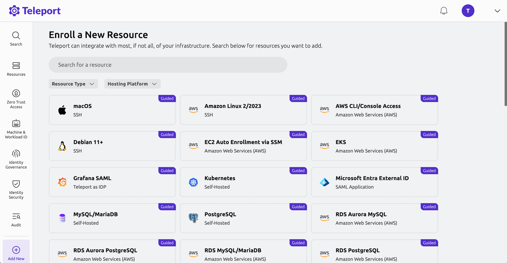

import Button from '@site/src/components/Button';
import Icon from '@site/src/components/Icon';
import TeleportEditionsGrid from '@site/src/components/Pages/GetStarted/TeleportEditionsGrid';
import TeleportEditionCard from '@site/src/components/Pages/GetStarted/TeleportEditionCard';
import FeatureMatrixBanner from '@site/src/components/Pages/GetStarted/FeatureMatrixBanner';

Teleport is an identity-based access platform that secures servers, Kubernetes clusters, databases, internal applications, and desktops using short-lived certificates, detailed audit logging, and fine-grained role-based access controls tied to your SSO provider (e.g., Okta, GitHub, Google Workspace).

This guide walks you through four essential steps to get you up and running.

## 1. Deploy a Teleport cluster

There are several editions of Teleport that differ in their feature sets, deployment options, and support.

Before choosing one, ask yourself:

- Am I looking to evaluate Teleport quickly or explore the full feature set without provisioning infrastructure? → **Enterprise Cloud (14-day trial)**
- Do I need to deploy and manage Teleport in my own environment for compliance reasons? → **Enterprise Self-Hosted**
- Do I prefer to self-host Teleport locally to test features or use it for free? → **Community Edition**

<TeleportEditionsGrid>
  <TeleportEditionCard
    title="Enterprise Cloud"
    iconName="teleportEnterpriseCloud"
    href="https://goteleport.com/signup/"
    subtitle="Managed and hosted by Teleport"
    id="enterprise-cloud"
  >
    
We handle infrastructure, upgrades, and certificates. Each customer receives a dedicated .teleport.sh subdomain. This option will take you directly to the signup page.

  </TeleportEditionCard>

  <TeleportEditionCard
    title="Enterprise Self-Hosted"
    iconName="teleportEnterpriseSelfHosted"
    href="https://goteleport.com/contact-us/"
    subtitle="Hosted and managed by you"
    id="enterprise-self-hosted"
  >
    
A paid plan for organizations requiring strict compliance, with features like FIPS support. A valid license is required, so use this option to speak with our team.

  </TeleportEditionCard>

  <TeleportEditionCard
    title="Community Edition"
    iconName="teleportCommunity"
    href="../linux-demo/"
    subtitle="Free and open source"
    id="community-edition"
  >
    
Includes core features like secure SSH, Kubernetes, databases, and app access. Best for hobbyists, homelabs, or small teams securing small-scale infrastructure.

  </TeleportEditionCard>
</TeleportEditionsGrid>

<FeatureMatrixBanner
  title="Quickly compare Teleport editions and see which edition works best for your organization"
  buttonText="Teleport Feature Matrix"
  buttonHref="../feature-matrix"
/>

## Step 2 - Enroll resources

After deploying your Teleport cluster, the next step is to enroll the infrastructure resources you want to secure.

Teleport supports a wide range of resource types, including Linux servers, MCP servers, Kubernetes clusters, databases, internal web apps, and cloud provider APIs. Each enrolled resource connects back to your cluster via a secure reverse tunnel, enabling identity-aware access with full session visibility and control.

### Using the Web UI

You can enroll a resource through the Teleport Web UI via our guided setups.

For example, to enroll an Ubuntu Linux server:
1. Click on the Enroll New Resource button, or go to `Add New` > `Resource` in the left sidebar.
2. Choose Ubuntu from the list of resources
3. Opt to add labels for filtering or restricting access later (optional).
4. Run the install script that Teleport provides on your Ubuntu server to install the Teleport SSH Service. 

Now you'll see your Ubuntu server listed under `Resources` in your Teleport Web UI. Click on the Connect button to SSH into the server.

### Using CLI tooling

You can also enroll resources using the Teleport CLI as our [Server Access Getting Started Guide](./enroll-resources/server-access/getting-started.mdx) demonstrates.

### Guides

If you'd like to see how other resource types are enrolled, here are some guides you can explore after finishing the Getting Started walkthrough.

<TileGrid
  tiles={[
       {
      icon: <Icon name="applications" size="xl" />,
      to: "../../enroll-resources/application-access/",
      name: "Applications",
    },
    {
      icon: <Icon name="linuxServers" size="xl" />,
      to: "../../enroll-resources/server-access/",
      name: "Linux Servers",
    },
    {
      icon: <Icon name="databases" size="xl" />,
      to: "../../enroll-resources/database-access/",
      name: "Databases",
    },
    {
      icon: <Icon name="kubernetesClusters" size="xl" />,
      to: "../../enroll-resources/kubernetes-access/",
      name: "Kubernetes Clusters",
    },
    {
      icon: <Icon name="windowsDesktops" size="xl" />,
      to: "../../enroll-resources/desktop-access/",
      name: "Windows Desktops",
    },
    {
      icon: <Icon name="autoDiscovery" size="xl" />,
      to: "../../enroll-resources/auto-discovery/",
      name: "Auto-Discovery of Resources",
    },
    {
      icon: <Icon name="cloudProviders" size="xl" />,
      to: "../../enroll-resources/application-access/cloud-apis/",
      name: "Cloud Providers",
    },
    {
      icon: <Icon name="mcpAndAi" size="xl" />,
      to: "../../enroll-resources/mcp-access/",
      name: "MCP and AI Agents",
    },
  ]}
/>

## Step 3 - Set Up Access Controls

You've deployed your Teleport cluster and connected infrastructure. Now it's time to set up access controls to secure your infrastructure. Teleport uses **Role-Based Access Control (RBAC)** to determine who can access what across your infrastructure. 

Every Teleport user is assigned one or more roles. These roles define the user's permissions, such as:

- What infrastructure resources they can access
- Whether they can request temporary access
- Whether they can edit cluster settings or view session recordings

You can assign roles when creating users or manage them later in the Teleport Web UI.

### Preset roles

If you visit the Teleport Web UI and navigate to `Zero Trust Access` > `Roles`, you will see that there are already a number of preset roles to help you get started.

Here are a few of the roles you will see:

| **Role**                      | **Description**                                                                 |
|------------------------------|---------------------------------------------------------------------------------|
| `access`                     | Grants access to infrastructure resources.                                     |
| `editor`                     | Allows editing cluster configuration (e.g., roles, connectors).                |
| `auditor`                    | Grants read-only access to audit logs, events, and session recordings.         |

View the full list of preset roles including Enterprise

(!docs/pages/includes/preset-roles-table.mdx!)

### Custom roles

Organizations often require custom roles to enforce least-privilege access and follow internal security policies. By creating custom roles, you can align Teleport's access controls with your company's structure and security policies.

For instructions on creating custom roles and assigning roles to users, follow along with our [Getting Started with Teleport Access Controls](./zero-trust-access/rbac-get-started/role-demo.mdx) demo guide. 

For mapping SSO users to roles, refer to our guide on [Configuring Single Sign-On](./zero-trust-access/sso/sso.mdx#how-teleport-uses-sso) for more information.

### Access Lists (Teleport Identity Governance)

Once you're comfortable with basic RBAC, you can explore Access Lists, a Teleport feature designed for more scalable, long-lived access delegation. 

Access Lists let administrators define and manage groups of users, automatically grant roles and traits to those users upon login, and enforce regular audit reviews of membership. This builds on your RBAC foundation by introducing centralized, long-term access workflows. 

You can learn how to create and assign Access Lists in the [Getting Started with Access Lists guide](./identity-governance/access-lists/guide.mdx).

## Step 4 - Monitor Audit Logs

Teleport logs cluster activity by emitting various events into its audit log. This can be viewed in the Teleport Web UI by clicking on `Audit` > `Audit Log` in the left sidebar. Here you'll see events like successful logins along with metadata such as event type, remote IP address, timestamp, and the identity involved.

In addition to recording structured events in its audit log, Teleport can also capture full session recordings for SSH, desktop, or Kubernetes shell sessions. These can be viewed by clicking on `Audit` > `Session Recordings` in the left sidebar. There, you can click the `Play` button to see a full recording of a session.

For a more in-depth look at how Teleport's audit system works, including event types and descriptions, storage options, and exporting events, see our [Audit Events and Records guide](./reference/deployment/monitoring/audit.mdx).

### What to explore next?

You've now explored the core steps of getting started with Teleport. However, this is only skimming the surface of what Teleport has to offer.  You can use the search above to locate content that best fits your specific situation or scroll through our many product use cases listed on our [documentation homepage](./index.mdx).

Here are a few places to start:

- Explore just-in-time access with [Access Requests](./identity-governance/access-requests/access-requests.mdx)
- Automate onboarding using [Terraform](./zero-trust-access/infrastructure-as-code/terraform-provider/terraform-provider.mdx) or the [Kubernetes Operator](./zero-trust-access/infrastructure-as-code/teleport-operator/teleport-operator.mdx)
- Integrate Teleport with your [SSO provider](./zero-trust-access/sso/sso.mdx) or even configure Teleport as an [IDP](./identity-governance/idps/idps.mdx)
- Learn how to use [Teleport's API libraries](./zero-trust-access/api/api.mdx) to automate setup tasks such as registering agents with an external service discovery API, generating roles from an external RBAC system, or writing [Access Request plugins](./identity-governance/access-request-plugins/access-request-plugins.mdx)**.**