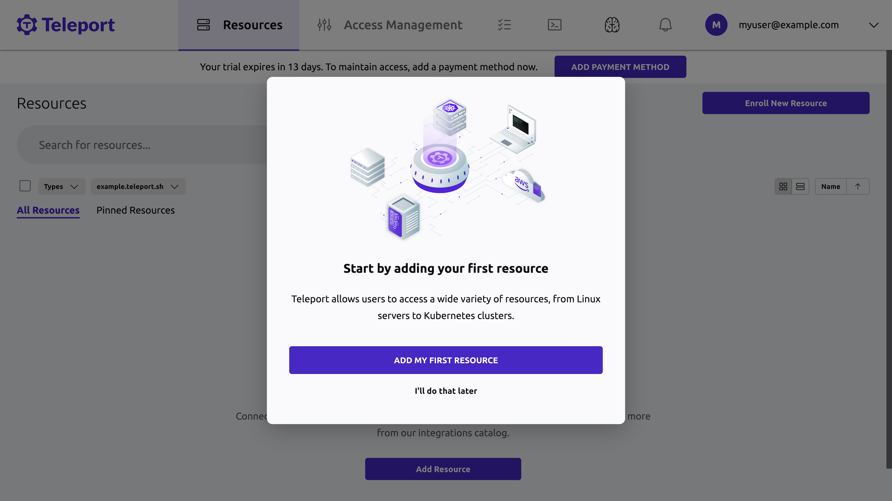
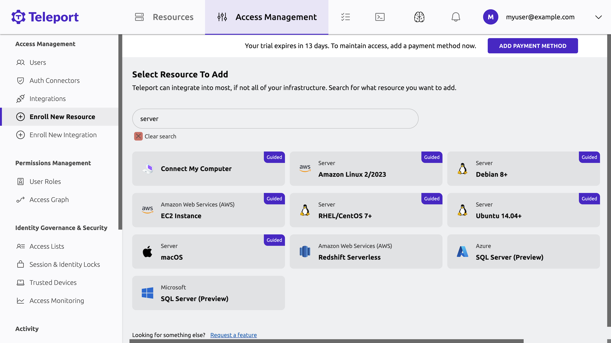
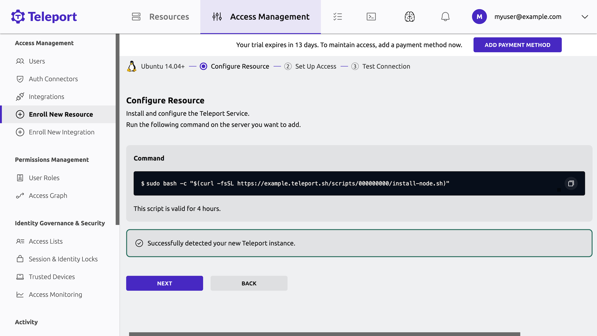

Teleport Enterprise helps organizations provide secure access to their
infrastructure with minimal configuration and cluster management. 

After you start a [free trial](https://goteleport.com/signup) of Teleport
Enterprise (Cloud), you can set up role-based access control (RBAC), enable
single sign-on, and prevent unauthorized use of organization resources.

This guide explains how to register a local server with a Teleport Enterprise
(Cloud) account. After you register the server, you can access it through the
Teleport Web UI in a browser or using the terminal. You can also record your
sessions, so you can review them later.

<Admonition type="tip">

You can also set up a Teleport cluster on a self-hosted virtual machine with
Teleport Community Edition. For instructions, read [Run a Self-Hosted Demo
Cluster](linux-demo.mdx).

</Admonition>

## How it works

With Teleport Enterprise (Cloud), the Teleport Auth Service and Teleport Proxy
Service are managed for you as cloud-based services. These services provide you
with immediate access to a scalable and fault-tolerant certificate authority and
reverse proxy that you don't need to manage or maintain. You can focus on
enrolling the resources you want to protect and configuring secure role-based
access for private and public networks across the globe.

## Prerequisites

- A Teleport Enterprise (Cloud) account. You can sign up for a free trial at the
  following page:

  https://goteleport.com/signup/

  After you sign up, you receive an email invitation to activate your account.
  Use this account to authenticate your identity when you access the Teleport
  Enterprise (Cloud) cluster.

- For following this guide, Docker installed on your workstation. 

  This guide illustrates how to register a server with Teleport Enterprise Cloud
  using a Docker container and the Teleport SSH Service. Docker is only required
  for the local demo environment used in this guide. You can find installation
  instructions for Docker on [Docker's
  website](https://docs.docker.com/get-docker/). If you want to register servers
  in Teleport without using Docker, see the getting started guide for
  [server access](enroll-resources/server-access/getting-started.mdx).

- The `tsh` client tool. `tsh` is included in the same packages and archives as
  the `teleport` binary. See the [Installation Guide](installation.mdx) for how
  to install Teleport on your operating system.
  
  This guide only requires the `tsh` client tool to access a server from a
  terminal. If you don't install the `tsh` client tool, you can access the
  server in Teleport Enterprise (Cloud) using the Web UI through your browser.

## Step 1/5. Spin up a server

To spin up a new server using Docker:

1. Open a terminal on your workstation.

1. Start a Docker container on your workstation to prepare a server that you want enroll 
as a resource in your Teleport Enterprise (Cloud) cluster:
   
   ```code
   $ docker run --interactive --tty ubuntu:24.04 /bin/bash
   ```
   
   This command starts a new shell session in a container running Ubuntu 24.04.

1. Run the following command to install `curl` and `telnet` from the package management repository:
   
   ```code
   $ apt update && apt install -y curl telnet
   ```
   
   The script that installs Teleport in this guide requires both `curl` and `telnet` to be installed.
   
   Keep the new shell open in your terminal.

## Step 2/5. Install the Teleport SSH Service

To install the Teleport SSH Service on your server:

1. Open a browser and go to the address for your Teleport cluster. For example,
   if your Teleport account is `example`, open `https://example.teleport.sh`.

1. Sign in with the credentials you used to activate your Teleport account.
   
   The first time you sign in, you are prompted to add your first resource: 
   
   

1. Click **Add my first resource**, and you will see the option to enroll
   resources in your Teleport cluster.

1. Type *server* in the search box to filter the list of resources:
   
   

1. Click **Ubuntu 18.04+** to register the server in the Docker container.
   
   After you select the resource type, the Web UI prompts you for your
   multi-factor authentication device, then displays a script to install and
   configure the Teleport SSH Service. For example:
   
   
   
1. The Teleport installation script uses `sudo`, which is not installed on your
   Docker container. Before copying the command to run the installation script,
   you need to alias `sudo` in the container terminal shell session.

   In the terminal with the container shell session, alias `sudo` by running 
the following command:
   
   ```code
   $ alias sudo=""
   ```

1. Copy the command to run the installation script from the Teleport Web UI and paste it 
into the container shell session.
   
   Leave the script running in the shell. After Teleport is installed on the server, 
   you'll see a message in the Web UI that your new Teleport instance was successfully detected:
   
   
   
   To continue, click **Next**.

1. Confirm that you want to authenticate as the `root` user and click **Next**:
   
   

1. Respond to the MFA prompt again, then click **Test Connection** to verify
   access to the server.
   
   

## Step 3/5. Start a session

To start a session on the server you just added to Teleport:

1. Click **Start Session** to start an interactive session.
   
   You should see a terminal prompt in a new browser window. Your Teleport 
   account routes your SSH connection through the Teleport Proxy Service, which
   connects to your container through a reverse tunnel. 
   Reverse tunnels allow Teleport to manage access to resources like Kubernetes 
   clusters and remote desktops, even if these resources are running on private networks.
      
   If you get an error connecting to your container, interrupt the `teleport` process in 
   the container shell with **Ctrl-C**, then run `teleport start` to restart the process.
       
1. Execute some commands in your terminal. 

1. Enter the `exit` command to end the remote interactive session. Close the
   browser tab.

1. In the last step of **Enroll New Resource**, click **Finish**.

1. Click **Browse existing resources** to see your new server listed in the Teleport Web UI.

## Step 4/5. Play back your session

As Teleport proxies SSH connections to registered servers, it records the
commands that users execute during their sessions so operators can play them
back later to investigate issues.

To play back a session in the Teleport Web UI:

1. Find the left sidebar and navigate to **Audit > Session Recordings**.

1. In the sidebar, under **Activity**, click **Session Recordings**.
   
   You will see the recording for your interactive session from the previous
   step listed.  For example:
   
   

1. Click **Play** to see a full recording of your session.

## Step 5/5. Access the server from the command line

To access the server using commands in a terminal:

1. Open a new terminal window.

1. Sign in to your Teleport cluster by running the `tsh login` command  with the
   URL of your cluster and the name of your Teleport user, assigning 
   <Var name="example" /> to your account subdomain and <Var name="username" /> to
   your Teleport username:
   
   ```code
   $ tsh login --proxy=<Var name="example" />.teleport.sh --user=<Var name="username" />
   ```
   
   When prompted, authenticate using your password, authenticator app, or hardware key.
   The command displays information about your Teleport cluster and account. For example:
   
   ```code
   > Profile URL:      https://example.teleport.sh:443
     Logged in as:       admin@teleport.example.com
     Cluster:            example.teleport.sh
     Roles:              access, auditor, editor
     Logins:             root
     Kubernetes:         enabled
     Valid until:        2023-07-08 01:35:20 -0700 PDT [valid for 12h0m0s]
     Extensions:         login-ip, permit-agent-forwarding, permit-port-forwarding, permit-pty, private-key-policy
   ```

1. List the servers your Teleport user can access. 
   
   ```code
   $ tsh ls
   ```

   You should see the name of the container you just registered. For example:
    
   ```code
   Node Name    Address    Labels
   ------------ ---------  ----------------------------------------------------------------------------------------
   b6c1072b5af5 ⟵ Tunnel  
   ```

1. Access your server as the `root` user, assigning <Var name="node-name" /> to
   the name of the server as displayed by `tsh ls`:

   ```code
   $ tsh ssh root@<Var name="node-name" />
   ```

## Next steps

This guide introduced how you can use Teleport Enterprise (Cloud) to protect your
infrastructure by demonstrating how to register a server with your Teleport
cluster. 

You can provide secure access to more of your infrastructure through Teleport by
deploying one or more Teleport **Agents** and configuring role-based access
control for users. 

Agents proxy traffic to all of your infrastructure resources—including servers,
databases, Kubernetes clusters, cloud provider APIs, and Windows desktops.
Role-based access control ensures that only authorized users are allowed access
to those resources.

To learn more information about deploying agents, see [Deploy Teleport Agents 
with Terraform](admin-guides/infrastructure-as-code/terraform-starter/enroll-resources.mdx).
