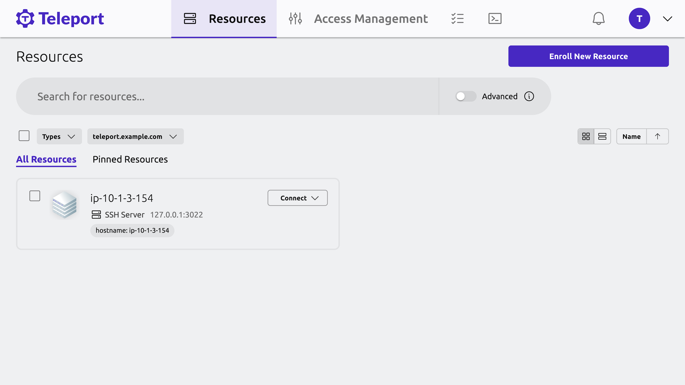

This tutorial will show you how to install and run a demo Teleport cluster
(=teleport.version=) on a Linux host using Teleport Community Edition. Once you
deploy the cluster, you can configure RBAC, register resources, and protect your
small-scale demo environments or home lab.

We will run the following Teleport services:

- **Teleport Auth Service:** The certificate authority for your cluster. It
  issues certificates and conducts authentication challenges. The Auth Service
  is typically inaccessible outside your private network.
- **Teleport Proxy Service:** The cluster frontend, which handles user requests,
  forwards user credentials to the Auth Service, and communicates with Teleport
  instances that enable access to specific resources in your infrastructure.
- **Teleport SSH Service:** An SSH server implementation that takes advantage of
  Teleport's short-lived certificates, sophisticated RBAC, session recording,
  and other features.

(!docs/pages/includes/cloud/call-to-action.mdx!)

## Prerequisites

- A Linux host with only port `443` open to ingress traffic. You must be able
  to install and run software on the host. Either configure access to the host
  via SSH for the initial setup (and open an SSH port in addition port `443`)
  or enter the commands in this guide into an Amazon EC2 [user data
  script](https://docs.aws.amazon.com/AWSEC2/latest/UserGuide/user-data.html),
  Google Compute Engine [startup
  script](https://cloud.google.com/compute/docs/instances/startup-scripts),
  or similar.

  <Admonition type="tip" title="Quick demo environments">

  For a quick demo environment you can use to follow this guide, consider
  installing our DigitalOcean 1-Click droplet. View the installation page on
  [DigitalOcean
  Marketplace](https://marketplace.digitalocean.com/apps/teleport). Once your
  droplet is ready, SSH into the droplet and follow the configuration wizard.

  </Admonition>

- A two-factor authenticator app such as [Authy](https://authy.com/download/),
  [Google Authenticator](https://www.google.com/landing/2step/), or [Microsoft
  Authenticator](https://www.microsoft.com/en-us/account/authenticator)

You must also have one of the following:
- A registered domain name.
- An authoritative DNS nameserver managed by your organization, plus an existing
  certificate authority. If using this approach, ensure that your browser is
  configured to use your organization's nameserver.

This guide is not intended for local deployments. If your environment doesn't
meet the prerequisites above, you can get started with Teleport by signing up
for a [free trial of Teleport Enterprise Cloud](https://goteleport.com/signup/).

## Step 1/4. Configure DNS

Teleport uses TLS to provide secure access to its Proxy Service and Auth
Service, and this requires a domain name that clients can use to verify
Teleport's certificate. Set up two DNS `A` records, each pointing to the IP
address of your Linux host. Assuming `teleport.example.com` is your domain name,
set up records for:

|Domain|Reason|
|---|---|
|`teleport.example.com`|Traffic to the Proxy Service from users and services.|
|`*.teleport.example.com`|Traffic to web applications registered with Teleport. Teleport issues a subdomain of your cluster's domain name to each application.|

## Step 2/4. Set up Teleport on your Linux host

### Install Teleport

On your Linux host, run the following command to install the Teleport binary:

```code
$ curl https://goteleport.com/static/install.sh | bash -s (=teleport.version=)
```

### Configure Teleport

Generate a configuration file for Teleport using the `teleport configure` command.
This command requires information about a TLS certificate and private key.

(!docs/pages/includes/tls-certificate-setup.mdx!)

### Start Teleport

(!docs/pages/includes/start-teleport.mdx!)

Access Teleport's Web UI via HTTPS at the domain you created earlier (e.g.,
`https://teleport.example.com`). You should see a welcome screen similar to the
following:


## Step 3/4. Create a Teleport user and set up two-factor authentication

In this step, we'll create a new Teleport user, `teleport-admin`, which is
allowed to log into SSH hosts as any of the principals `root`, `ubuntu`, or
`ec2-user`.

On your Linux host, run the following command:

```code
# tctl is an administrative tool that is used to configure Teleport's auth service.
$ sudo tctl users add teleport-admin --roles=editor,access --logins=root,ubuntu,ec2-user
```

The command prints a message similar to the following:

```text
User "teleport-admin" has been created but requires a password. Share this URL with the user to complete user setup, link is valid for 1h:
https://teleport.example.com:443/web/invite/123abc456def789ghi123abc456def78

NOTE: Make sure teleport.example.com:443 points at a Teleport proxy which users can access.
```

Visit the provided URL in order to create your Teleport user.

<Admonition
  type="tip"
  title="OS User Mappings"
>

  The users that you specify in the `logins` flag (e.g., `root`, `ubuntu` and
  `ec2-user` in our examples) must exist on your Linux host. Otherwise, you
  will get authentication errors later in this tutorial.

  If a user does not already exist, you can create it with `adduser <login>` or
  use [host user creation](./server-access/guides/host-user-creation.mdx).

  If you do not have the permission to create new users on the Linux host, run
  `tctl users add teleport $(whoami)` to explicitly allow Teleport to
  authenticate as the user that you have currently logged in as.

</Admonition>

Teleport enforces the use of two-factor authentication by default. It supports
one-time passwords (OTP) and second-factor authenticators (WebAuthn). In this
guide, you will need to enroll an OTP authenticator application using the QR
code on the Teleport welcome screen.

<Details title="Logging in via the CLI">

In addition to Teleport's Web UI, you can access resources in your
infrastructure via the `tsh` client tool.

Install `tsh` on your local workstation:

<Tabs>
  <TabItem label="Mac">
    [Download the MacOS .pkg installer](https://goteleport.com/download?os=mac) (`tsh` client only, signed) and double-click to run it.
  </TabItem>

  <TabItem label="Mac - Homebrew">
    ```code
    $ brew install teleport
    ```

    <Admonition type="note">
      The Teleport package in Homebrew is not maintained by Teleport and we can't
      guarantee its reliability or security. We recommend the use of our [own Teleport packages](https://goteleport.com/download?os=mac).

      If you choose to use Homebrew, you must verify that the versions of `tsh` and
      `tctl` are compatible with the versions you run server-side. Homebrew usually
      ships the latest release of Teleport, which may be incompatible with older
      versions. See our [compatibility policy](./management/operations/upgrading.mdx#component-compatibility) for details.
    </Admonition>
  </TabItem>

  <TabItem label="Windows - Powershell">
    ```code
    $ curl -O https://cdn.teleport.dev/teleport-v(=teleport.version=)-windows-amd64-bin.zip
    # Unzip the archive and move `tsh.exe` to your %PATH%
    ```
  </TabItem>

  <TabItem label="Linux">
    For more options (including RPM/DEB packages and downloads for i386/ARM/ARM64) please see our [installation page](./installation.mdx).

    ```code
    $ curl -O https://get.gravitational.com/teleport-v(=teleport.version=)-linux-amd64-bin.tar.gz
    $ tar -xzf teleport-v(=teleport.version=)-linux-amd64-bin.tar.gz
    $ cd teleport
    $ sudo ./install
    # Teleport binaries have been copied to /usr/local/bin
    # To configure the systemd service for Teleport take a look at examples/systemd/README.mdx
    ```
  </TabItem>
</Tabs>

Log in to receive short-lived certificates from Teleport:

```code
# Replace teleport.example.com with your Teleport cluster's public address as configured above.
$ tsh login --proxy=<Var name="teleport.example.com" /> --user=teleport-admin
> Profile URL:        https://teleport.example.com:443
  Logged in as:       teleport-admin
  Cluster:            teleport.example.com
  Roles:              access, editor
  Logins:             root, ubuntu, ec2-user
  Kubernetes:         enabled
  Valid until:        2022-04-26 03:04:46 -0400 EDT [valid for 12h0m0s]
  Extensions:         permit-agent-forwarding, permit-port-forwarding, permit-pty
```

</Details>

## Step 4/4. Enroll your infrastructure

With Teleport, you can protect all of the resources in your infrastructure
behind a single identity-aware access proxy, including servers, databases,
applications, Kubernetes clusters, Windows desktops, and cloud provider APIs.

To enroll a resource with Teleport, visit the Web UI and click the name of a
resource on the sidebar, e.g., **Servers**, **Applications**, and
**Kubernetes**. The Web UI will show you the steps you can take to enroll that
resource.



In the **Servers** tab, you can see that you have already enrolled your Linux
server. 

## Next steps

Now that you have launched your Teleport cluster and added your first resources,
see how to use Teleport to set up secure access to your infrastructure. 

Read the [Manage Access](./access-controls/introduction.mdx) documentation to
get started setting up role-based access controls for all of the resources you
registered.

To learn about common Day Two operations when managing a Teleport cluster, read
the [Manage your Cluster](./management/introduction.mdx) guides.

You can also read more about how to protect your infrastructure with Teleport,
including:

- [Applications](./application-access/introduction.mdx)
- [Databases](./database-access/introduction.mdx)
- [Kubernetes clusters](./kubernetes-access/introduction.mdx)
- [Servers](./server-access/introduction.mdx)
- [Windows desktops](./desktop-access/introduction.mdx)
- [Service accounts](./machine-id/introduction.mdx) (via Machine ID)

## Further reading

- How Let's Encrypt uses the [ACME protocol](https://letsencrypt.org/how-it-works/) to issue certificates.
- Configuration for the `teleport` daemon relies on [systemd](https://www.freedesktop.org/wiki/Software/systemd/). For more information on how the
`teleport` service daemon is configured, see our guide on how to [Run Teleport as a Daemon](management/admin/daemon.mdx).
