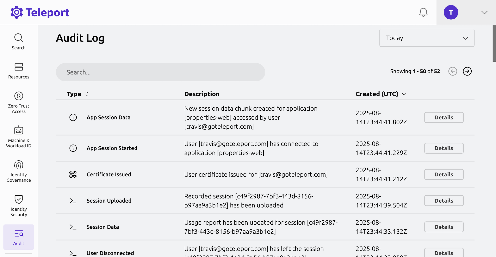

Teleport logs cluster activity by emitting various events into its audit log.

This can be viewed in the Teleport Web UI by clicking on `Audit` > `Audit Log` in the left sidebar.

Here you'll see events like successful logins along with metadata such as event type, remote IP address, timestamp, and the identity involved.

In addition to recording structured events in its audit log, Teleport can also capture full session recordings for SSH, desktop, or Kubernetes shell sessions.

These can be viewed by clicking on `Audit` > `Session Recordings` in the left sidebar. There, you can click the `Play` button to see a full recording of a session.

For a more in-depth look at how Teleport's audit system works, including event types and descriptions, storage options, and exporting events, see our [Audit Events and Records guide](../reference/deployment/monitoring/audit.mdx).

## What's next?

You've now explored the core steps of getting started with Teleport. However, this is only skimming the surface of what Teleport has to offer. 

You can use the search above to locate content that best fits your specific situation or scroll through our many product use cases listed on our [documentation homepage](../index.mdx).

Here are a few places to start:

- Explore just-in-time access with [Access Requests](../identity-governance/access-requests/access-requests.mdx)
- Automate onboarding using [Terraform](../zero-trust-access/infrastructure-as-code/terraform-provider/terraform-provider.mdx) or the [Kubernetes Operator](../zero-trust-access/infrastructure-as-code/teleport-operator/teleport-operator.mdx)
- Integrate Teleport with your [SSO provider](../zero-trust-access/sso/sso.mdx) or even configure Teleport as an [IDP](../identity-governance/idps/idps.mdx)
- Learn how to use [Teleport's API libraries](../zero-trust-access/api/api.mdx) to automate setup tasks such as registering agents with an external service discovery API, generating roles from an external RBAC system, or writing [Access Request plugins](../identity-governance/access-request-plugins/access-request-plugins.mdx).