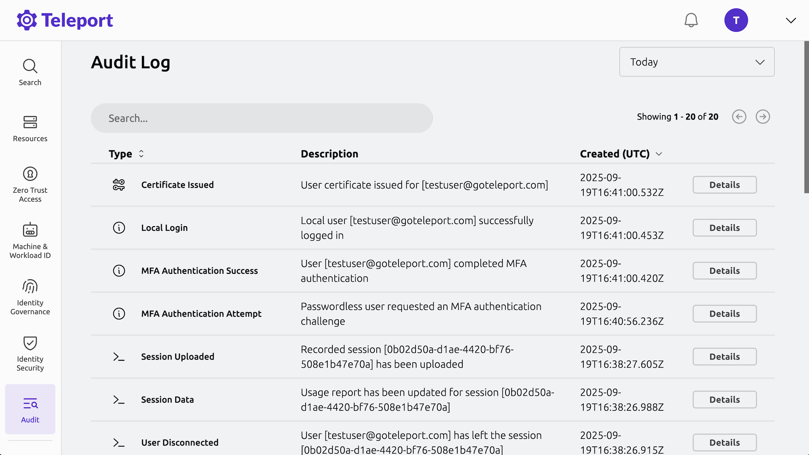

import Icon from '@site/src/components/Icon';

Teleport logs cluster activity by emitting various events into its audit log.

This can be viewed in the Teleport Web UI by clicking on **Audit** > **Audit Log** in the left sidebar.

Here you'll see events like successful logins along with metadata such as event type, remote IP address, timestamp, and the identity involved. Click on **Details** to see the complete event information in JSON format.

## View your SSH session recording

In addition to recording structured events in its audit log, Teleport can also capture full session recordings for SSH, desktop, or Kubernetes shell sessions.

Remember when you connected to your Ubuntu server via SSH in Step 2? That entire session was recorded.

To view the recording:

1. Click on **Audit** > **Session Recordings** in the left sidebar
2. Find your recent SSH session to your Ubuntu server
3. Click the **Play** button to watch a full playback of everything you typed and the server's responses

This is especially useful for security audits, compliance requirements, and troubleshooting.

For a more in-depth look at how Teleport's audit system works, including event types and descriptions, storage options, and exporting events, see our [Audit Events and Records guide](../reference/deployment/monitoring/audit.mdx).

## What's next?

You've now explored the core steps of getting started with Teleport. However, this is only skimming the surface of what Teleport has to offer.

### Enroll other resource types

In this guide, you enrolled an Ubuntu Linux server. Teleport supports many other resource types that you can enroll using similar workflows:

<TileGrid
  tiles={[
    {
      icon: <Icon name="applications" size="xl" />,
      to: "../../enroll-resources/application-access/",
      name: "Applications",
    },
    {
      icon: <Icon name="linuxServers" size="xl" />,
      to: "../../enroll-resources/server-access/",
      name: "Linux Servers",
    },
    {
      icon: <Icon name="databases" size="xl" />,
      to: "../../enroll-resources/database-access/",
      name: "Databases",
    },
    {
      icon: <Icon name="kubernetesClusters" size="xl" />,
      to: "../../enroll-resources/kubernetes-access/",
      name: "Kubernetes Clusters",
    },
    {
      icon: <Icon name="windowsDesktops" size="xl" />,
      to: "../../enroll-resources/desktop-access/",
      name: "Windows Desktops",
    },
    {
      icon: <Icon name="autoDiscovery" size="xl" />,
      to: "../../enroll-resources/auto-discovery/",
      name: "Auto-Discovery of Resources",
    },
    {
      icon: <Icon name="cloudProviders" size="xl" />,
      to: "../../enroll-resources/application-access/cloud-apis/",
      name: "Cloud Providers",
    },
    {
      icon: <Icon name="mcpAndAi" size="xl" />,
      to: "../../enroll-resources/mcp-access/",
      name: "MCP and AI Agents",
    },
  ]}
/>

### Explore additional features

You can use the search above to locate content that best fits your specific situation or scroll through our many product use cases listed on our [documentation homepage](../index.mdx).

Here are a few places to start:

- Explore just-in-time access with [Access Requests](../identity-governance/access-requests/access-requests.mdx) or longer-term, auditable access management with [Access Lists](../identity-governance/access-lists/access-lists.mdx)
- Automate onboarding using [Terraform](../zero-trust-access/infrastructure-as-code/terraform-provider/terraform-provider.mdx) or the [Kubernetes Operator](../zero-trust-access/infrastructure-as-code/teleport-operator/teleport-operator.mdx)
- Integrate Teleport with your [SSO provider](../zero-trust-access/sso/sso.mdx) or even configure Teleport as an [IDP](../identity-governance/idps/idps.mdx)
- Learn how to use [Teleport's API libraries](../zero-trust-access/api/api.mdx) to automate setup tasks such as registering agents with an external service discovery API, generating roles from an external RBAC system, or writing [Access Request plugins](../identity-governance/access-request-plugins/access-request-plugins.mdx).