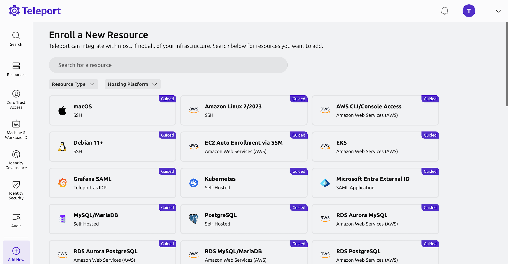

import Button from '@site/src/components/Button';
import Icon from '@site/src/components/Icon';

After deploying your Teleport cluster, the next step is to enroll the infrastructure resources you want to secure.

Teleport supports a wide range of resource types, including Linux servers, MCP servers,Kubernetes clusters, databases, internal web apps, and cloud provider APIs. You can enroll these through the Teleport Web UI's guided setup workflows.

## Demo: Enroll an Ubuntu server

To help you understand the enrollment process, let's walk through enrolling an Ubuntu Linux server as a hands-on example.

**What you'll need for this demo:**

- An Ubuntu Linux server that you can SSH into (physical server, VM or cloud instance like EC2, or homelab server), OR
- Docker installed on your workstation (to create a temporary demo server)

If you don't have an Ubuntu server available, expand the section below for instructions to create a demo server using Docker.

<details>
  <summary>Create a demo Ubuntu server with Docker</summary>

  To follow along with this guide, you can spin up a new Ubuntu server using Docker:

1. Open a terminal on your workstation.

1. Start a Docker container to create a server that you can enroll as a resource in your Teleport cluster:

   ```code
   $ docker run --interactive --tty ubuntu:24.04 /bin/bash
   ```

   This command starts a new shell session in a container running Ubuntu 24.04.

1. Run the following command to install `curl` and `telnet`:

   ```code
   $ apt update && apt install -y curl telnet
   ```

   The Teleport installation script requires both `curl` and `telnet` to be installed.

1. Create an alias for `sudo` since it's not installed on the Docker container:

   ```code
   $ alias sudo=""
   ```

   The Teleport installation script uses `sudo`, so this alias allows the script to run without errors.

   Keep this shell open. You'll use it in the next steps.

</details>

### Enroll your Ubuntu server

You can enroll resources through the Teleport Web UI using guided setup workflows.



Follow these steps to enroll your Ubuntu Linux server:

1. In the Teleport Web UI, click **Enroll New Resource**, or navigate to **Add New** > **Resource** in the left sidebar.
2. Select **Ubuntu** from the list of resource types.
3. (Optional) Add labels like `env: staging` or `cloud: aws` for filtering or restricting access later.
4. Run the install script that Teleport provides on your Ubuntu server (or in your Docker container) to install the Teleport SSH Service. 
5. Wait for the installation to complete. You should see a notification in the Teleport Web UI confirming the agent was successfully detected.
6. Add `ubuntu` as an OS user you will use to connect to the server and test your connection to verify that the server is accessible before you finish the guided setup.

Now you'll see your Ubuntu server listed under Resources in your Teleport Web UI. Click on the Connect button to SSH into the server.

<details>
  <summary>How does passwordless SSH work?</summary>

When you click **Connect** and choose the `ubuntu` user, here's what happens under the hood:

1. **Short-lived certificate authentication** - Teleport's Auth Service uses the short-lived identity certificate it issued when you logged in (typically valid for 12 hours). This certificate is signed by Teleport's internal Certificate Authority (CA) and includes your roles and allowed logins, defining exactly what you can access.
2. **The server trusts Teleport's CA** - When the Ubuntu server was enrolled, the Teleport Agent configured it to trust certificates signed by Teleport's CA instead of static SSH keys.
3. **Certificate-based access** - Your client presents that certificate, the server validates it against the trusted CA, and access is granted, with authorization enforced by the roles encoded in your certificate.

Teleport handles all the PKI complexity behind the scenes with automatic certificate issuance and expiration.

</details>

### Alternative: Enroll using the CLI

{/* vale messaging.protocol-products = NO */}
While the Web UI provides a guided experience, you can also enroll servers using the Teleport CLI as demonstrated in the [Server Access Getting Started Guide](../enroll-resources/server-access/getting-started.mdx).
{/* vale messaging.protocol-products = YES */}

## Enroll other resource types

While this step focuses on Ubuntu servers for demonstration purposes, you can enroll many other resource types through the same Web UI or CLI workflow:

- **Applications** - Internal web apps and cloud provider APIs
- **Databases** - PostgreSQL, MySQL, MongoDB, and more
- **Kubernetes clusters** - EKS, GKE, AKS, or self-hosted
- **Windows Desktops** - RDP access to Windows machines
- **And more** - See detailed enrollment guides for all resource types at the end of this guide

## Next step: Set up access controls

In the next step of the Getting Started guide, we'll discuss role-based access control (RBAC) so you can control **who** can connect to your newly enrolled server and **what actions** they can take once connected.

<div style={{ marginTop: 'var(--m-4)' }}>
  <Button style={{ padding: '0 var(--m-2)' }} as="link" href="../access/" variant="primary" shape="lg">Step 3 - Configure Access Controls <Icon name="arrowRight" inline size="sm"/></Button>
</div>