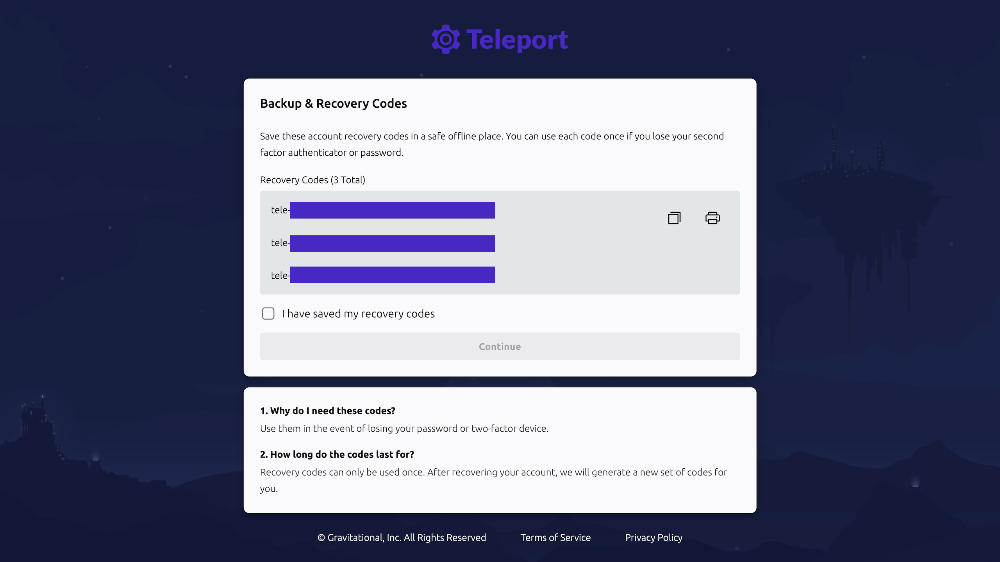

import Button from '@site/src/components/Button';

Teleport Enterprise Cloud is the **fastest and easiest way to get started**.  

Infrastructure and certificates are managed for you. All that's left is deploying agents to enroll your resources.

To get started, simply sign up for a 14-day free trial. We'll automatically provision and manage a fully featured Teleport cluster in a dedicated tenant with a unique `example.teleport.sh` domain.

## Deploy your cluster

Once you sign up for a Teleport Cloud account, Teleport-managed infrastructure
spins up the Auth Service and Proxy Service for you. 

### Initial setup

1. Go to [goteleport.com/signup](https://goteleport.com/signup)
2. Follow the sign-up steps to launch your cluster

When setup is finished, you'll have a production-grade Teleport cluster
configured with secure defaults, automatic updates, and built-in scalability.

The signup flow creates a local Teleport user with the following preset roles:

|Role|Permissions|
|---|---|
|`editor`|Perform administrative tasks in your cluster|
|`access`|Connect to any Teleport-protected resource|
|`auditor`|View audit events and session recordings|

Since this user has almost total privileges, you should treat this identity as a
fallback after completing initial setup operations. In Step 3 of the Get Started
series, we will show you how to set up a more authentication and role-based
access control for day-to-day Teleport usage.

### Create a backup local user

We recommend having more than one local user to prevent lockout. As with the
default user, we recommend treating this identity as a fallback, rather than
relying on it for day-to-day usage:


1. On your workstation, run the following command. `tctl` is a client tool for
   configuring the Teleport Auth Service:

   ```code
   $ sudo tctl users add teleport-admin-backup --roles=editor,access,auditor --logins=root,ubuntu,ec2-user
   ```

   The command prints a message similar to the following:
   
   ```text
   User "teleport-admin-backup" has been created but requires a password. Share this URL with the user to complete user setup, link is valid for 1h:
   https://teleport.example.com:443/web/invite/123abc456def789ghi123abc456def78
   
   NOTE: Make sure teleport.example.com:443 points at a Teleport proxy which users can access.
   ```

1. Visit the provided URL in order to create your Teleport user.

## Save your recovery codes

During signup, Teleport generates recovery codes for your account. Store them
securely in an offline location. If you lose access to your multi-factor
authentication device, you will need these codes to regain access.



If you forgot to copy your recovery codes, you can navigate to
`/web/account/security` and click **Generate new recovery codes**.

<Admonition type="danger">

If you are locked out of your account and do not have recovery codes, the only
recourse is to set up a new Teleport Enterprise Cloud account.

</Admonition>

## Next step: Enroll resources

At this point, you've launched your own Teleport Enterprise Cloud cluster and created a local admin user. You can now move on to the next step of enrolling your infrastructure resources.

<div style={{ marginTop: 'var(--m-4)' }}>
  <Button style={{ padding: '0 var(--m-2)' }} as="link" href="../connect/" variant="primary" shape="lg">Step 2 - Enroll resources <Icon name="arrowRight" inline size="sm"/> </Button>
</div>
