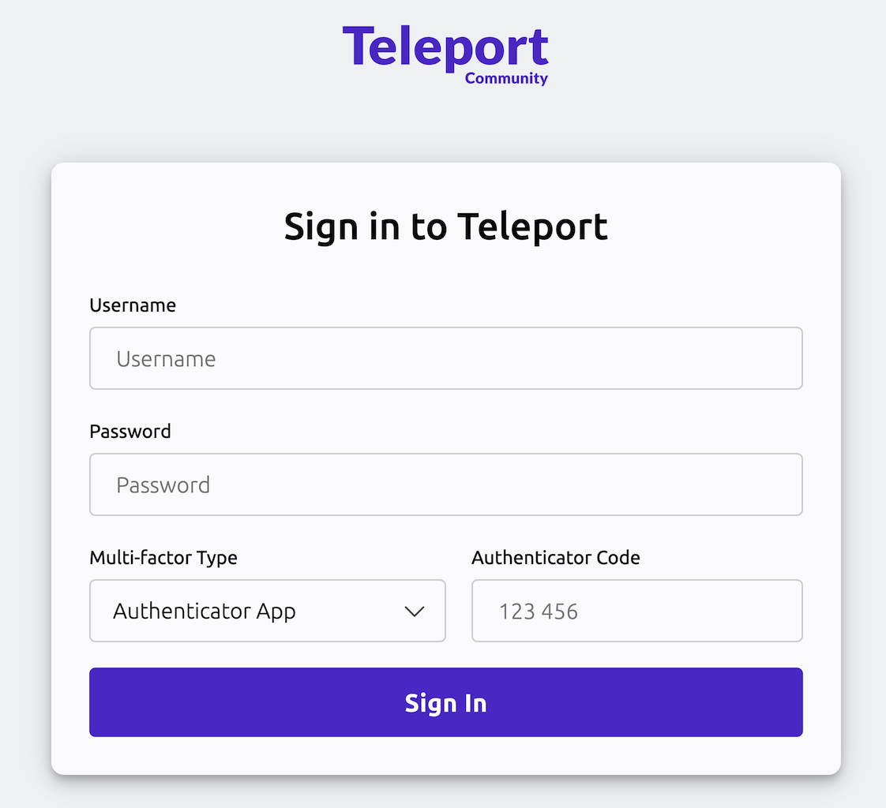
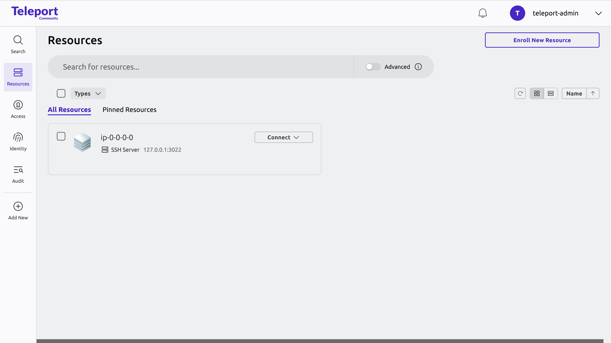

import Button from '@site/src/components/Button';

<EnterpriseFeatureWidget title="Did you know?">
   You can try out Teleport Enterprise capabilities like SSO, session recording summaries, and just-in-time Access Requests for free. No payment information required.
</EnterpriseFeatureWidget>

In this guide, you will deploy Teleport Community Edition. 

You'll spin up a single-instance Teleport cluster on a Linux server, ideal for small-scale demos or home lab environments. Once deployed, you can move ahead in the guide to connecting your infrastructure, setting up role-based access control (RBAC), and auditing your access.

## How it works

The Teleport cluster we set up in this guide consists of three services:

- **Teleport Auth Service:** The certificate authority for your cluster. It
  issues certificates and conducts authentication challenges. The Auth Service
  is typically inaccessible outside your private network.
- **Teleport Proxy Service:** The cluster frontend, which handles user requests,
  forwards user credentials to the Auth Service, and communicates with Teleport
  instances that enable access to specific resources in your infrastructure.
- **Teleport SSH Service:** An SSH server that enforces Teleport access
  controls, records sessions, and logs activity as Teleport audit events,
  enabling you to protect a Linux server with Teleport.

The Teleport Auth Service and Proxy Service are considered the **control
plane**. In Teleport Cloud, they run on Teleport-managed infrastructure. The
Teleport SSH Service is an example of a **Teleport Agent** service, which
proxies connections to and from a resource in your infrastructure.


You can read more about the architecture of Teleport in the [Core Concepts](../core-concepts.mdx) page.

## Prerequisites

You will need the following to deploy a demo Teleport cluster. If your
environment doesn't meet the prerequisites, you can get started with Teleport by
signing up for a [free trial of Teleport Enterprise
Cloud](https://goteleport.com/signup/) and jumping ahead to [Step 2: Connect infrastructure](./connect.mdx).

Also, if you want to get a feel for Teleport commands and capabilities without setting
up any infrastructure, take a look at the browser-based [Teleport
Labs](https://goteleport.com/labs).

You can work through this guide with either a remote virtual machine (e.g., an
Amazon EC2 instance) or a local Docker container. **We recommend the Amazon EC2
instance approach** for simplicity. Once you have completed this guide, having a
dedicated host for your self-hosted Teleport cluster reduces the complexity of
following other guides in the Teleport documentation.

Make sure you have met the following requirements for your platform:

<Tabs>
<TabItem label="Remote virtual machine">

- A Linux host with only port `443` open to ingress traffic, and no existing
  Teleport installation.
  - You must be able to install and run software on the host. Either configure
    access to the host via SSH for the initial setup (and open an SSH port in
    addition to port `443`) or enter the commands in this guide into an Amazon
    EC2 [user data
    script](https://docs.aws.amazon.com/AWSEC2/latest/UserGuide/user-data.html),
    Google Compute Engine [startup
    script](https://cloud.google.com/compute/docs/instances/startup-scripts), or
    similar.
  - The host can start with 2 vCPU and 1GB RAM for testing, though for
    additional users and resources, we recommend a larger instance size. For the
    most scalable performance, run Teleport-protected resources on separate
    hosts from the Teleport cluster.
- **One** of the following:
  - A registered domain name or access to a service like Amazon Route53 that
    allows you to register domain names.
  - An authoritative DNS nameserver managed by your organization, plus an
    existing certificate authority. If using this approach, ensure that your
    browser is configured to use your organization's nameserver.

</TabItem>
<TabItem label="Local Docker container">

1. Install [mkcert](https://github.com/FiloSottile/mkcert) so you can set up a
   local certificate authority and create a certificate for running the Teleport
   Web UI with HTTPS.

1. Install the mkcert CA:

   ```code
   $ mkcert -install
   ```

1. Create a directory on your workstation in which to place TLS credentials for
   Teleport:

   ```code
   $ mkdir teleport-tls
   ```

1. Generate a certificate and private key for Teleport:

   ```code
   $ cd teleport-tls
   $ mkcert localhost
   ```

1. Add the mkcert CA certificate to the `teleport-tls` directory so your Docker
   container can access it:

   ```code
   $ cp "$(mkcert -CAROOT)/rootCA.pem" .
   ```

1. Start a local Docker container where you can follow the remaining
   instructions in this guide:

   ```code
   $ docker run -it -v .:/etc/teleport-tls -p 3080:443 ubuntu:22.04
   ```

1. Make sure `curl` is installed on your container:

   ```code
   $ apt-get update && apt-get install -y curl
   ```

1. On the container, move the mkcert CA certificate into the directory where
   your container stores CA certs (installing `curl` sets this up for you). When
   starting, Teleport verifies its TLS certificate against the CA:

   ```code
   $ cp /etc/teleport-tls/rootCA.pem /etc/ssl/certs/mkcertCA.pem
   ```

</TabItem>
</Tabs>

Finally, you will need a multi-factor authenticator app such as
[Authy](https://authy.com/download/), [Google
Authenticator](https://www.google.com/landing/2step/), or
[1Password](https://support.1password.com/one-time-passwords/).

<Admonition type="danger">

For your Teleport cluster to be functional, the Proxy Service must be
addressable from outside the cluster with a valid TLS certificate. In most
cases, this requires a domain name. Only run your Teleport cluster with
self-signed certificates if you understand the implications. Other guides in the
documentation assume that your cluster has a domain name.

See [Self-Signed
Certificates](../installation/self-hosted/self-signed-certs.mdx) for how to run
a Teleport cluster with self-signed certificates.

</Admonition>

## Step 1/4. Create DNS records

If you are following this guide with a local Docker container for testing, skip
to Step 2.

Create two DNS `A` records, each pointing to the IP address of your Linux host.
Assuming `teleport.example.com` is your domain name, set up records for:

|Domain|Reason|
|---|---|
|`teleport.example.com`|Traffic to the Proxy Service from users and services.|
|`*.teleport.example.com`|Traffic to web applications registered with Teleport. Teleport issues a subdomain of your cluster's domain name to each application.|

Here are example commands for creating these records on AWS and Google Cloud. If
you are using a DNS name server managed by your organization, use your internal
tooling to create the two records and skip to Step 2.

1. Assign the following variables:
   - <Var name="instance-ip" />: An IP address for the instance where you want to
     run Teleport (mentioned in the Prerequisites). It must be reachable by cluster
     users as well as any infrastructure resources you want to protect.
   - <Var name="teleport.example.com"/>: The subdomain for your Teleport cluster.

1. Run the appropriate commands for your cloud provider:

   <Tabs>
   <TabItem label="AWS Route 53">

   Assign <Var name="myzone" /> to the ID of your Route 53 hosted zone and run
   the following command:

   ```code
   $ MYDNS='<Var name="teleport.example.com" />'
   $ MYIP='<Var name="instance-ip" />'
   $ MYZONE='<Var name="myzone" />'
   
   # Create a JSON file changeset for AWS.
   $ jq -n --arg dns "${MYDNS?}" --arg ip "${MYIP?}" \
       '{
           "Comment": "Create records",
           "Changes": [
             {
               "Action": "CREATE",
               "ResourceRecordSet": {
                 "Name": $dns,
                 "Type": "A",
                 "TTL": 300,
                 "ResourceRecords": [
                   { "Value": $ip }
                 ]
               }
             },
             {
               "Action": "CREATE",
               "ResourceRecordSet": {
                 "Name": ("*." + $dns),
                 "Type": "A",
                 "TTL": 300,
                 "ResourceRecords": [
                   { "Value": $ip }
                 ]
               }
             }
         ]
       }' > myrecords.json
   
   # Review records before applying.
   $ cat myrecords.json | jq
   # Apply the records and capture change id
   $ CHANGEID="$(aws route53 change-resource-record-sets --hosted-zone-id "${MYZONE?}" --change-batch file://myrecords.json | jq -r '.ChangeInfo.Id')"
   
   # Verify that change has been applied
   $ aws route53 get-change --id "${CHANGEID?}" | jq '.ChangeInfo.Status'
   # "INSYNC"
   ```

   </TabItem>
   <TabItem label="Google Cloud DNS">

   Assign <Var name="myzone" /> to the name of the Cloud DNS zone in which you will
   create records.

   Run the following commands:

   ```code
   $ MYZONE='<Var name="myzone" />'
   $ MYIP='<Var name="instance-ip" />'
   $ MYDNS='<Var name="teleport.example.com" />'
   
   $ gcloud dns record-sets transaction start --zone="${MYZONE?}"
   $ gcloud dns record-sets transaction add ${MYIP?} --name="${MYDNS?}" --ttl="300" --type="A" --zone="${MYZONE?}"
   $ gcloud dns record-sets transaction add ${MYIP?} --name="*.${MYDNS?}" --ttl="300" --type="A" --zone="${MYZONE?}"
   $ gcloud dns record-sets transaction describe --zone="${MYZONE?}"
   $ gcloud dns record-sets transaction execute --zone="${MYZONE?}"
   ```

   </TabItem>
   </Tabs>

## Step 2/4. Set up Teleport on your Linux host

In this step, you will log into your Linux host, download the Teleport binary,
generate a Teleport configuration file, and start the Teleport Auth Service,
Proxy Service, and SSH Service on the host.

### Install Teleport

On your Linux host or container, run the following command to install the
Teleport binary:

```code
$ curl (=teleport.teleport_install_script_url=) | bash -s (=teleport.version=)
```

### Configure Teleport

Generate a configuration file for Teleport using the `teleport configure` command.
This command requires information about a TLS certificate and private key.

The instructions depend on whether you are running Teleport on the public
internet, a local container, or a private network. Unless you have specific
security needs, **we recommend using Let's Encrypt on the public internet**.
This reduces the complexity of following additional guides in the Teleport
documentation since you do not need to export a certificate authority to all
infrastructure in your cluster.

<Tabs>

  <TabItem label="Public internet deployment with Let's Encrypt">
    Let's Encrypt verifies that you control the domain name of your Teleport cluster
    by communicating with the HTTPS server listening on port 443 of your Teleport
    Proxy Service.

    You can configure the Teleport Proxy Service to complete the Let's Encrypt
    verification process when it starts up.

    On the host where you will start the Teleport Auth Service and Proxy Service,
    run the following `teleport configure` command. Assign 
    <Var name="teleport.example.com" /> to the
    domain name of your Teleport cluster and <Var name="user@example.com" /> to
    an email address used for notifications (you can use any domain):

    ```code
    $ sudo teleport configure -o file \
        --acme --acme-email=<Var name="user@example.com" description="Your email address to register with Let's Encrypt for TLS certificates" /> \
        --cluster-name=<Var name="teleport.example.com" description="The domain name of your Teleport cluster" />
    ```

    Port 443 on your Teleport Proxy Service host must allow traffic from all sources.
  </TabItem>
  <TabItem label="Docker container">

  The Docker container you started while beginning this guide mounts the
  `teleport-tls` directory in `/etc/`, including a TLS certificate and private
  key for Teleport.

  On the container, run the following `teleport configure` command: 

  ```code
  $ teleport configure -o file \
      --cluster-name=localhost \
      --public-addr=localhost:443 \
      --cert-file=/etc/teleport-tls/localhost.pem \
      --key-file=/etc/teleport-tls/localhost-key.pem
  ```
  </TabItem>
</Tabs>

### Start Teleport

1. Start Teleport on your virtual machine or container by following the
   instructions below:

   <Tabs>
   <TabItem label="Virtual machine">
   
   Enable and start the Teleport systemd service:
   
   ```code
   $ sudo systemctl enable teleport
   $ sudo systemctl start teleport
   ```
   
   </TabItem>
   <TabItem label="Local container">
   
   Run the following command:
   
   ```code
   $ teleport start --config="/etc/teleport.yaml"
   ```
   
   </TabItem>
   </Tabs>

1. Access the Teleport Web UI via HTTPS at the domain you created earlier at
   <Var name="teleport.example.com" /> and accept the terms of using Teleport
   Community Edition.

   If you are running Teleport on a local Docker container, visit
   https://localhost:3080.

   You should see a welcome screen similar to the following:

   

<Checkpoint
  title="Verify Teleport is running"
  description="Confirm that you can access the Teleport Web UI and see the welcome screen."
>
  Here are some troubleshooting tips:
  - Ensure that Teleport is running on your host (`systemctl status teleport` on a VM, or check that the `teleport start` command is still running in your container).
  - Verify that port 443 (or 3080 for Docker) is accessible and not blocked by a firewall.
  - Check the Teleport logs for errors: `sudo journalctl -u teleport` on a VM, or review the terminal output in your container.
</Checkpoint>

## Step 3/4. Create a Teleport user and set up multi-factor authentication

In this step, we'll create a new Teleport user, `teleport-admin`, which is
allowed to log into SSH hosts as any of the principals `root`, `ubuntu`, or
`ec2-user`.

1. If you are following this guide on a local container, open another terminal and
   access your container:

   ```code
   $ docker exec -it <CONTAINER_ID> /bin/bash
   ```

1. On your VM or container, run the following command (remove `sudo` if using a
   local container). `tctl` is a client tool for configuring the Teleport Auth
   Service:

   ```code
   $ sudo tctl users add teleport-admin --roles=editor,access,auditor --logins=root,ubuntu,ec2-user
   ```

   The command prints a message similar to the following:
   
   ```text
   User "teleport-admin" has been created but requires a password. Share this URL with the user to complete user setup, link is valid for 1h:
   https://teleport.example.com:443/web/invite/123abc456def789ghi123abc456def78
   
   NOTE: Make sure teleport.example.com:443 points at a Teleport proxy which users can access.
   ```

   If using a local container, replace the host and port with `localhost:3080`.

1. Visit the provided URL in order to create your Teleport user.

   The `tctl` command you ran earlier created a local Teleport user with the
   following preset roles:
   
   |Role|Permissions|
   |---|---|
   |`editor`|Perform administrative tasks in your cluster|
   |`access`|Connect to any Teleport-protected resource|
   |`auditor`|View audit events and session recordings|

   Since this user has almost total privileges, you should treat this identity
   as a fallback after completing initial setup operations, and define other
   roles and identities for day-to-day usage.

   <Admonition
     type="tip"
     title="OS User Mappings"
   >
   
     The users that you specify in the `logins` flag (e.g., `root`, `ubuntu` and
     `ec2-user` in our examples) must exist on your Linux host. Otherwise, you
     will get authentication errors later in this tutorial.
   
     If a user does not already exist, you can create it with `adduser <login>` or
     use [host user creation](../enroll-resources/server-access/guides/host-user-creation.mdx).
   
     If you do not have the permission to create new users on the Linux host, run
     `tctl users update teleport-admin --logins=root,ubuntu,ec2-user,$(whoami)` to explicitly allow Teleport to
     authenticate as the user that you have currently logged in as.
   
   </Admonition>

1. [Recommended] Repeat these steps to create a second local user with
   administrative privileges. We recommend more than one local user to prevent
   lockout. As with the first identity you created, treat this one as a fallback
   rather than an identity for day-to-day usage.

1. Teleport enforces the use of multi-factor authentication by default. It
   supports one-time passwords (OTP) and multi-factor authenticators (WebAuthn).
   In this guide, you will need to enroll an OTP authenticator application using
   the QR code on the Teleport welcome screen.

<details>
<summary>Logging in via the CLI</summary>

In addition to Teleport's Web UI, you can access resources in your
infrastructure via the `tsh` client tool.

Install `tsh` on your local workstation:

(!docs/pages/includes/install-tsh.mdx!)

Log in to receive short-lived certificates from Teleport. Replace 
<Var name="teleport.example.com" /> with your Teleport cluster's public address
as configured above:

```code
$ tsh login --proxy=<Var name="teleport.example.com" /> --user=teleport-admin
> Profile URL:        https://teleport.example.com:443
  Logged in as:       teleport-admin
  Cluster:            teleport.example.com
  Roles:              access, auditor, editor
  Logins:             root, ubuntu, ec2-user
  Kubernetes:         enabled
  Valid until:        2022-04-26 03:04:46 -0400 EDT [valid for 12h0m0s]
  Extensions:         permit-agent-forwarding, permit-port-forwarding, permit-pty
```

</details>

## Step 4/4. Access your server with Teleport

Now that you have Teleport running and a user configured, you can access your Linux server through the Teleport Web UI (it will be automatically enrolled since Teleport is running on it).



Click on `Connect` to access it via the web-based terminal, or use Teleport's [`tsh` CLI tool](../connect-your-client/teleport-clients/tsh.mdx) to SSH into it:

```code
$ tsh ssh root@<server-name>
```

<Checkpoint
  title="Verify server access"
  description="Confirm that you can authenticate and connect to your Linux server through the Teleport Web UI or via tsh ssh."
>
  Here are some troubleshooting tips:
  - Ensure the user you created has the correct logins assigned (e.g., `root`, `ubuntu`, `ec2-user`) that match existing OS users on the host.
  - If you receive a permission denied error, verify that the login user exists on the Linux host or create it with `adduser <login>`.
  - Check that your MFA device is properly enrolled and that you're completing the authentication challenge.
</Checkpoint>

## Next step: deploy Teleport Agents

At this point, you've launched your own Teleport Community Edition cluster and created a user. You can now move on to the next step of connecting your infrastructure.

<div style={{ marginTop: 'var(--m-4)' }}>
<Button style={{ padding: '0 var(--m-2)' }} as="link" href="../connect/" variant="primary" shape="lg">Step 2 - Connect infrastructure <Icon name="arrowRight" inline size="sm"/> </Button>
</div>

## Advanced: Bring your own certificate

It is possible to deploy Teleport Community Edition in environments that are
air-gapped or require a private certificate authority. You can configure the
Teleport Proxy Service to present a custom certificate and CA.

On your Teleport host, place a valid private key and a certificate chain in
`/var/lib/teleport/privkey.pem` and `/var/lib/teleport/fullchain.pem`
respectively.

The leaf certificate must have a subject that corresponds to the domain of your
Teleport host, e.g., `*.teleport.example.com`.

On the host where you will start the Teleport Auth Service and Proxy Service,
run the following `teleport configure` command. Assign
<Var name="teleport.example.com" /> to the domain name of your Teleport cluster.

```code
$ sudo teleport configure -o file \
    --cluster-name=<Var name="teleport.example.com" /> \
    --public-addr=<Var name="teleport.example.com" />:443 \
    --cert-file=/var/lib/teleport/fullchain.pem \
    --key-file=/var/lib/teleport/privkey.pem
```

All clients and Teleport Agents connecting to this cluster must trust the
certificate authority that signed `fullchain.pem`. See [Running Teleport with
Self-Signed Certificates]( ../installation/self-hosted/self-signed-certs.mdx)
for details.
