import Button from '@site/src/components/Button';
import Icon from '@site/src/components/Icon';

Teleport Identity Security centralizes access policy across your infrastructure,
helping you discover unintended access controls and unexpected trends in how
users access your resources.

When you [sign up](https://goteleport.com/signup) for a free trial of Teleport
Cloud, you can use **Teleport Access Graph**, which visualizes the permissions
granted by role-based access controls in your organization. 

Access Graph shows at a glance which infrastructure resources users and roles
can access. This makes it easier to design the right policies for your
organization.

<Admonition type="tip">

Identity Security features besides Access Graph require a Teleport Enterprise
account with an Identity Security entitlement. These include:

- Summarizing session recordings with AI
- Investigating security risks using aggregated audit logs

</Admonition>

## Enable integrations

Teleport Access Graph integrates with your infrastructure. The Teleport
Discovery Service, which for Teleport Cloud users runs on Teleport-managed
infrastructure, reads access control policies from third-party services and
feeds them to Access Graph for visualization.

```mermaid
architecture-beta
    group thirdparty[Third Party Services]
    group cloud[Teleport Cloud]
    group ag[Access Graph] in cloud

    service aws(logos:aws) in thirdparty
    service github(logos:github-icon) in thirdparty
    service okta(logos:okta) in thirdparty

    junction jct_aws in thirdparty
    junction jct_github in thirdparty
    junction jct_okta in thirdparty

    service disco(teleport:logo-purple)[Teleport] in cloud

    service tag(teleport:logo-purple)[Access Graph Server] in ag
    service db(carbon:data-base)[Access Graph Backend] in ag

    aws:R -- L:jct_aws
    github:R -- L:jct_github
    okta:R -- L:jct_okta

    jct_aws:B -- T:jct_github
    jct_github:B -- T:jct_okta

    jct_aws:R --> L:disco
    disco:R --> L:tag
    tag:B --> T:db
```

To enable an integration, visit the Teleport Web UI and navigate to **Identity
Security** > **Integrations** > **Set up new integration**.

You can set up the following integrations using guided flows in the Web UI:
- AWS
- GitHub
- GitLab
- SSH Key Scanning

If you completed the guided Microsoft Entra ID or Okta integration setup wizards
([Step 4](sso.mdx)), Teleport also imports data from Entra ID and Okta into
Access Graph.

Other integrations require manual setup. For a full explanation of supported
integrations, see
[Integrations](../identity-security/integrations/integrations.mdx).

## Additional resources

Now that you have enabled Teleport Access Graph integrations, you can explore
additional features provided by Teleport Identity Security.

[Read the documentation](../identity-security/identity-security.mdx).

