import Button from '@site/src/components/Button';
import Icon from '@site/src/components/Icon';

Machine & Workload Identity enables automated services and workloads to connect
to Teleport-protected infrastructure with short-lived, continuously updated
credentials.

With Machine ID, automated services use Teleport-issued credentials to connect
to resources in your infrastructure, minimizing the chance of a credential-based
attacks on non-human identities.

Workload Identity allows workloads to authenticate themselves to one another and
prevent a malicious workload from connecting to services in your infrastructure. 

## Protect GitHub Actions workflows

In the Teleport Web UI, you can follow guided flows to configure GitHub Actions
to connect to Teleport-protected servers and Kubernetes clusters. This way, you
can prevent compromised workflows from giving malicious actors access to your
infrastructure.

To complete a guided flow to set up Machine ID with GitHub Actions, visit the
Teleport Web UI. From the **Machine & Workload ID** tab, visit **Enroll New
Bot**, then select one of the two guided integration flows:

- **MWI: GitHub Actions + Kubernetes**
- **MWI: GitHub Actions + SSH**

These flows return GitHub Actions configurations that use Machine ID to
authenticate the workflow to your Teleport cluster so you can use `tsh` and
`kubectl` to connect to, respectively, Teleport-protected servers and Kubernetes
clusters.

```mermaid
architecture-beta
    service runner(logos:github-actions)[GitHub Actions Runner]
    service teleport(teleport:logo-purple)[Teleport]
    service ssh(carbon:bare-metal-server)[SSH Nodes]
    service k8s(logos:kubernetes)[Kubernetes Cluster]

    junction j_resources

    runner:R --> L:teleport
    teleport:R -- L:j_resources
    j_resources:B --> T:ssh
    j_resources:R --> L:k8s
```

## Self-hosting Machine & Workload Identity

To use the full range of Machine & Workload Identity features, you can deploy
the MWI daemon, `tbot`, on your infrastructure. `tbot` can run on CI/CD
platforms, Kubernetes clusters, Linux servers, and other environments. To get
started, read [Deploy
`tbot`](../machine-workload-identity/deployment/deployment.mdx).

All Workload Identity features require self-hosting `tbot`. To protect a
workload running on a host, you must deploy `tbot` on that host. [Get started
with Workload
Identity](../machine-workload-identity/workload-identity/getting-started.mdx).

## Next steps

In Step 8, we'll show you how to enable Identity Security to gain visibility
into access patterns and standing privileges across your infrastructure.

  <Button style={{ padding: '0 var(--m-2)' }} as="link" href="../identity-security/" variant="primary" shape="lg">Step 8 - Enable Identity Security <Icon name="arrowRight" inline size="sm"/> </Button>

