import Button from '@site/src/components/Button';
import Icon from '@site/src/components/Icon';

In Step 4, we will show you how to connect Teleport to your identity provider so
users can sign in to Teleport by authenticating to your IdP. With this setup,
your IdP becomes the source of truth for permissions to access resources in your
infrastructure. Teleport on- and offboards users automatically as you register
them with your IdP. And if you need to change someone's level of access, you can
do so by modifying their data on your SSO provider.

When you set up your Teleport cluster in Step 1, you created a **local user**,
which is stored on the Teleport Auth Service backend and has a fixed set of
roles. You can use the local user as a fallback as you configure SSO for
Teleport.

## How Teleport handles single sign-on

When a user authenticates to Teleport, the Teleport Auth Service issues TLS and
SSH certificates for the user. Teleport cluster components use these
certificates to verify the user's identity. Teleport-issued certificates include
a user's Teleport roles ([Step 3](access.mdx)).

When you connect your SSO provider to Teleport, you configure the Auth Service
to trust that the SSO provider has authenticated the user. Before issuing a
certificate to the user, the Auth Service determines which roles to associate
with the user by consulting a **role mapping**.

```mermaid
architecture-beta
    group tele(teleport-logo-purple)[Teleport]
    service auth(teleport-logo-purple)[Teleport Auth Service] in tele
    service role_map(carbon-user-role)[Role Mapping] in tele
    service user(carbon-user)[User]
    service idp(carbon-id-management)[Identity Provider]
    service cert(carbon-certificate)[Certificate with Roles]
    junction j

    user:R --> L:auth
    auth:T <--> B:idp
    role_map:L --> R:auth
    auth:B -- T:j
    j:L --> R:cert
```

In a role mapping, you configure the user data from your SSO provider that
corresponds to roles in your Teleport cluster. For example, you can indicate
that members of the SRE team receive a role that grants access to protected
servers, while members of the Internal Analytics team receive a role with
read-only access to certain databases.

## Connect your identity provider to Teleport

For most users, you can connect your identity provider to Teleport by following
a guided wizard in the Teleport Web UI. For advanced users who need more control
over their configuration, or for identity providers that do not have a guided
flow, you can manually configure Teleport to connect to your IdP.

Teleport Community Edition only supports GitHub as an Idp, and you can only
[connect GitHub
manually](../zero-trust-access/sso/integrate-idp/github-sso.mdx).

### Guided flows

Teleport supports guided flows for the following identity providers:

- Okta
- Microsoft Entra ID

To enroll your provider, visit the Teleport Web UI. From the sidebar, navigate to
**Zero Trust Access -> Auth Connectors -> Add Auth Connector**.

### Create an authentication connector

You can connect any identity provider to Teleport as long as it supports the
SAML or OIDC protocols. Teleport also supports GitHub as an IdP (the only option
for Teleport Community Edition). 

Connecting an IdP to Teleport involves the following steps:

1. Declare a new application (relying party) on your IdP.
2. Create an **authentication connector**, a dynamic Teleport resource that includes
   information about your IdP and configures a role mapping.
3. Create a Teleport **cluster authentication preference** to configure users to
   sign in through your IdP.

For guidance on connecting your IdP to Teleport, read the appropriate guide in
[Integrate your Identity
Provider](../zero-trust-access/sso/integrate-idp/integrate-idp.mdx).

## Next steps

In the final step of the Getting Started guide, we'll explain how to monitor
activity and use audit logs to strengthen security and ensure compliance.

  <Button style={{ padding: '0 var(--m-2)' }} as="link" href="../audit/" variant="primary" shape="lg">Step 5 - Monitor Audit Logs <Icon name="arrowRight" inline size="sm"/> </Button>

