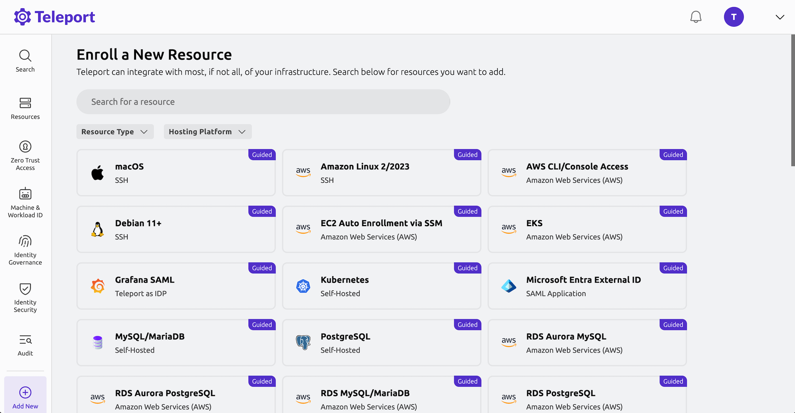

import Button from '@site/src/components/Button';
import Icon from '@site/src/components/Icon';

After deploying your Teleport cluster, the next step is to enroll the infrastructure resources you want to secure.

Teleport supports a wide range of resource types, from Linux servers and Kubernetes clusters to databases, internal web apps, and cloud provider APIs. Each enrolled resource connects back to your cluster via a secure reverse tunnel, enabling identity-aware access with full session visibility and control.

One of the easiest ways to enroll a resource is through the Teleport Web UI via our guided setups.

For example, to enroll an Ubuntu Linux server:
1. Click on Enroll New Resource
2. Choose Ubuntu 18.04+ from the list of resources
3. Run the install script that Teleport provides on your Ubuntu server to install the Teleport SSH Service. 

Done! Now you'll see it listed under **Resources** in your Teleport Cluster. Click on **Connect** for options to connect to the resource.

You can also enroll resources using the Teleport CLI as our [Server Access Getting Started Guide](../enroll-resources/server-access/getting-started.mdx) demonstrates.

For guides to other resource types, you can choose from the list below. 

## Resource guides

<TileGrid
  tiles={[
       {
      icon: <Icon name="applications" size="xl" />,
      to: "../../enroll-resources/application-access/",
      name: "Applications",
    },
    {
      icon: <Icon name="linuxServers" size="xl" />,
      to: "../../enroll-resources/server-access/",
      name: "Linux Servers",
    },
    {
      icon: <Icon name="databases" size="xl" />,
      to: "../../enroll-resources/database-access/",
      name: "Databases",
    },
    {
      icon: <Icon name="kubernetesClusters" size="xl" />,
      to: "../../enroll-resources/kubernetes-access/",
      name: "Kubernetes Clusters",
    },
    {
      icon: <Icon name="windowsDesktops" size="xl" />,
      to: "../../enroll-resources/desktop-access/",
      name: "Windows Desktops",
    },
    {
      icon: <Icon name="autoDiscovery" size="xl" />,
      to: "../../enroll-resources/auto-discovery/",
      name: "Auto-Discovery of Resources",
    },
    {
      icon: <Icon name="cloudProviders" size="xl" />,
      to: "../../enroll-resources/application-access/cloud-apis/",
      name: "Cloud Providers",
    },
    {
      icon: <Icon name="mcpAndAi" size="xl" />,
      to: "../../enroll-resources/mcp-access/",
      name: "MCP and AI Agents",
    },
  ]}
/>

## Next step: Set up access controls

In the next step of the Getting Started guide, we'll discuss role-based access control (RBAC) so you can control **who** can connect to your enrolled resources and **what actions** they can take once connected.

  <Button as="link" href="./step-3-access" variant="primary" shape="lg">Step 3 - Configure Access Controls <Icon name="arrowRight" inline size="md"/></Button>

