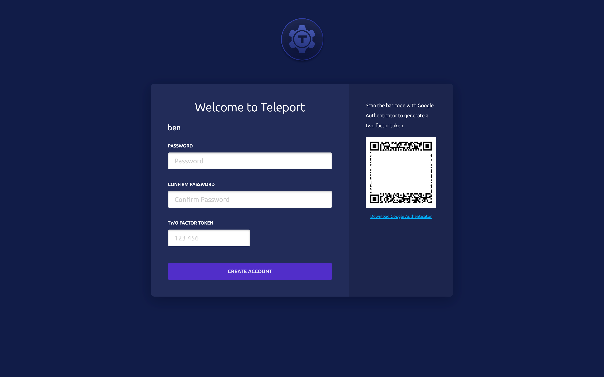
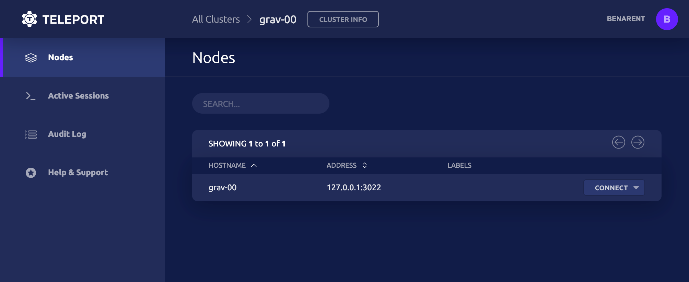

This tutorial will guide you through the steps needed to install and run
Teleport (=teleport.version=) on Linux machines.

## Prerequisites

- A Linux machine with a port `443` open
- A two-factor authenticator app such as [Authy](https://authy.com/download/), [Google Authenticator](https://www.google.com/landing/2step/), or [Microsoft Authenticator](https://www.microsoft.com/en-us/account/authenticator)
- An SSH client like OpenSSH
- Access to a DNS service such as Amazon Route 53 or CoreDNS

<Admonition title="Local-only setups" type="tip">
If you would like to try out Teleport on your local machine—e.g., you do not have access to a DNS server or internal public key infrastructure—we recommend following our [Docker Compose guide](./docker-compose.mdx).
</Admonition>

## Step 1/4. Install Teleport on a Linux host

Run the following commands to install the Teleport binary on your system:

<Tabs>
  <TabItem label="Amazon Linux 2/RHEL (RPM)">
    ```code
    $ sudo yum-config-manager --add-repo https://rpm.releases.teleport.dev/teleport.repo
    $ sudo yum install teleport

    # Optional:  Using DNF on newer distributions
    # $ sudo dnf config-manager --add-repo https://rpm.releases.teleport.dev/teleport.repo
    # $ sudo dnf install teleport
    ```
  </TabItem>

  <TabItem label="Debian/Ubuntu (DEB)">
    ```code
    $ curl https://deb.releases.teleport.dev/teleport-pubkey.asc | sudo apt-key add -
    # software-properties-common includes add-apt-repository
    $ apt-get install --no-install-recommends software-properties-common
    $ sudo add-apt-repository 'deb https://deb.releases.teleport.dev/ stable main'
    $ sudo apt-get update
    $ sudo apt-get install teleport
    ```
  </TabItem>

  <TabItem label="Linux">
    ```code
    $ curl -O https://get.gravitational.com/teleport-v(=teleport.version=)-linux-amd64-bin.tar.gz
    $ tar -xzf teleport-v(=teleport.version=)-linux-amd64-bin.tar.gz
    $ cd teleport
    $ sudo ./install
    ```
  </TabItem>

  <TabItem label="ARMv7 (32-bit)">
    ```code
    $ curl -O https://get.gravitational.com/teleport-v(=teleport.version=)-linux-arm-bin.tar.gz
    $ tar -xzf teleport-v(=teleport.version=)-linux-arm-bin.tar.gz
    $ cd teleport
    $ sudo ./install
    ```
  </TabItem>

  <TabItem label="ARMv8 (64-bit)">
    ```code
    $ curl -O https://get.gravitational.com/teleport-v(=teleport.version=)-linux-arm64-bin.tar.gz
    $ tar -xzf teleport-v(=teleport.version=)-linux-arm64-bin.tar.gz
    $ cd teleport
    $ sudo ./install
    ```
  </TabItem>
</Tabs>

Take a look at the [Installation Guide](../installation.mdx) for more options.

(!docs/pages/includes/permission-warning.mdx!)

### Configure DNS

Teleport uses TLS to provide secure access to its Proxy Service and Auth Service, and this requires a domain name that clients can use to verify Teleport's certificate. To get started, set up two `A` records for `tele.example.com` and `*.tele.example.com` pointing to the IP/FQDN of the machine with Teleport installed.

<Admonition
  type="tip"
  title="Tip"
>
  You can use `dig` to make sure that DNS records are propagated:

  ```code
  $ dig @$DNS_SERVER_ADDRESS tele.example.com
  ```
</Admonition>

### Configure Teleport

Next, generate a configuration file for Teleport using the `teleport configure` command. This command requires information about a TLS certificate and private key. If your environment allows your Teleport Auth Server to be reachable via the public internet, we recommend using Let's Encrypt to generate your key and certificate automatically. Otherwise, you can use a key and certificate provided via your organization's internal public key infrastructure.

<Tabs>
  <TabItem label="Public internet deployment with Let's Encrypt">
  Teleport uses the ACME protocol to request automatic TLS certificates from Let's Encrypt, which accesses an HTTP endpoint on your Teleport host in order to complete authentication challenges.

  Use the following command to configure Teleport:

  ```code
  $ sudo teleport configure --acme --acme-email=your-email@example.com --cluster-name=tele.example.com -o file
  # Wrote config to file "/etc/teleport.yaml". Now you can start the server. Happy Teleporting!
  ```

  The `--acme-email` flag indicates an email address that Let's Encrypt can use for notifications, and does *not* require the same domain name as your Teleport host. 
  
  For the `--cluster-name` flag, enter the domain name you used when creating a DNS A record earlier.

  </TabItem>

  <TabItem label="Private net deployment">
  On your Teleport host, place a valid private key and a certificate chain in `/var/lib/teleport/privkey.pem`
  and `/var/lib/teleport/fullchain.pem` respectively.

  The leaf certificate must have a subject that corresponds to the domain of your Teleport host, e.g., `*.teleport.example.com`.

  Configure Teleport, changing the values of the `--cluster-name` and `--public-addr` flags to match the domain name of your Teleport host.

  ```code
  $ sudo teleport configure -o file \
      --cluster-name=tele.example.com \
      --public-addr=tele.example.com:443 \
      --cert-file=/var/lib/teleport/fullchain.pem \
      --key-file=/var/lib/teleport/privkey.pem
  ```
  </TabItem>

</Tabs>


## Start Teleport

<Tabs>
  <TabItem label="Package manager RPM/DEB">
    ```code
    $ sudo systemctl start teleport
    ```
  </TabItem>

  <TabItem label="Source or custom install">
    ```code
    $ sudo teleport start
    ```
  </TabItem>
</Tabs>

You can access Teleport's Web UI via HTTPS at the domain you created earlier.

## Step 2/4. Create a Teleport user and set up two-factor authentication

In this example, we'll create a new Teleport user `teleport-admin`, which is allowed to log into
SSH hosts as any of the principals `root`, `ubuntu`, or `ec2-user`.

```code
# tctl is an administrative tool that is used to configure Teleport's auth service.
$ tctl users add teleport-admin --roles=editor,access --logins=root,ubuntu,ec2-user
```

Teleport will always enforce the use of two-factor authentication by default. It supports One-Time
Passwords (OTP) and second factor authenticators (WebAuthn). This quick start will use OTP—you'll
need an OTP-compatible app that can scan a QR code.



<Admonition
  type="tip"
  title="OS User Mappings"
>
  The OS users that you specify (`root`, `ubuntu` and `ec2-user` in our examples) must exist!
  On Linux, if a user does not already exist, you can create it with `adduser <login>`. If you
  do not have the permission to create new users on the Linux host, run `tctl users add teleport $(whoami)` to explicitly allow Teleport to authenticate as the user that you have currently logged in as. If you do not map to an existing OS user, you will get authentication errors later on in this tutorial!
</Admonition>



### Install a Teleport client locally

<Tabs>
  <TabItem label="Mac">
    [Download the MacOS .pkg installer](https://goteleport.com/teleport/download?os=mac) (`tsh` client only, signed) and double-click to run it.
  </TabItem>

  <TabItem label="Mac - Homebrew">
    ```code
    $ brew install teleport
    ```

    <Admonition type="note">
      The Teleport package in Homebrew is not maintained by Teleport and we can't
      guarantee its reliability or security. We recommend the use of our [own Teleport packages](https://goteleport.com/teleport/download?os=mac).

      If you choose to use Homebrew, you must verify that the versions of `tsh` and
      `tctl` are compatible with the versions you run server-side. Homebrew usually
      ships the latest release of Teleport, which may be incompatible with older
      versions. See our [compatibility policy](../setup/operations/upgrading.mdx#component-compatibility) for details.
    </Admonition>
  </TabItem>

  <TabItem label="Windows - Powershell">
    ```code
    $ curl -O teleport-v(=teleport.version=)-windows-amd64-bin.zip https://get.gravitational.com/teleport-v(=teleport.version=)-windows-amd64-bin.zip
    # Unzip the archive and move `tsh.exe` to your %PATH%
    ```
  </TabItem>

  <TabItem label="Linux">
    For more options (including RPM/DEB packages and downloads for i386/ARM/ARM64) please see our [installation page](../installation.mdx).

    ```code
    $ curl -O https://get.gravitational.com/teleport-v(=teleport.version=)-linux-amd64-bin.tar.gz
    $ tar -xzf teleport-v(=teleport.version=)-linux-amd64-bin.tar.gz
    $ cd teleport
    $ sudo ./install
    # Teleport binaries have been copied to /usr/local/bin
    # To configure the systemd service for Teleport take a look at examples/systemd/README.mdx
    ```
  </TabItem>
</Tabs>

## Step 3/4. Log in using tsh

`tsh` is our client tool. It helps you log into Teleport clusters and obtain short-lived credentials. It can also be used to list servers, applications, and Kubernetes clusters registered with Teleport.

Log in to receive short-lived certificates from Teleport:

```code
# Replace teleport.example.com with your Teleport cluster's public address as configured above.
$ tsh login --proxy=teleport.example.com --user=teleport-admin
```

## Step 4/4. Have fun with Teleport!

Congrats! You've completed setting up Teleport! Now, feel free to have fun and explore the many features Teleport has to offer.

Here are several common commands and operations you'll likely find useful:

### View Status

```code
$ tsh status
```

### SSH into a node

```code
# list all SSH servers connected to Teleport
$ tsh ls

# ssh into `node-name` as `root`
$ tsh ssh root@node-name
```

### Add a node to the cluster

Generate a short-lived dynamic join token using `tctl`:

```code
$ tctl tokens add --type=node
```

Bootstrap a new node:

<Tabs>
  <TabItem label="teleport start">
    Replace `auth_servers` with the hostname and port of your Teleport cluster,
    `token` with the token you generated above.

    ```code
    $ sudo teleport start \
    --roles=node \
    --auth-server=https://teleport.example.com:443 \
    --token=${TOKEN?} \
    --labels=env=demo
    ```
  </TabItem>

  <TabItem label="cloud-config">
    Replace `auth_servers` with the hostname and port of your Teleport cluster,
    `auth_token` with the token you generated above.

    ```ini
    #cloud-config

    package_upgrade: true

    write_files:
    - path: /etc/teleport.yaml
        content: |
            teleport:
                auth_token: ""
                auth_servers:
                    - "https://teleport.example.com:443"
            auth_service:
                enabled: false
            proxy_service:
                enabled: false
            ssh_service:
                enabled: true
                labels:
                    env: demo

    runcmd:
    - 'mkdir -p /tmp/teleport'
    - 'cd /tmp/teleport && curl -O https://get.gravitational.com/teleport_(=teleport.version=)_amd64.deb'
    - 'dpkg -i /tmp/teleport/teleport_(=teleport.version=)_amd64.deb'
    - 'systemctl enable teleport.service'
    - 'systemctl start teleport.service'
    ```
  </TabItem>
</Tabs>

### Add an application to your Teleport cluster

Generate a short-lived dynamic token to join apps:

```code
$ tctl tokens add --type=app
```

Add a new application:

<Tabs>
  <TabItem label="teleport start">
    Install Teleport on the target node, then start it using a command as shown below.
    Review and update `auth-server`, `token`, `app-name`, and `app-uri` before running this command.

    ```code
    $ sudo teleport start \
    --roles=app \
    --token=${TOKEN?} \
    --auth-server=teleport.example.com:3080 \
    --app-name=example-app  \ # Change "example-app" to the name of your application.
    --app-uri=http://localhost:8080  # Change "http://localhost:8080" to the address of your application.
    ```
  </TabItem>
</Tabs>

## Guides

Check out our collection of step-by-step guides for common Teleport tasks.

- [Install Teleport](../installation.mdx)
- [Admin Guides](../setup/admin.mdx)
- [Share Sessions](../server-access/guides/tsh.mdx#sharing-sessions)
- [Manage Users](../setup/admin/users.mdx)
- [Github SSO](../setup/admin/github-sso.mdx)
- [Label Nodes](../setup/admin/labels.mdx)
- [Teleport with OpenSSH](../server-access/guides/openssh.mdx)

## Further reading
- How Let's Encrypt uses the [ACME protocol](https://letsencrypt.org/how-it-works/) to issue certificates
