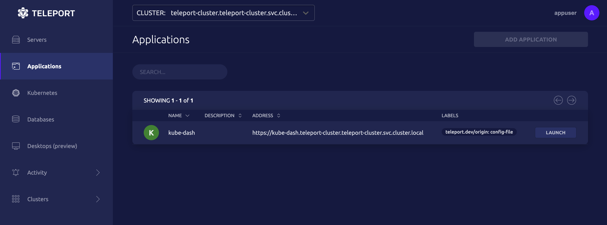

In this guide, we will show you how to set up Teleport on a local Kubernetes
cluster. You will see how Teleport enables users to access private resources in
your cluster—all from a single ingress port—so you can manage authentication,
authorization, and audit.

## The demo environment

Our demo will run using minikube, which deploys Kubernetes on your local
machine. The cluster will run Kubernetes Dashboard, the official browser UI for
Kubernetes.

While it is possible to expose the dashboard outside the cluster using the
`kubectl proxy` command, in our demo the dashboard will only be accessible via
Teleport.

We will deploy the following Teleport components:

- **Teleport Auth Service:** The certificate authority for your cluster. It
issues certificates and conducts authentication challenges.
- **Teleport Proxy Service:** The cluster frontend, which handles user requests,
  forwards user credentials to the Auth Service, and communicates with Teleport
  instances that enable access to specific resources in your infrastructure.
- **Teleport Application Service:** Enables access to Kubernetes Dashboard for
  authorized end-users.

One pod will run the Auth Service and Proxy Service, and a second pod will run
the Application Service.

## Prerequisites

While this guide deploys resources only on your local development machine, you
will need access to the Internet in order to pull Helm charts and container
images.

Make sure that the following tools are installed locally:

|Tool|Purpose|Installation link|
|---|---|---|
|minikube|Local Kubernetes deployment tool|[Install minikube](https://minikube.sigs.k8s.io/docs/start/)|
|Helm|Kubernetes package manager|[Install Helm](https://helm.sh/docs/intro/install/)|
|kubectl|Kubernetes admin CLI|[Install kubectl](https://kubernetes.io/docs/tasks/tools/)|
|Docker Desktop (MacOS and Windows) or Docker Engine (Linux desktop) | Required minikube driver | [Get Started With Docker](https://www.docker.com/get-started)|

You should also install a one-time passcode (OTP) application like Authy on your
mobile device. You will use this to authenticate to your Teleport cluster.

## Step 1/4 Deploy resources

### Start minikube

Start minikube with the Docker driver:

```code
$ minikube start --driver=docker
```

Add the Teleport Helm repository. Our Helm charts make it easier to deploy
Teleport on your local Kubernetes cluster:

```code
$ helm repo add teleport https://charts.releases.teleport.dev
```

### Install the Teleport Auth Service and Proxy Service

You will deploy the Auth Service and Proxy Service by installing the
`teleport-cluster` Helm chart. To do so, run the following commands:

```code
# This is the DNS name Kubernetes will assign to the Proxy Service
$ CLUSTER_NAME="teleport-cluster.teleport-cluster.svc.cluster.local"
$ helm install teleport-cluster teleport/teleport-cluster \
--create-namespace \
--namespace=teleport-cluster \
--set clusterName=${CLUSTER_NAME?}
$ kubectl config set-context --current --namespace teleport-cluster
```

Any `kubectl` commands you run will now use the `teleport-cluster` namespace.

Verify that Teleport is running.

```code
$ kubectl get pods
NAME                               READY   STATUS    RESTARTS   AGE
teleport-cluster-b9dc6c68b-d75fb   1/1     Running   0          46s
```

### Expose the Proxy Service to your local machine

The `teleport-cluster` service is of type `LoadBalancer`, meaning that your
platform needs to supply a load balancer to route traffic to the service.

The `minikube tunnel` command provides a load balancer and establishes a reverse
SSH tunnel to ports on your local machine.

Open a new terminal and run the following command to create a reverse tunnel. In
this case, the tunnel forwards port 443, so you will need to enter your
password.

```code
$ minikube tunnel
✅  Tunnel successfully started

📌  NOTE: Please do not close this terminal as this process must stay alive for the tunnel to be accessible ...

❗  The service/ingress teleport-cluster requires privileged ports to be exposed: [443]
🔑  sudo permission will be asked for it.
🏃  Starting tunnel for service teleport-cluster.
Password:
```

The `teleport-cluster` service should now have an external IP:

```code
$ kubectl get services
NAME               TYPE           CLUSTER-IP       EXTERNAL-IP   PORT(S)                                                                     AGE
teleport-cluster   LoadBalancer   10.107.218.212   127.0.0.1     443:32143/TCP,3023:30618/TCP,3026:32750/TCP,3024:32406/TCP,3036:30687/TCP   6m18s
```

The Proxy Service enables you to manage your cluster via an HTTP API. Assign the
external IP of the load balancer to an environment variable and verify that the
HTTP API is working:

```code
$ EXTERNAL_IP=$(kubectl get service teleport-cluster -o jsonpath='{ .status.loadBalancer.ingress[0].ip }')
$ curl --insecure https://${EXTERNAL_IP?}:443/webapi/ping
{"auth":{"type":"local","second_factor":"otp","preferred_local_mfa":"otp","has_motd":false},"proxy":{"kube":{"enabled":true,"listen_addr":"0.0.0.0:3026"},"ssh":{"listen_addr":"[::]:3023","tunnel_listen_addr":"0.0.0.0:3024","public_addr":"teleport-cluster:443"},"db":{"mysql_listen_addr":"0.0.0.0:3036"},"tls_routing_enabled":false},"server_version":"8.2.0","min_client_version":"7.0.0"}%
```

<Details opened={false} title='Getting a "Connection refused" error?'>

The `minikube tunnel` command works by executing the `ssh` binary in `PATH` to
establish a reverse tunnel from the `minikube` container to the local host. It
uses credentials managed by `minikube` to authenticate.

If you are getting a "Connection refused" error, that probably means that the `ssh` command has failed. Try the following steps:

- If the SSH agent is running, the `ssh` command will attempt to load keys from
  the agent. If there are too many keys loaded, the `ssh` client will fail to
  authenticate. Clear any keys from the SSH agent using the following command:

  ```code
  $ ssh-add -D
  ```

- Ensure that no configuration options or environment variables are conflicting
  with the `ssh` command, which will resemble the following:

  ```code
  $ sudo ssh -o UserKnownHostsFile=/dev/null \
     -o StrictHostKeyChecking=no \
     -N docker@127.0.0.1 \
     -p 49894 \
     -i /${HOME}/.minikube/machines/minikube/id_rsa \
     -L 443:10.98.6.171:443 \
     -L 3023:10.98.6.171:3023 \
     -L 3026:10.98.6.171:3026 \
     -L 3024:10.98.6.171:3024 \
     -L 3036:10.98.6.171:3036
  ```

</Details>

<Admonition type="warning" title="Certificate warning">
The Teleport Proxy Service requires a TLS certificate and private key. In this
guide, Teleport runs with a self-signed certificate. For convenience, we
configure HTTP clients not to verify the certificate.

In production setups, you will need to configure Teleport to use a certificate
from a certificate authority like Let's Encrypt.
</Admonition>

### Configure DNS

For the Proxy Service to communicate with end-users and Teleport resource
services, it needs a domain name that is resolvable both inside and outside your
Kubernetes cluster.

Production Teleport deployments achieve this by either using a registered domain
name or an internal DNS infrastructure. For this demonstration, we will
edit the `/etc/hosts` file instead.

<Notice type="warning">
Set yourself a reminder to clean up your `/etc/hosts`
file when you are done with this guide.
</Notice>

Append an entry to your `/etc/hosts` file that maps the external IP of your
Proxy Service to the DNS name Kubernetes assigns, plus a DNS name we will use
later for Kubernetes Dashboard.

```code
$ sudo -E bash -c "echo \"${EXTERNAL_IP?} teleport-cluster.teleport-cluster.svc.cluster.local kube-dash.teleport-cluster.teleport-cluster.svc.cluster.local\" >> /etc/hosts"
```

`teleport-cluster.teleport-cluster.svc.cluster.local` is the DNS name that
Kubernetes assigns to the Proxy Service. As you complete this guide, the
Application Service will make Kubernetes Dashboard available at the
`kube-dash` subdomain of the Proxy Service's domain name.

### Deploy Kubernetes Dashboard

Deploy Kubernetes Dashboard using the following command:

```code
$ kubectl apply -f https://raw.githubusercontent.com/kubernetes/dashboard/v2.4.0/aio/deploy/recommended.yaml
```

Verify that the dashboard and metrics scraper services are running:

```code
$ kubectl get services -n kubernetes-dashboard
NAME                        TYPE        CLUSTER-IP     EXTERNAL-IP   PORT(S)    AGE
dashboard-metrics-scraper   ClusterIP   10.100.9.163   <none>        8000/TCP   8s
kubernetes-dashboard        ClusterIP   10.100.80.65   <none>        443/TCP    8s
```

The `kubernetes-dashboard` service has an open HTTPS port but is not accessible
outside the cluster (i.e., it has no external IP). By enabling Teleport
Application Access, we will alow users to securely access the dashboard.

<Notice type="tip">

If installing the dashboard leads to an unexpected result,
check the following documentation for updated installation steps:
[Deploying the Dashboard UI](https://kubernetes.io/docs/tasks/access-application-cluster/web-ui-dashboard/#deploying-the-dashboard-ui).

</Notice>

## Step 2/4 Create a user

We will create a Teleport user who can access Kubernetes Dashboard from
outside the cluster. To do this, we will use the `tctl` administrative tool from
inside the pod that runs the Auth Service and Proxy Service.

Run the following commands to get the name of the relevant pod and execute a
`tctl` command to create a user:

```code
# We will use this variable for subsequent commands
$ PROXY_POD=$(kubectl get po -l app=teleport-cluster -o jsonpath='{.items[0].metadata.name}')
$ kubectl exec $PROXY_POD -- tctl users add --roles=access appuser
User "appuser" has been created but requires a password. Share this URL with the user to complete user setup, link is valid for 1h:
https://teleport-cluster.teleport-cluster.svc.cluster.local:443/web/invite/<token>
```

Next, open a browser at the URL returned by `tctl users add` command. minikube's
reverse tunnel will allow you to access the Teleport Proxy Service at
`https://teleport-cluster.teleport-cluster.svc.cluster.local:443`.

(!docs/pages/includes/insecure-certificate.mdx!)


In the Teleport Web UI, enter a password and scan the QR code with your OTP
application to create your user.

<Details title="Don't want to use MFA in your local demo?" opened={false}>
We recommend requiring MFA for all Teleport users. However, for
convenience while setting up your local demo, you can run the following command
to create a dynamic configuration resource that disables MFA for your demo user:

```code
$ kubectl exec -i $PROXY_POD -- bash -c "cat<<EOF>>/home/cp.yaml
kind: cluster_auth_preference
version: v2
metadata:
  name: cluster-auth-preference
spec:
  type: local
  second_factor: "off"
EOF
tctl create --force --confirm /home/cp.yaml"
```
</Details>

After signing in, you will navigate to the Teleport Web UI.


## Step 3/4 Enable access to Kubernetes Dashboard

We will configure the Teleport Application Service to proxy traffic to
Kubernetes Dashboard so we can access it securely from outside the cluster.

To do so, we will generate a token that our Application Service Node can use to
register itself with the cluster, then run the Application Service with the
token, configuring it to access Kubernetes Dashboard.

Run the following commands to generate the token, which is specific to
Kubernetes Dashboard:

```code
# The cluster IP of Kubernetes Dashboard
$ DASH_ADDR=$(kubectl -n kubernetes-dashboard get service kubernetes-dashboard -o jsonpath="{.spec.clusterIP}")
$ kubectl exec -i $PROXY_POD -- tctl tokens add \
--type=app \
--app-name=kube-dash \
--app-uri=https://$DASH_ADDR
The invite token: <token>.
This token will expire in 60 minutes.
...
```

Copy the invite token so you can assign it to `INVITE_TOKEN` below, then launch the
Teleport Application service:

```code
# If you need to retrieve this again you can run "tctl tokens ls"
$ INVITE_TOKEN=<token>
$ PROXY_ADDR="$(kubectl get service teleport-cluster -o jsonpath="{.spec.clusterIP}"):443"
$ helm install teleport-kube-agent teleport/teleport-kube-agent \
  --namespace teleport-cluster \
  --set roles=app \
  --set proxyAddr=${PROXY_ADDR?} \
  --set authToken=${INVITE_TOKEN?} \
  --set "apps[0].name"="kube-dash" \
  --set "apps[0].uri"=https://${DASH_ADDR?} \
  --set insecureSkipProxyTLSVerify=true
```

<Details title="Why do we skip certificate verification here?">
In this `helm install` command, we use the `insecureSkipProxyTLSVerify=true`
option to prevent the Application Service from verifying the TLS certificate of
the Proxy Service.

This is because, in our environment, the TLS certificate is
valid for `127.0.0.1`, the external IP of the Proxy Service, while the
Application Service sees the Proxy Service's cluster IP.

Production environments must not skip TLS certificate verification.
</Details>

<Admonition type="tip" title="Need to retrieve your token again?">
Run the following command:

```code
$ kubectl exec $PROXY_POD -- tctl tokens ls
```
</Admonition>

Visit the Teleport Web UI at the following link:

{/* This link will trigger the dead link checker, but exists for the convenience
of readers who have launched a local Application Service. */}

{/* lint ignore no-dead-urls */}

[Applications](https://teleport-cluster.teleport-cluster.svc.cluster.local/web/cluster/teleport-cluster.teleport-cluster.svc.cluster.local/apps)

You will now see Kubernetes Dashboard as connected to your cluster.



To access Kubernetes Dashboard, click "LAUNCH." If you see an authentication
form with the title, "Kubernetes Dashboard," you have successfully gained access
via Teleport on Kubernetes.

If you want to play around with the dashboard, read the following guide:

[Deploy and Access the Kubernetes Dashboard](https://kubernetes.io/docs/tasks/access-application-cluster/web-ui-dashboard/)

## Step 4/4 Clean up

Now that you have successfully accessed Kubernetes Dashboard, make sure to
remove the entry you added to your `/etc/hosts` file.

Terminate the `minikube tunnel` process you started earlier and run
`minikube delete` to tear down your demo cluster.

## Next steps

Now that you have used Teleport to securely access resources in your local
Kubernetes cluster, read our guides to setting up Teleport for Kubernetes in
production.

- Get started with Teleport on AWS EKS: [Running an HA Teleport cluster using
  AWS, EKS, and Helm](../setup/helm-deployments/aws.mdx)
- Manage access to your Kubernetes cluster with the Teleport Kubernetes Service:
  [Connect Kubernetes Cluster to Teleport](../kubernetes-access/getting-started.mdx)
- Integrate Teleport with your SSO provider:
  [Single Sign-On and Kubernetes RBAC](../kubernetes-access/controls.mdx)
- Have a Kubernetes cluster but don't want to run Teleport there?
  [Kubernetes Access from Standalone Teleport](../kubernetes-access/guides/standalone-teleport.mdx)


