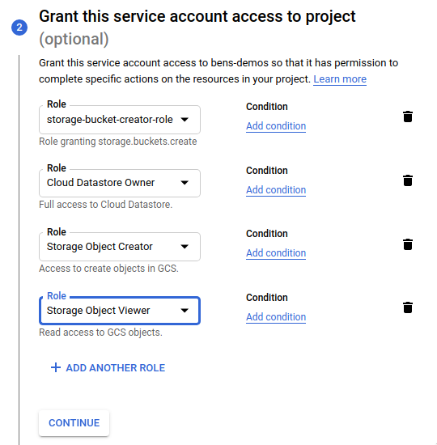

In this guide, we'll go through how to set up a highly-available Teleport cluster with multiple replicas in Kubernetes
using Teleport Helm charts and Google Cloud Platform products (Firestore and Google Cloud Storage).

This guide assumes that you've finished the [Getting Started with the Teleport Helm chart repository guide](./getting-started.mdx) and have Helm configured successfully.

If not, please finish that guide first before starting this one!

### Setting up an HA Teleport cluster using Helm

In `gcp` mode, the `teleport-cluster` Helm chart uses Google Cloud Firestore for storing its backend database and audit logs. The highly-available
shared storage of Google Cloud Firestore means that multiple Teleport pods can use the same backing database, enabling a Teleport cluster to scale
efficiently with load.

The chart also uses Google Cloud Firestore to hold Teleport's audit log, keeping track of actions performed within your cluster.

Teleport's session recordings will be stored in a Google Cloud storage bucket, providing functional, efficient storage for any number of users.

### Mandatory settings

You'll need five pieces of information to configure `gcp` mode:

| Key | Description | Example |
| - | - | - |
| `clusterName` | Name of your Teleport cluster. We recommend using the fully-qualified domain name you'll use for external access to your cluster | `teleport.example.com` |
| `gcp.projectId` | Google Cloud project ID | `gcpproj-123456` |
| `gcp.backendTable` | Name of the Firestore collection to use for Teleport's backend database | `teleport-helm-backend` |
| `gcp.auditLogTable` | Name of the Firestore collection to use for Teleport's audit event log (this **must** be different to `backendTable` due to differing schemas) | `teleport-helm-events` |
| `gcp.sessionRecordingBucket` | Name of the Google Cloud Storage bucket to use for Teleport's session recordings | `teleport-helm-sessions` |

<Admonition type="note">
  You cannot change the `clusterName` after the cluster is configured, so make sure you choose wisely. It's usually a good idea to use the
  fully-qualified domain name that you'll use for external access to your Teleport cluster.
</Admonition>

#### High availability

To make your cluster highly available, set the `highAvailability.replicaCount` parameter to the number of replicas you would like.

In this guide, we'll be configuring 2 replicas. This can be changed after installation [using `helm upgrade` as detailed below](#making-changes-to-the-cluster-after-deployment).

See the [high availability section of our `teleport-cluster` chart reference](./teleport-cluster-reference.mdx#highavailability) for more details.

### Google Cloud IAM configuration

For Teleport to be able to create the Firestore collections, indexes and the Google Cloud storage bucket it needs,
you'll need to configure a Google Cloud service account with permissions to use these services.

#### Create an IAM role granting the `storage.buckets.create` permission

Go to the "Roles" section of Google Cloud IAM & Admin.

1. Click the "Create Role" button at the top.


2. Fill in the details of a "Storage Bucket Creator" role (we suggest using the name `storage-bucket-creator-role`)


3. Click the "Add Permissions" button.


4. Use the "Filter" box to enter `storage.buckets.create` and select it in the list.


5. Check the `storage.buckets.create` permission in the list and click the "Add" button to add it to the role.


6. Once all these settings are entered successfully, click the "Create" button.


#### Create a service account for the Teleport Helm chart

<Admonition type="note">
 If you already have a JSON private key for an appropriately-provisioned service account that you wish to use, you can skip this
 creation process and go to the ["Create the Kubernetes secret containing the JSON private key for the service account"](#create-the-kubernetes-secret-containing-the-json-private-key-for-the-service-account)
 section below.
</Admonition>

Go to the "Service Accounts" section of Google Cloud IAM & Admin.

1. Click the "Create Service Account" button at the top.


2. Enter details for the service account (we recommend using the name `teleport-helm`) and click the "Create" button.


3. In the "Grant this service account access to project" section, add these four roles:

| Role | Purpose |
| - | - |
| storage-bucket-creator-role | Role you just created allowing creation of storage buckets |
| Cloud Datastore Owner | Grants permissions to create Cloud Datastore collections |
| Storage Object Creator | Allows writing of Google Cloud storage objects |
| Storage Object Viewer | Allows reading of Google Cloud storage objects |



4. Click the "continue" button to save these settings, then click the "create" button to create the service account.

#### Generate an access key for the service account

Go back to the "Service Accounts" view in Google Cloud IAM & Admin.

1. Click on the `teleport-helm` service account that you just created.


2. Click the "Keys" tab at the top and click "Add Key". Choose "JSON" and click "Create".


3. The JSON private key will be downloaded to your computer. Take note of the filename (`bens-demos-24150b1a0a7f.json` in this example)
   as you will need it shortly.


#### Create the Kubernetes secret containing the JSON private key for the service account

Find the path where the JSON private key was just saved (likely your browser's default "Downloads" directory).

Use `kubectl` to create the secret, using the path to the JSON private key:

```shell
kubectl create namespace teleport && \
kubectl --namespace teleport create secret generic teleport-gcp-credentials --from-file=gcp-credentials.json=/path/to/downloads/bens-demos-24150b1a0a7f.json
```

<Admonition type="tip">
  If you installed the Teleport chart into a specific namespace, the `teleport-gcp-credentials` secret you create must also be added to the same namespace.
</Admonition>

<Admonition type="note">
 The default name configured for the secret is `teleport-gcp-credentials`.

 If you already have a secret created, you can skip this creation process and specify the name of the secret using `gcp.credentialSecretName`.

 The credentials file stored in any secret used must have the key name `gcp-credentials.json`.
</Admonition>

### Choose how to configure the cluster

There are two different ways to configure the `teleport-cluster` Helm chart to use `gcp` mode - using a `values.yaml` file or using `--set`
on the command line.

We recommend using a `values.yaml` file as it can be easily kept in source control.

The `--set` CLI method is more appropriate for quick test deployments.

<Tabs>
  <TabItem label="Using values.yaml">
  Create a `gcp-values.yaml` file and write the values you've chosen above to it:

  ```yaml
  clusterName: teleport.example.com
  chartMode: gcp
  gcp:
    projectId: gcpproj-123456
    backendTable: teleport-helm-backend
    auditLogTable: teleport-helm-events
    sessionRecordingBucket: teleport-helm-sessions
  highAvailability:
    replicaCount: 2
  ```

  Install the chart with the values from your `gcp-values.yaml` file using this command:

  ```shell
  helm install teleport teleport/teleport-cluster \
    --create-namespace \
    --namespace teleport \
    -f gcp-values.yaml
  ```

  </TabItem>
  <TabItem label="Using --set via CLI">
  Install the chart using this command, replacing the placeholders with the values you've chosen above:

  ```shell
  helm install teleport teleport/teleport-cluster \
    --create-namespace \
    --namespace teleport \
    --set clusterName=teleport.example.com \
    --set chartMode=gcp \
    --set gcp.projectId=gcpproj-123456 \
    --set gcp.backendTable=teleport-helm-backend \
    --set gcp.auditLogTable=teleport-helm-events \
    --set gcp.sessionRecordingBucket=teleport-helm-sessions \
    --set highAvailability.replicaCount=2
  ```
  </TabItem>
</Tabs>

<Admonition type="tip">
  It will help if you have access to the DNS provider which hosts `example.com` so you can add a `teleport.example.com` record
  and point it to the external IP or hostname of the Kubernetes load balancer.

  If you're using Google Cloud DNS, you can do this by using [`gcloud dns record-sets`](https://cloud.google.com/sdk/gcloud/reference/dns/record-sets)
  on the command line, or using the Google Cloud DNS UI.

  You can also consider using other Kubernetes-based services like [external-dns](https://github.com/kubernetes-sigs/external-dns).

  For other DNS providers, consult their documentation.
</Admonition>

Once the chart is installed, you can use `kubectl` commands to view the deployment:

```shell
$ kubectl --namespace teleport get all
NAME                           READY   STATUS    RESTARTS   AGE
pod/teleport-b64dd8849-fklvk   1/1     Running   0          7m4s
pod/teleport-b64dd8849-jqvns   1/1     Running   0          7m15s

NAME               TYPE           CLUSTER-IP     EXTERNAL-IP    PORT(S)                                                      AGE
service/teleport   LoadBalancer   10.40.14.191   35.203.56.38   443:31758/TCP,3023:30409/TCP,3026:30939/TCP,3024:31403/TCP   26m

NAME                       READY   UP-TO-DATE   AVAILABLE   AGE
deployment.apps/teleport   2/2     2            2           26m

NAME                                  DESIRED   CURRENT   READY   AGE
replicaset.apps/teleport-55bd4f7d44   0         0         0       26m
replicaset.apps/teleport-b64dd8849    2         2         2       7m16s
```

At this point, you'll still need to create a user to be able to log into Teleport. This needs to be done on the Teleport auth server,
so we can run the command using `kubectl`:

```shell
$ kubectl --namespace teleport exec deploy/teleport -- tctl users add test --roles=access,editor
User "test" has been created but requires a password. Share this URL with the user to complete user setup, link is valid for 1h:
https://teleport.example.com:443/web/invite/91cfbd08bc89122275006e48b516cc68

NOTE: Make sure teleport.example.com:443 points at a Teleport proxy which users can access.
```

<Admonition type="note">
  If you didn't set up DNS for your hostname earlier, remember to replace `teleport.example.com` with the external IP or hostname of the Kubernetes load balancer.

  ```shell
  $ kubectl --namespace teleport get service/teleport -o jsonpath='{.status.loadBalancer.ingress[*].ip}'
  35.203.56.38
  ```

  In this instance, you would load https://35.203.56.38/web/invite/91cfbd08bc89122275006e48b516cc68 instead to create the Teleport user.

  You may need to accept insecure warnings in your browser to view the page successfully.
</Admonition>

<Admonition type="warning">
  Using a Kubernetes-issued load balancer IP or hostname is OK for testing, but is not viable when running a production Teleport cluster
  as the Subject Alternative Name on any public-facing certificate will be expected to match the cluster's configured public address (which is
  the same as the configured `clusterName` when using the `teleport-cluster` chart). For security, all Teleport services will validate this when
  communicating with the cluster.

  You must configure DNS properly using methods described above for production workloads.
</Admonition>

Load the user creation link to create a password and set up 2-factor authentication for the Teleport user via the web UI.

You can follow our [Getting Started with Teleport guide](../../getting-started.mdx#step-2-create-a-teleport-user-and-set-up-2-factor-authentication) to finish setting up your
Teleport cluster.

### Making changes to the cluster after deployment

To make changes to your Teleport cluster after deployment, you can use `helm upgrade`:

<Tabs>
  <TabItem label="Using values.yaml">
  Edit your `gcp-values.yaml` file from above and make the appropriate changes.

  Upgrade the deployment with the values from your `gcp-values.yaml` file using this command:

  ```shell
  helm upgrade teleport teleport/teleport-cluster \
    --namespace teleport \
    -f gcp-values.yaml
  ```

  </TabItem>
  <TabItem label="Using --set via CLI">
  Run this command, editing your command line parameters as appropriate:

  ```shell
  helm upgrade teleport teleport/teleport-cluster \
    --namespace teleport \
    --set highAvailability.replicaCount=3
  ```
  </TabItem>
</Tabs>

<Admonition type="note">
  To change `chartMode`, `clusterName` or any `gcp` settings, you must first uninstall the existing chart and then install
  a new version with the appropriate values.
</Admonition>

### Uninstalling the Helm chart

To uninstall the `teleport-cluster` chart, use `helm uninstall <release-name>`. For example:

```shell
helm --namespace teleport uninstall teleport
```
