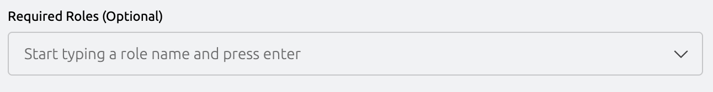
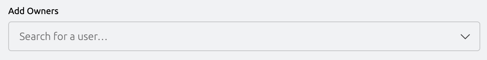
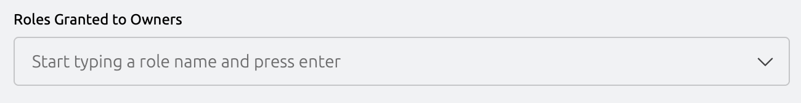
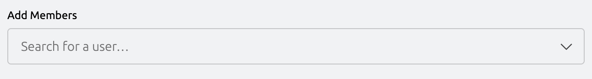
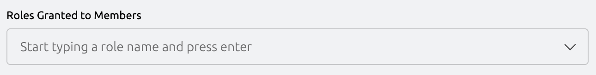

The web UI's **Custom Form** creates an Access List by directly assigning
existing roles to members and owners. Unlike the guided flows
([Standing](./standing-access-list.mdx) and
[Just-in-Time](./jit-access-list.mdx)), it does not generate roles for you —
you pick from roles that already exist in the cluster.

This guide will help you:

- Decide when the Custom Form is the right fit
- Create an Access List using the Custom Form in the Teleport Web UI
- Verify that members get access on login

## When to use this flow

Use the Custom Form when:

- You already have roles in the cluster that capture the access you want to
  grant, and you'd rather assign those roles than have the guided flow generate
  new ones.
- You need fine-grained control over the role and trait grants that isn't
  exposed in the guided flow.
- You're comfortable editing the underlying roles yourself.

If you'd rather have Teleport generate the roles for you from a resource picker,
use the [Standing Access Guide](./standing-access-list.mdx) (access on
login) or the [Just-in-Time Access Guide](./jit-access-list.mdx) (access on
request).

## Prerequisites

- A running Teleport Enterprise cluster. If you don't have one yet,
  [sign up](https://goteleport.com/signup) for a free trial.

(!docs/pages/identity-governance/access-lists/includes/preset-prerequisites.mdx!)

## Step 1/3. Open the Custom Form

In the Teleport Web UI, hover over **Add New** from the sidebar menu then click
**Access List**.

Enter a name and optional description for the list, then click **Use Custom Form Instead**.

## Step 2/3. Fill in the Access List

The Custom Form is a single page split into three sections. Fill them out top
to bottom, then click **Create Access List** at the bottom.

### Basic Information

- **Title** — required. The display name of the list.
- **Description** — optional context.
- **Review recurrence** — how often the list must be reviewed (frequency and
  day of month). Periodic reviews are how owners reaffirm that the right
  members are still on the list.
- **Deadline for first review** — the first review date. Pick a date in the
  future.

### List Owners

Owners manage members and membership requirements, and conduct periodic
access reviews.

- **Eligibility (required roles)** (optional) — restrict who can be added as an
  owner. A Teleport user assigned as an owner takes effect only if they hold
  every role listed here; if they later lose one, ownership has no effect
  until it is restored.

- **Owners** — the users to enroll as owners.

- **Grants** (optional) — roles an owner receives by being an owner.
  Typically used to grant the ability to review
  [Access Requests](../access-requests/access-requests.mdx) for this
  list — the preset
  [`reviewer`](../../reference/access-controls/roles.mdx#preset-roles) role
  is a common choice.

### Members

Members are the users who receive the list's grants. Granting members access
is the primary purpose of most Access Lists.

- **Eligibility (required roles)** (optional) — restrict who can be a member. A
  user added as a member takes effect only if they hold every role listed
  here; if they lose one later, the list's grants no longer apply to them
  until it is restored.

- **Members** — the users to enroll as members.

- **Grants** — the roles members receive by being on the list.

## Step 3/3. Verify the access

Log in as one of the members you added. The resources granted by the roles
you selected should appear in the resource list and you should be able to
connect to them.

## Next steps

- Create an Access List whose members get access on login with the
  [Standing Access Guide](./standing-access-list.mdx).
- Create an Access List whose members request temporary access with the
  [Just-in-Time Access Guide](./jit-access-list.mdx).
- Group members by inheriting access from other lists with
  [nested Access Lists](./nested-access-lists.mdx).
- Learn more about managing Access Lists as code with the
  [Terraform provider and Kubernetes operator](../../zero-trust-access/infrastructure-as-code/managing-resources/access-list.mdx).
