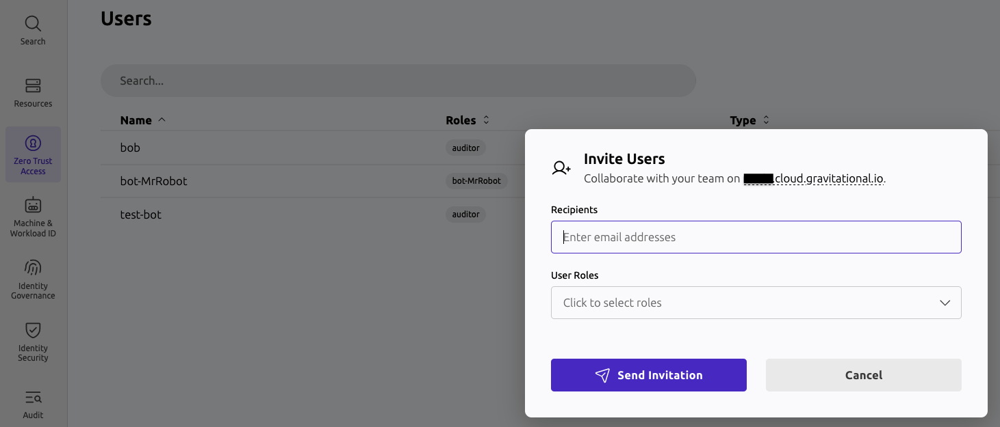

{/* lint disable page-structure remark-lint */}

This guide walks you through the Teleport Web UI to:

- Create an Access List
- Assign a member to it
- Verify permissions granted through the list membership

## Prerequisites

- A running Teleport Enterprise (v18.8.0 or higher) cluster. If you don't have one yet,
  [sign up](https://goteleport.com/signup) for a free trial.
- An admin user with the preset `editor` role, which will have permissions to create Access Lists.

## Step 1/4. Enroll a test resource

We need at least one resource on the cluster to grant access to. If you already
have a resource enrolled that you can use for testing, skip to the next step.

Otherwise, follow the <a href="/get-started/connect/" target="_blank" rel="noopener">Connect Infrastructure</a>
guide to enroll a host through the Web UI's guided setup. The linked page uses an
Ubuntu server as its example, but the same flow works for your own machine
(Linux or macOS) — just pick your OS during the guided setup and run the
install command it gives you.

<Admonition type="tip">
When the guided setup asks you to add labels, add at least one — for example,
`env: test`. We'll use this label in Step 3 to select the host. (You can also
match all hosts with a `*` wildcard, but using a real label is closer to how
you'd build an Access List in practice.)
</Admonition>

The rest of this guide assumes you've enrolled an SSH server.

## Step 2/4. Create a test user

We need to create a simple test user that has only the `requester` role, which has no default access
to anything within a cluster. This user will only be used for the purposes of this guide, so you may use
another user if you so choose. If you would rather use your own user, skip to the next step.

From the sidebar menu, click **Zero Trust Access** > **Users** > **Enroll Users**. Fill in `test-user` as
the name and select `requester` as the role.

Submit the form to create the user, then navigate to the provided URL in order to set up the credentials for your test user.
Try logging into the cluster with the test user to verify that no resources show up in the resources page.

## Step 3/4. Create an Access List

Next, we'll create a simple Access List that grants its members access to the SSH
host we enrolled in Step 1. Login as the admin user mentioned in the
prerequisites.

From the sidebar menu, hover over **Add New** then click **Access List**.

Enter `test-list` as the Access List name, optionally add a description, then
select **Standing Access Guide** — this is the flow that grants members access on
sign-in, which is what we want for this tutorial. (The other option,
[Just-in-Time Access](./jit-access-list.mdx), makes resources *requestable*
instead of granted automatically.)

Click **Start Guide**.

<Admonition type="tip" title="Prefer Terraform?">
As you fill out the guided flow, a Terraform panel on the side mirrors your input
live. At the final **Deployment** step you can choose to apply the list with Teleport
directly or follow the in-UI instructions to apply it with Terraform.
</Admonition>

### Walk through the guide

The guide will step you through six screens.

#### 1. Define Access to Resources

- Click **Server** from the resource-type column on the left.
- Click the `env: test` label next to your host (or whichever label you set in
  Step 1) to select it.
- If you didn't add a label, type `*` into the label input box and press
  **Enter** to match all servers.

This gives members of the list access to SSH servers matching the
`env: test` label (or any SSH server, if you used `*`).

#### 2. Define Resource Identities or Principals

- Under Server Identities **Logins**, add the OS user(s) you want members to be
  able to log in as on the host (for example, `ubuntu` on a Linux server or your
  local username on macOS).

Note: this screen only asks for SSH logins because Server was the only resource
type you selected in the previous step.

#### 3. Basic Information

- Confirm the title and description.
- Select a date in the future for the next review.

#### 4. Define Membership

- Add your test user as a member.
- Optionally, expand **Optional Advanced Settings** and select `requester` as a
  required role. The required role ensures any member of the list must hold
  `requester` to be granted access; if a member loses the role later, they will
  not be granted the access described in the list.

#### 5. Define Ownership

- Add your admin user as an eligible owner.
- Optionally, expand **Optional Advanced Settings** and select `editor` as a
  required role. The required role ensures any owner must hold `editor` to
  manage the list; if an owner loses the role later, they remain reflected as
  an owner but cannot manage the list.

#### 6. Deployment

- Review the summary and click **Create Access List Now**.

(!docs/pages/identity-governance/access-lists/includes/editing-roles-warning.mdx!)

## Step 4/4. Login as the test user

Login as the test user. When logging in now, you should see the SSH server you
enrolled in Step 1 in the resource list, and should be able to SSH into it using
one of the logins you allowed in **Define Resource Identities or Principals** step.

## Cleanup (optional)

If you'd like to remove the SSH server you enrolled in Step 1, follow
[Uninstall Teleport](../../installation/uninstall-teleport.mdx#step-13-stop-any-running-teleport-processes).

Once the agent is stopped, Teleport automatically removes the server from the
resource list after a few minutes.

## Next steps

- Read more about the flow you just used in [Standing Access
  Lists](./standing-access-list.mdx).
- Create an Access List whose members can [request temporary access to
  resources](./jit-access-list.mdx) instead of receiving them on sign-in.
- Read [Creating Access Lists with
  IaC](../../zero-trust-access/infrastructure-as-code/managing-resources/access-list.mdx) for instructions on managing Access Lists with the Teleport Terraform provider and Kubernetes operator.
- Familiarize yourself with the CLI tooling available for managing Access Lists in the [reference](../../reference/access-controls/access-lists.mdx).
- Learn how to work with nested Access Lists in the [nested Access Lists guide](./nested-access-lists.mdx).
