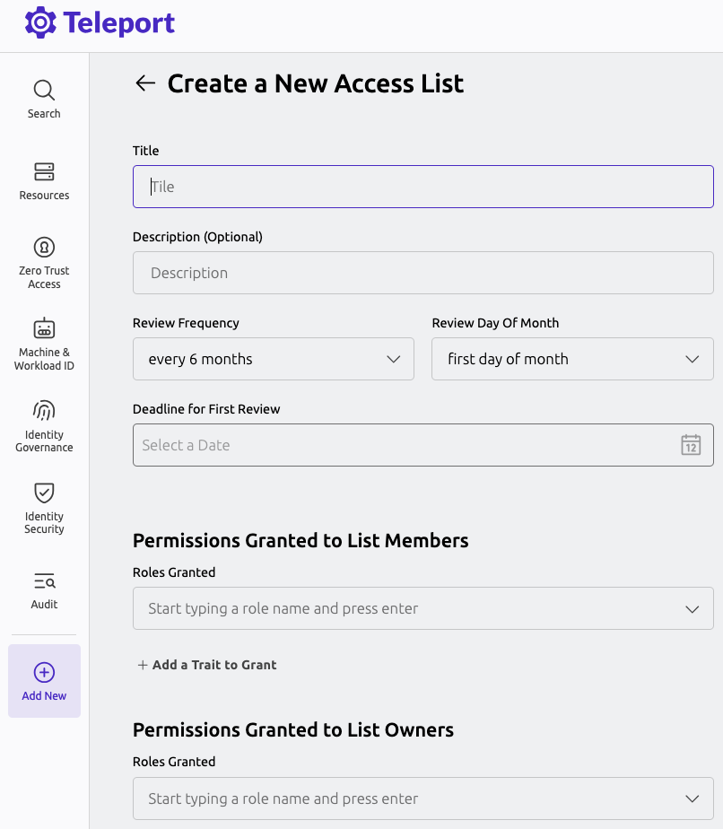

This guide will help you:
- Create an Access List
- Assign a member to it
- Verify permissions granted through the list membership

## Prerequisites

(!docs/pages/includes/commercial-prereqs-tabs.mdx!)

- (!docs/pages/includes/tctl.mdx!)
- A user with the preset `editor` role, which will have permissions to create Access Lists.

## Step 1/4. Setting up the Application Service on the cluster for testing

One of the easiest ways to get resources on the cluster for testing is to set up a Teleport Application Service
instance with the debugging application enabled. To do this, add the following config to your `teleport.yaml`
configuration:

```yaml
app_service:
  enabled: true
  debug_app: true
```

And restart Teleport. The "dumper" app should show up in the resource list.


## Step 2/4. Create a test user

We need to create a simple test user that has only the `requester` role, which has no default access
to anything within a cluster. This user will only be used for the purposes of this guide, so you may use
another user if you so choose. If you would rather use your own user, skip to the next step.

Navigate to the management pane and select "Users." Click on "Create New User" and fill in `test-user` as
the name and select `requester` as the role.


Click "Save," and then navigate to the provided URL in order to set up the credentials for your test user.
Try logging into the cluster with the test user to verify that no resources show up in the resources page.

## Step 3/4. Create an Access List

Next, we'll create a simple Access List that will grant the `access` role to its members.
Login as the administrative user mentioned in the prerequisites. Click on "Add New" in the left pane, and then "Create an Access List."



Here, fill in a title, description, and grant the `access` role. Select a date in the future for the next
review date.


Under "List Owners" select `editor` as a required role, then add your administrative user under "Add
Eligible List Owners." By selecting `editor` as a required role, this will ensure that any owner of the list
must have the `editor` role in order to actually manage the list. If the user loses this role later, they will
not be able to manage the list, though they will still be reflected as an owner.


Under "Members" select `requester` as a required role, then add your test user to the Access List. Similar to
the owner requirements, this will ensure that any member of the list must have the `requester` role in order to
be granted the access described in this list. If the user loses this role later, they will not be granted the
roles or traits described in the Access List.


Finally, click "Create Access List" at the bottom of the page.

## Step 4/4. Login as the test user

Again, login as the test user. When logging in now, you should now see the dumper application contained within
the cluster, and should be able to interact with it as expected.

## Next Steps

- Familiarize yourself with the CLI tooling available for managing Access Lists in the [reference](../../reference/access-controls/access-lists.mdx).
- Learn how to work with nested Access Lists in the [nested Access Lists guide](./nested-access-lists.mdx).
