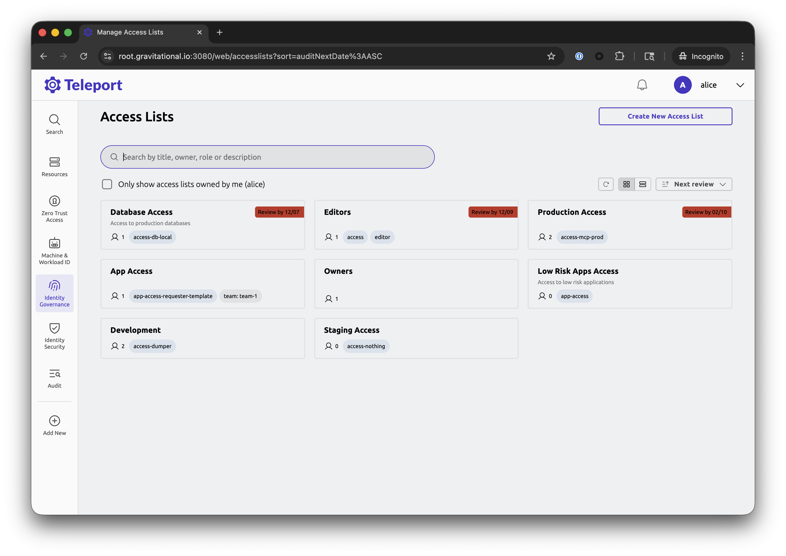
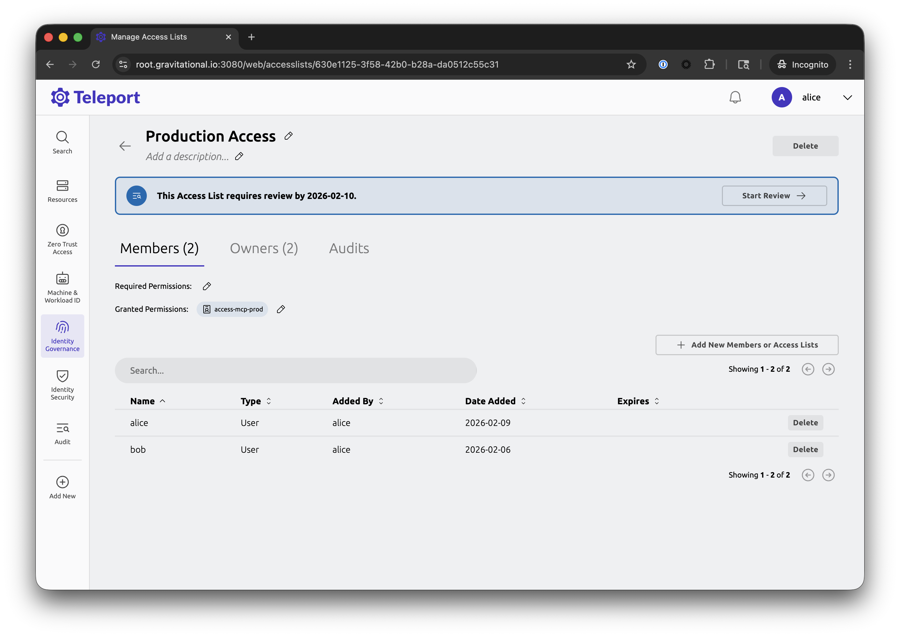
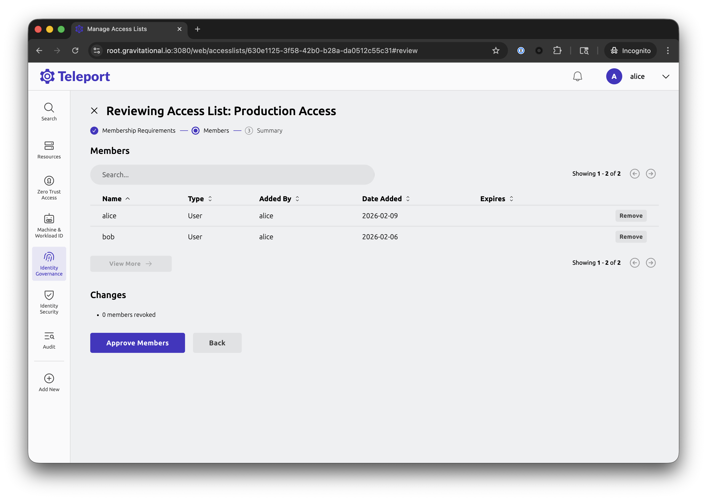
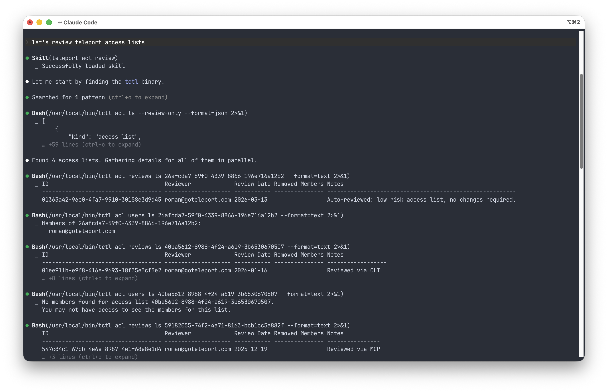
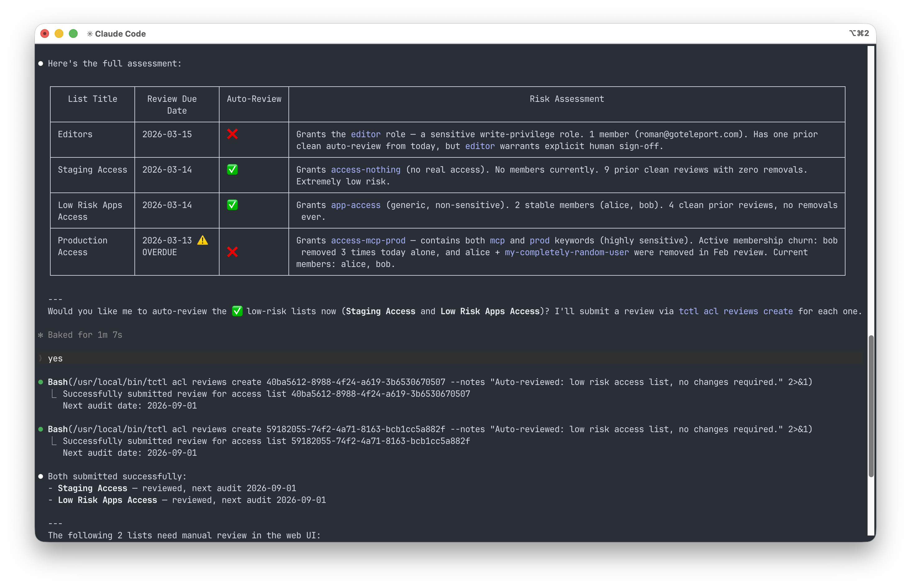

Access List owners are responsible for periodically reviewing their lists.
An Access List review (also commonly referred to as "recertification") typically
involves an owner verifying that the list contains only members that still
require access to resources granted by the list and removing members who no
longer require this access.

Access List review cadence depends on the audit period that was configured for
the list at its [creation time](guide.mdx#step-34-create-an-access-list). It is
a typical practice to perform access reviews quarterly for lists that grant
access to production or otherwise critical resources and once every 6 to 12
months for less sensitive infrastructure.

By default, owners can't change any of the list settings (such as granted roles,
membership requirements or review frequency) during the review process and are
only required to certify the list's members and remove those who no longer
require access. If a list has multiple owners, it is sufficient for one of them
to perform the review.

Keep the following in mind:

- When reviewing lists synced from Okta using via [Okta integration](../integrations/okta/okta.mdx),
  changes made during the review are reflected in the downstream Okta groups.
- [Static lists](../../zero-trust-access/infrastructure-as-code/managing-resources/access-list.mdx)
  that are managed by terraform and lists that are synced from external IdPs such
  as Entra, Sailpoint or via generic SCIM can't be reviewed from within Teleport
  since their member list is managed externally.

## Reviewing Access Lists in web UI

To find lists requiring your review, sign into your Teleport web UI, navigate to
the Identity Governance / Access Lists page and use the "sort by" dropdown to
sort all lists by the next review date.



Pick a list to review and click on Start Review button.



Go through the review steps, approve membership requirements and then review
member list. Remove members that no longer need to be in the list.



Click on Approve Members, verify information on the summary screen, provide
optional review notes and submit the review.

## Reviewing Access Lists using CLI

Teleport provides CLI tooling for reviewing Access Lists as well.

To see the lists requiring your review, you can use the following `tctl acl`
command.

```bash
$ tctl acl ls --review-only --format=text
ID                                   Title             Next Audit Granted Roles   Granted Traits
------------------------------------ ----------------- ---------- --------------- --------------
26afcda7-59f0-4339-8866-196e716a12b2 Editors           2025-12-09 access,editor
5cf4c7f0-6281-4bde-b934-e75699d9d45f Database Access   2025-12-07 access-db-local
630e1125-3f58-42b0-b28a-da0512c55c31 Production Access 2026-03-13 access-mcp-prod
```

You can inspect the list's members using the following command.

```bash
$ tctl acl users ls 630e1125-3f58-42b0-b28a-da0512c55c31
Members of 630e1125-3f58-42b0-b28a-da0512c55c31:
- alice
- bob
```

To submit a review for the access list, use `tctl acl reviews create` tool.

```bash
$ tctl acl reviews create 630e1125-3f58-42b0-b28a-da0512c55c31 --remove-members=bob --notes="Reviewed via CLI"
Successfully submitted review for access list 630e1125-3f58-42b0-b28a-da0512c55c31
Next audit date: 2026-09-01
```

To see the list's past audits, use `tctl acl reviews ls`.

```bash
$ tctl acl reviews ls 630e1125-3f58-42b0-b28a-da0512c55c31
ID                                   Reviewer             Review Date Removed Members                 Notes
------------------------------------ -------------------- ----------- ------------------------------- ----------------
d7f3d963-6006-48ca-85a1-5c10e81c1ea8 roman@goteleport.com 2026-03-13  bob                             Reviewed via CLI
f858efaa-e02f-4926-8ffc-009f6d296488 alice                2026-03-13  bob
```

See full `tctl acl` command reference in [References](../../reference/cli/tctl.mdx).

## Reviewing Access Lists using Claude Code

You can use an LLM client such as Claude Code to help you automate bulk access
list reviews. Provided with a CLI interface, like described above, an AI model
is able to figure out the correct command usage so you can tailor it to your
specific use-case however for convenience Teleport maintains an example [Claude
Skill](https://github.com/gravitational/teleport/tree/roman/acldocs/examples/skills/teleport-acl-review)
that you can install in your local client to get the reasonable behavior out of
the box.

To install the skill for Claude Code, copy the skill directory to `~/.claude/skills`.

```
$ ls -l ~/.claude/skills
total 0
drwxr-xr-x  1 example  staff  95 Mar 13 14:13 teleport-acl-review
```

This works for Claude Code in the terminal. If you're using Code in Claude
Desktop, you can upload the skill's mardown file using Claude Desktop's
Customize menu.

Once the skill has been installed, your Claude Code environment will invoke it
every time you ask it to help you review Teleport access lists. Note that `tctl`
should be installed and available in PATH for Claude to be able to find and use
it.



After reviewing your lists, it will attempt to categorize them into low-risk
lists that can be auto-recertified and lists that require human review. Note
that in the default skill the categorization is best-effort and takes into
account things like access list metadata, granted roles and past audits so
it is still an owner's responsibility to verify the model's reasoning.



You can ask Claude to submit reviews for any access list and it will do so using
appropriate `tctl` CLI commands.
